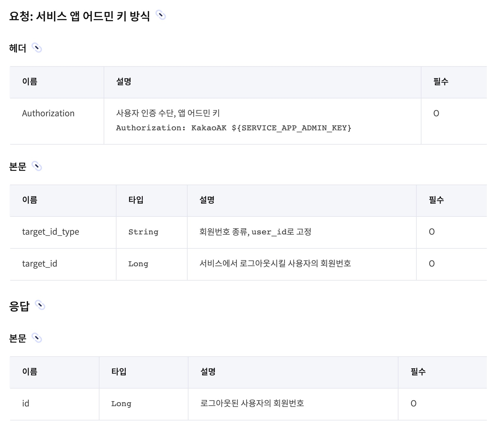

안녕하세요. 셀럽잇 팀 백엔드 도기입니다. 🐶

이번 글은 OAuth, 그 중에서도 **카카오 OAuth의 로그아웃** **구현 방법**에 대한 글입니다. 
회원탈퇴에 대한 글도 작성하려 했지만 로그아웃과 카카오 API만 다를 뿐 나머지는 모두 동일하기에 따로 작성하진 않겠습니다.

그럼 바로 시작하겠습니다.

# 로그아웃 API 명세

우선 OAuth 관련 기능을 구현하려면 무조건 해당 OAuth 서버의 공식 문서를 통해 API 명세를 확인해야합니다.

카카오의 로그아웃 API 명세는 다음과 같습니다.

# 인증 방식 선택

인증 방식을 보면 `액세스 토큰`, `서비스 앱 어드민 키`(이하 어드민 키)로 두 가지가 있습니다.

제가 사용할 인증 방식은 `어드민 키` 인데요, 이유는 다음과 같습니다. 
로그아웃 요청을 위해 액세스 토큰을 저장하려면 프론트엔드에게 토큰을 받아야 합니다. 즉, 클라이언트가 액세스 토큰을 관리해야합니다. 
하지만 이는 매우 위험합니다. 공식 문서에서 액세스 토큰에 대한 설명은 아래와 같은데요.

악성 유저가 사용자의 액세스 토큰을 탈취 후, 마음대로 사용자의 소중한 정보를 가져오는 등 심각한 보안 문제가 일어날 수 있기 때문입니다. 
물론 액세스 토큰을 서버에 저장하여 관리하면 이런 일은 방지할 수 있습니다. 동시에 `어드민 키 방식`보다 더 간결하게 API를 호출할 수 있습니다. 
그럼에도 `어드민 키` 방식을 사용하는 이유는 **현재 로그인 로직에서 `액세스 토큰`을 저장하지 않으며**, 저장하려면 회원 테이블에 칼럼을 추가하고 **상태를 관리해야 할 비용**이 생긴다는 점 때문입니다.

> 어드민 키는 '내 애플리케이션 - 앱 키' 에서 확인할 수 있습니다.

# 구현

그럼 이제 `어드민 키` 방식으로 구현해보겠습니다.

일단 그 전에 어드민 키를 환경 변수에 설정해줍니다.

그 다음 API 명세를 자세 보며 코드로 구현해봅시다.

눈여겨 볼 포인트는 **헤더**와 **본문**, **응답**이겠죠? 
이를 코드로 나타내보겠습니다.

아래는 `OauthController`의 코드 입니다.

아래는 `KakaoMemberClient`의 코드입니다.

아래는 `KakaoApiClient`의 코드입니다.

이렇게 구현이 끝났습니다.

물론 `oauthServerId`를 조회하는 등의 다른 로직도 필요하지만 따로 다루진 않겠습니다.

# 테스트

테스트 방식은 다음과 같습니다.
1. 로컬에서 프론트 애플리케이션을 띄운다.
2. 브라우저를 통해 로그인 요청을 보낸다.
3. 로그인 후 획득한 세션 아이디를 통해 포스트맨으로 로그아웃 요청을 보낸다.
4. 결과를 확인한다.

## 로그인 요청 실패
이때, 브라우저를 통해 로그인 요청을 보내면 이런 에러가 뜰 수 있습니다.

코드 상으로 분명 문제가 없는데 위같은 에러가 뜬다면, 이는 허용 IP 주소를 설정해주지 않아서 생기는 오류입니다.

위 페이지로 들어와서 수정을 통해 현재 IP를 추가해줍니다. 
입력할 IP는 `외부 IP 주소`입니다. 외부 IP는 (맥 기준) 터미널에 `curl ipecho.net/plain; echo` 명령어를 통해 확인할 수 있습니다.

그리고 다시 로그인 요청을 보내면 정상적으로 되는 것을 확인할 수 있습니다.

## 로그아웃 요청

로그인을 통해 얻은 세션을 아래와 같이 설정해주고 요청을 보내봅니다.

정상적으로 로그아웃되는 것을 확인할 수 있습니다.

# 마무리

이렇게 백엔드의 Kakao Oauth 로그아웃 구현을 알아보았습니다. 
개인적으로 프론트에서도 로그아웃 요청을 보내 테스트하고 싶었지만, 로컬에서는 쿠키가 담겨지지 않는 문제가 있어 실패했습니다.

다음엔 왜 로컬에서는 쿠키가 담겨지지 않는지 원인을 파악하고 해결하여 로컬에서도 브라우저를 통해 테스트하기를 기대합니다.

그럼 'Oauth 로그아웃 - 카카오' 포스팅을 마치겠습니다. 
감사합니다.
