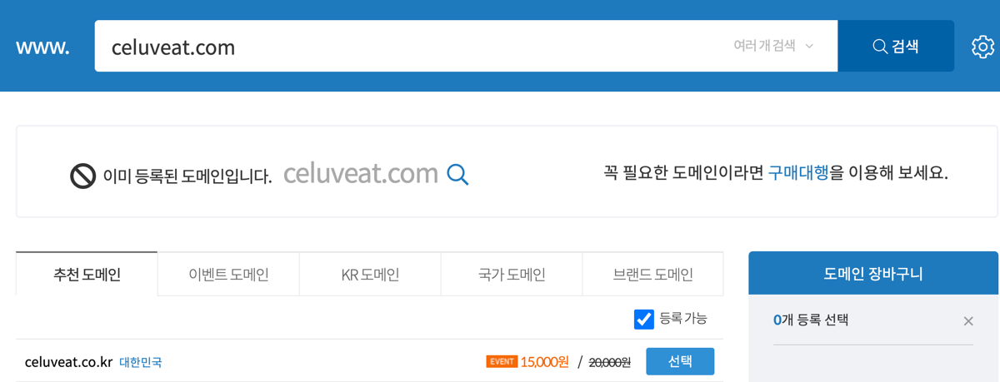
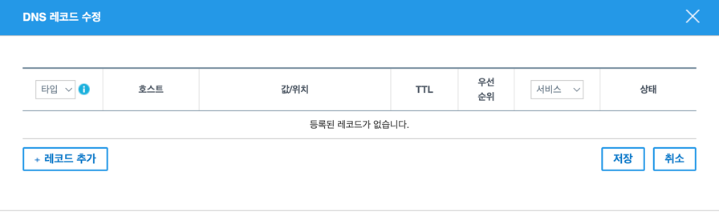
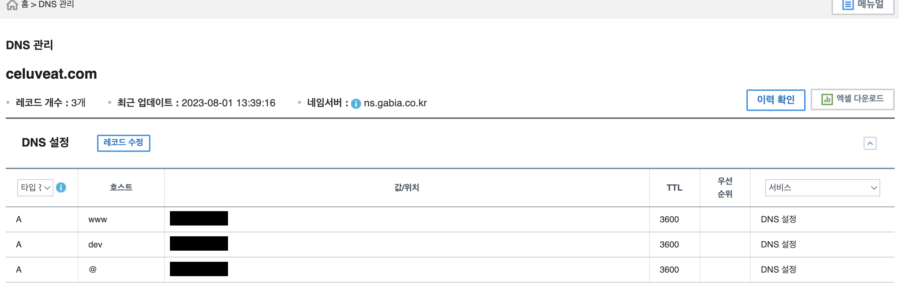
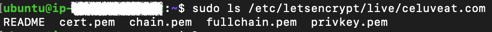
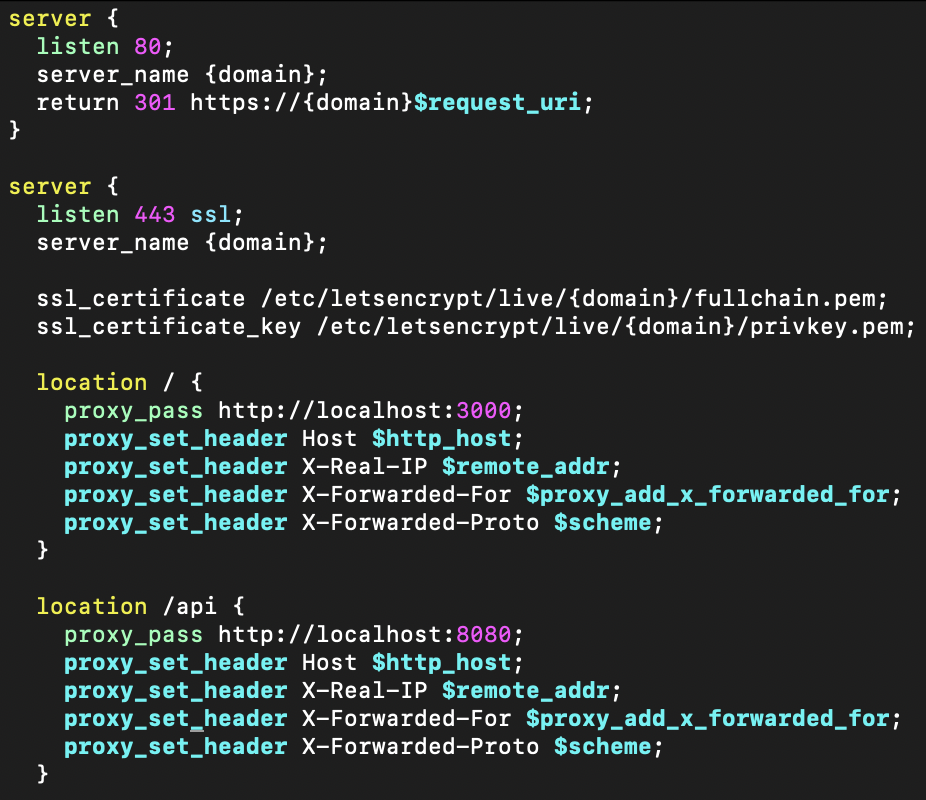
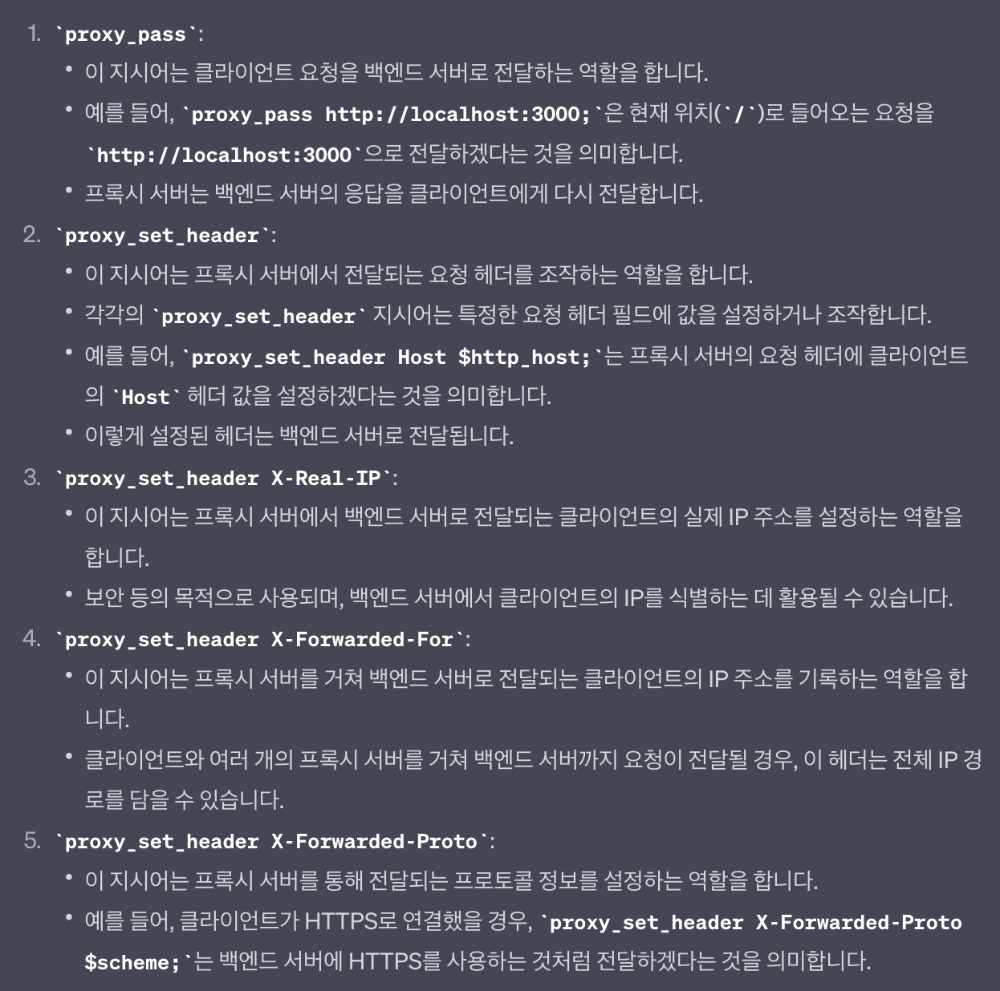

EC2 서버 HTTPS 적용하기

<!--truncate-->

안녕하세요. 셀럽잇 팀의 백엔드 도기입니다. 🐶

저희 팀은 이번 3차 데모데이에 운영 서버에 서비스를 배포했습니다!! 🎉

그 과정에서 Domain Name과 HTTPS를 적용했는데요. 그 과정을 모두 기록하려고 합니다.

그럼 바로 시작하겠습니다.

# 적용 이유 🧐

도메인과 HTTPS 적용 이유는 다음과 같습니다.

1. 도메인 적용 --> 사용자에게 편리한 접근성을 제공한다. 
2. HTTPS 적용 --> 사용자에게 안전한 서비스를 제공한다.

실제 사용자가 사용할 서비스인데 외우기도 어려운 서버 IP를 쳐서 들어오면 ... 🫨 저라도 들어가기 싫을 것 같습니다.<br/>
그리고 사용중인 서비스가 내 정보를 쉽게 탈취 가능한 서비스라면 아무리 좋은 서비스라도 사용하지 않겠죠.

# 도메인 적용 🎯

우선 도메인을 적용하는 것부터 설명하겠습니다.

## 1. 도메인 구매

도메인 구매하면 가장 먼저 생각나는 [가비아](https://www.gabia.com/?utm_source=google&utm_medium=cpc&utm_term=%25EA%25B0%2580%25EB%25B9%2584%25EC%2595%2584&utm_campaign=%25EA%25B0%2580%25EB%25B9%2584%25EC%2595%2584)에서 도메인을 먼저 구매하겠습니다.<br/>



현재 저희는 celuveat.com 을 구매한 상태이기에 "이미 등록된 도메인"이라고 뜨네요.

## 2. 레코드 수정

구매한 다음, My 가비아 -> 서비스 관리 -> (구매한 도메인) 관리 -> DNS 정보 -> DNS 관리 -> (구매한 도메인) 설정 -> 레코드 수정을 누르면 다음 화면이 뜹니다.



여기서 레코드 추가를 누르면 하나의 레코드가 추가되는데요.<br/>



그러면 위처럼 설정을 해주고 '값/위치'에 서버 IP를 입력해주세요.<br/>
(참고로 호스트에 dev는 개발 서버를 위한 도메인이고, @은 `celuveat.com`으로 바로 들어오기 위한 설정입니다.)

## 3. 적용 확인
그 다음 바로 `www.celuveat.com`에 접속해서 확인을 하시면 됩니다.<br/>
저희는 현재 HTTPS를 적용한 상태이기에 결과를 보여드리진 못할 것 같네요 😭

그럼 바로 HTTPS를 적용해봅시다!

# HTTPS 적용 🎯

저희는 nginx를 사용해서 HTTPS를 적용하기로 했습니다.

이유는 한 대의 서버 안에 React와 Spring 애플리케이션이 모두 돌아가는 상황이기에 진입점에 따른 포트 포워딩이 필요함과 동시에, <br/>
시간과 비용이 부족한 스프린트 환경을 고려하여 nginx와 연동이 가능한 ssl 발급해주는 무료 오픈소스 `Let's encrypt`를 사용하기 위함입니다. 

## 1. Nginx, CertBot 설치

우선 서버에 접속해서 **Nginx**와 Let’s Encrypt 인증서를 사용하여 HTTPS를 적용할 수 있게 하는 오픈 소스툴인 **CertBot**을 설치하겠습니다.

```
$ sudo apt-get update
$ sudo apt-get upgrade
$ sudo apt-get install nginx
$ sudo apt-get install python3-certbot-nginx
```

## 2. SSL 인증서 발급

설치한 CertBot을 이용하여 SSL 인증서를 발급받겠습니다.

`$ certbot certonly --nginx -d {domain}`

이때 `{domain}` 에는 적용하고자하는 도메인을 입력해주세요!

그 다음엔 이메일을 입력하고, 약관 동의인 첫 번째엔 y 이메일 수신 여부인 두 번째에는 n을 누릅니다.

이제 `$ sudo ls /etc/letsencrypt/live/{domain}` 을 통해 1개의 README 파일과 4개의 pem키 파일이 생성된 것을 확인하시면 됩니다.



## 3. Nginx 설정

이제 nginx 설정을 통해 도메인에 들어오는 요청을 https로 리다이렉션과 포트포워딩을 해주겠습니다.



저희의 설정은 다음과 같습니다.<br/>
꼭 위 {domain}에는 적용하고자는 도메인 주소를 입력해주세요 !!

1. HTTP로 들어오는 80 포트에 대해서는 `https://{domain}/$request_uri`로 리다이렉션합니다.
2. 위에서 리다이렉션 해준 위치이자, 정상적인 HTTPS 요청의 경우 CertBot을 통한 ssl 인증서를 적용합니다.
그리고 요청 URI의 마지막이 `/` 로 들어온 요청은 리액트로, `/api`로 들어온 요청은 스프링으로 요청을 보내도록 포트 포워딩을 적용했습니다.

>`proxy_set_header`에 대한 설명으로는 지 선생님의 답변을 대신하겠습니다.



## 4. Nginx 실행

이제 설정도 했으니 nginx를 실행시켜야겠죠?<br/>
실행 명령어는 다음과 같습니다.

`$ sudo service nginx start`

그 후 `$ sudo service nginx status` 명령어를 통해 


*active*가 초록색인지 확인해봅니다!

## 5. 브라우저를 통해 확인

nginx가 처음 동작하면 다소 시간이 걸릴 수 있습니다.<br/>
그래서 실행 직후 바로 들어간다면 화면이 안뜰 수 있어요.<br/>
하지만 조금 기다렸다가 브라우저 주소창에 적용한 도메인을 입력하면 아래와 같이 확인할 수 있습니다~!


# 마무리 🙇‍♂️

이렇게 배포한 EC2 서버에 HTTPS를 적용하는 과정에 대해 정리해보았습니다.<br/>
인프라는 너무 어렵고 낯선 것 같아요.. 🥲
