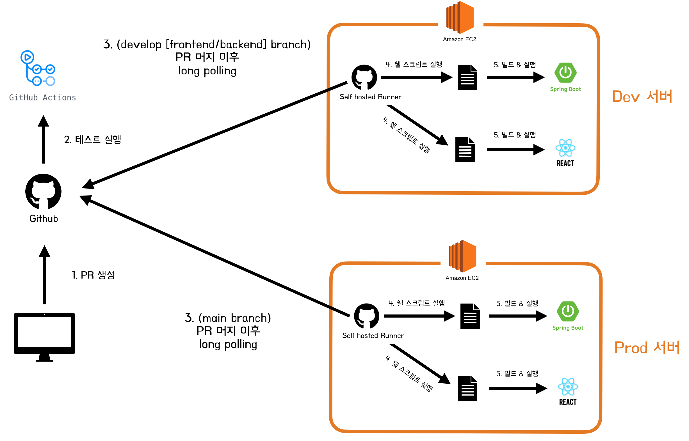
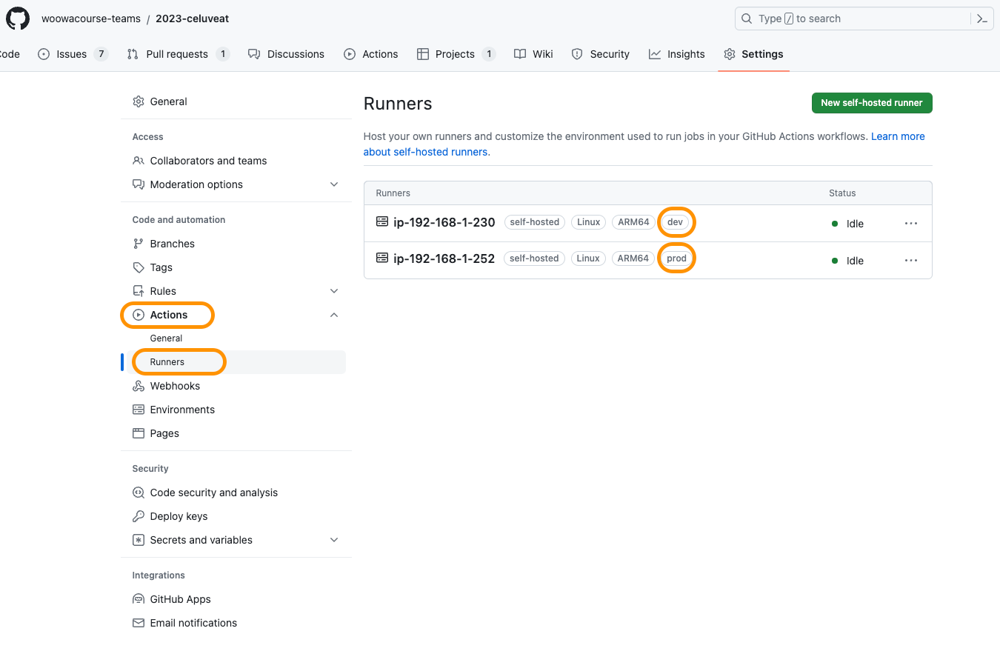

셀럽잇 CI/CD 발전기 - (2) Git 서브모듈 도입

<!--truncate-->

<br/>

### 셀럽잇 CI/CD 발전기 시리즈
- [(1) 쉘 스크립트를 통한 배포 자동화](../cicd-1/cicd.mdx)
- [(2) Git 서브모듈 도입](./cicd2.mdx)
- [(3) docker와 github actions를 통한 배포 자동화](../cicd-3/cicd3.mdx)

<br/>
<br/>
<br/>

## 🧐 서론

안녕하세요. 셀럽잇의 백엔드 말랑입니다.

3차 데모데이를 앞두고 프로덕션 서버를 준비하다 보니, 셀럽잇 팀의 CI/CD 방식에 변경 사항이 생겨서 이를 공유하기 위해 찾아왔습니다 😎

첫번째 변경점은 **Git Submodule**을 도입했다는 것입니다. <br/>

기능이 추가됨에 따라 **Dev** 환경과 **Prod** 환경에서 각각 설정해 주어야 하는 변수들이 많아지다 보니<br/>
이들이 **추가되거나 변경될 때마다** 매번 **서버에 들어가 배포 스크립트에 추가하고 수정**해주는 작업이 많이 번거로웠습니다.<br/>
또한 반드시 우테코 교육장에서만 ec2 서버에 ssh 로 접근을 할 수 있도록 설정되어있기 때문에, **집에 간 상황에서 설정을 바꾸어 줄 방법이 없었습니다**.

이러한 문제점을 해결하기 위해 저희는 **Git Submodule**을 도입했는데요,
서브모듈에 대한 기본적인 설명은 [말랑이의 블로그](https://ttl-blog.tistory.com/1346)에 나와있으므로 해당 글에서는 생략하도록 하겠습니다.

대신 서브 모듈을 도입하면서 발생했던 이슈들을 해결하는 과정을 서술하겠습니다.

<br />
<br />

두번째 변경점은 **프로덕션 서버를 위한 배포 스크립트가 작성**된 것입니다. <br/>

이전 글에서 작성하지 않은 **Prod 서버를 위한 CD workflow** 설정을 중심적으로 살펴보고,<br/>
하나의 Git Repository에서 `dev`와 `prod` 서버를 구분하여 배포하도록 설정하는 방법에 대해 살펴보겠습니다.

<br />
<br />
<br />
<br />
<br />

## 🧐 Submodule 적용 트러블슈팅

저희 팀은 CD를 `Github Actions Self-hosted Runners`를 통해 수행하는데요,
이때 Workflow를 다시 살펴보겠습니다.

```yml
name: ✨ Celuveat backend DEV CD ✨

on:
  push:
    branches:
      - develop-backend
    paths:
      - "backend/**"

jobs:
  deploy-backend:
    runs-on: self-hosted

    steps:
      - name: ✨ Run Backend Deploy Script
        run: |
          cd ~
          sudo ./deploy-backend.sh
```

마지막 부분을 보면 아시겠지만, `sudo`를 통해서 배포 스크립트를 실행하는데요, 이때 문제가 발생합니다.

[말랑이의 Git Submodule 설명 글](https://ttl-blog.tistory.com/1346)의
[EC2에서 Private Repository에 대한 인증 문제 해결하기](https://ttl-blog.tistory.com/1346#%F0%9F%A7%90%20EC2%EC%97%90%EC%84%9C%20Private%20Repository%EC%97%90%20%EB%8C%80%ED%95%9C%20%EC%9D%B8%EC%A6%9D%20%EB%AC%B8%EC%A0%9C%20%ED%95%B4%EA%B2%B0%ED%95%98%EA%B8%B0-1)
부분을 보고 똑같이 적용하였는데, git submodule update를 하는 과정에서 `Permission denied (publickey)` 오류가 발생하였습니다.

이에 대한 원인을 찾아보니, git 에서 sudo 명령을 되도록 사용해서는 않는것을 권장한다고 하며,
`sudo 없이 ssh 키를 생성`한 다음 `sudo git push`와 같은 명령을 사용하면 `생성한 것과 동일한 키가 사용되지 않는다`고
[다음 문서](https://docs.github.com/ko/authentication/troubleshooting-ssh/error-permission-denied-publickey)에 나와있었습니다.

<br />
<br />
<br />
<br />

### 🐳 왜 문제인가?

`sudo` 명령을 통해 쉘 스크립트를 실행하게 되면, `쉘 스크립트에서 사용되는 모든 명령어`가 `sudo 권한`으로 실행되게 됩니다.

그런데 이때 배포 스크립트에는 다음 명령어가 존재했습니다.

```bash
# ...생략

git submodule update

# ...생략
```

즉 위 명령이 실제로는 `sudo git submodule update`로 실행되는 것이었습니다.

EC2에서 Private repository에 대한 인증 처리를 위해 서브모듈의 URL을 **ssh**로 설정하였기에
`git submodule update`를 위해서는 `ssh key`가 필요한 상황이었습니다.

그러나 위 문서의 설명에 나와있듯이 `sudo 없이 ssh 키를 생성`한 다음 `sudo git update submodule` 명령어를 사용하였기에,
`생성한 것과 동일한 키가 사용되지 않아` 문제가 발생했던 것이었습니다.

<br />
<br />
<br />
<br />

### 🐳 어떻게 해결하나요?

간단합니다.
sudo 없이 ssh 키를 생성한 것이 문제였기 때문에, `sudo 명령어와 함께 ssh 키를 생성`해주면 됩니다.

이때 sudo 명령어로 생성된 키는 `cat ~/.ssh/id_rsa.pub`로는 바로 볼 수 없으며,

`sudo su` 명령을 통해 root 계정으로 전환 후 `cat ~/.ssh/id_rsa.pub`를 실행해 주어야 합니다.
(해당 과정도 블로그 글에 업데이트 해두었으니, 상세한 설명은 블로그를 참조해주시면 감사하겠습니다.)

<br />
<br />
<br />
<br />
<br />
<br />
<br />
<br />

## 🧐 개발 서버(Dev)와 프로덕션 서버(Prod)의 배포 자동화하기

프로덕션 서버를 포함한 저희의 CI/CD 구조는 다음과 같습니다.


구조를 보면 알 수 있듯이, `develop-frontend` 브랜치와 `develop-backend` 브랜치에 PR이 Merge되면,<br/>
`dev 서버`의 frontend와 backend의 배포 스크립트를 각각 실행시키는 방법을 사용하고 있습니다.

또한 `main` 브랜치에 PR이 Merge되면 `prod 서버`의 frontend와 backend의 배포 스크립트를 실행시킵니다.

이때 `dev 서버`와 `prod 서버` 모두 `self-hosted runners`를 각각 실행하고 있는 상태입니다.

이 상황에서 어떻게 `workflow`에 따라 특정 서버의 `self-hosted runners`만 실행할 수 있을까요? <br/>
(더 정확히는 어떻게 **PR이 Merge되는 브랜치에 따라** 특정 `self-hosted runners`만 실행되도록 설정할 수 있을까요?)

<br />
<br />
<br />
<br />

### 🐳 Runners 의 Label 활용하기

([다음 문서](https://docs.github.com/en/actions/hosting-your-own-runners/managing-self-hosted-runners/using-self-hosted-runners-in-a-workflow#using-custom-labels-to-route-jobs)를 참고하여 설정하였습니다.)

`Actions`의 `Runners`는 `Label`을 가질 수 있습니다.



위 사진과 같이, 저희는 dev 서버와 prod 서버의 Runner 에 대하여, 각각 `dev`와 `prod`라는 label을 붙여주어 이들을 구분지었습니다.

그리고 백엔드의 DEV 서버용 CD workflow를 다음과 같이 수정하였습니다.

<br />

#### 🚀 백엔드 DEV용 CD workflow

```yml
name: ✨ Celuveat backend DEV CD ✨

on:
  push:
    branches:
      - develop-backend
    paths:
      - "backend/**"

jobs:
  deploy-backend:
    runs-on: [self-hosted, dev] ## 추가

    steps:
      - name: ✨ Run Backend Deploy Script
        run: |
          cd ~
          sudo sh deploy-backend.sh
```

<br />
<br />

이후 백엔드의 PROD 서버용 CD workflow를 다음과 같이 작성하였습니다.

<br />

#### 🚀 백엔드 PROD용 CD workflow

```yml
name: ✨ Celuveat backend PROD CD ✨

on:
  push:
    branches:
      - main
    paths:
      - "backend/**"

jobs:
  deploy-backend:
    runs-on: [self-hosted, prod]

    steps:
      - name: ✨ Run Backend Deploy Script
        run: |
          cd ~
          sudo sh deploy-backend.sh
```

<br />
<br />
<br />
<br />
<br />
<br />

## 😎 마무리

이렇게 해서 셀럽잇 팀의 변경된 CI/CD 아키텍처를 살펴보았습니다.

생각보다 제 블로그로 서브모듈 관련 내용을 넘어가니 정리할 내용이 얼마 없었네요 :)

읽어주셔서 감사합니다 😊

<br />
<br />
<br />
