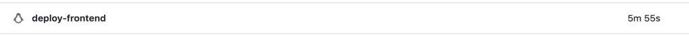
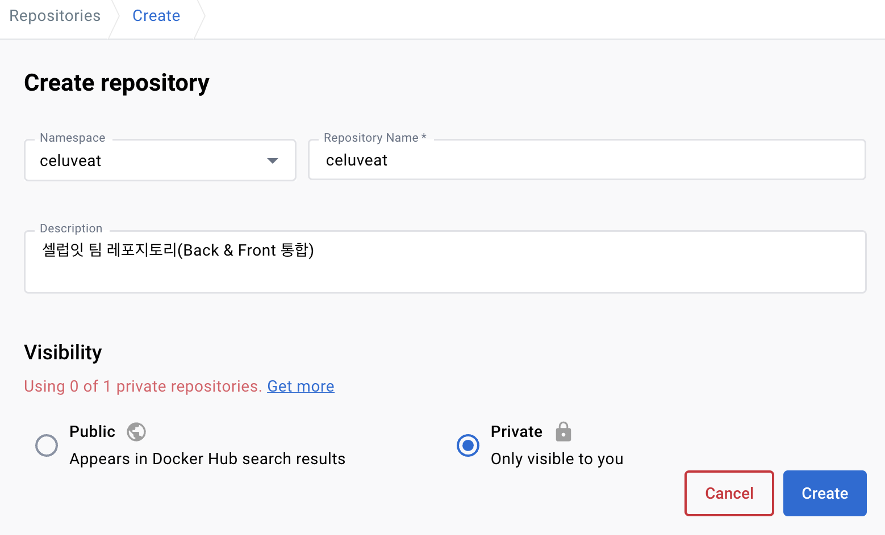
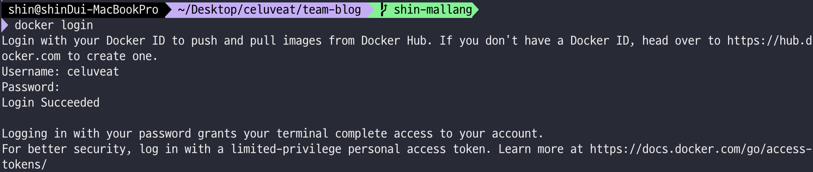

셀럽잇 CI/CD 발전기 - (3)

<!--truncate-->

<br />
<br />
<br />

## 🧐 서론

안녕하세요. 셀럽잇의 백엔드 말랑입니다.

다른 팀들과 마찬가지로 셀럽잇 팀도 지난주에 실제 서버에 배포하는 과정을 진행했는데요, 그 과정에서 서버가 거의 죽어가는 상황이 발생했습니다 😢



그 당시 서버의 여유 메모리를 확인해보니 이미 `Swap Memory`를 `2GB` 쓰고 있는 상황이었음에도 `20~50mb` 정도밖에 남지 않았습니다.

이 문제는 일시적으로 발생했어서 지금 다시 실행해보면 최소 500Mb 정도의 여유 메모리가 남게 되는데요, <br/>
지금 당장은 문제가 되지 않더라도 언젠가는 문제가 될 수 있기 때문에 이를 해결해보려 합니다.


<br />
<br />
<br />
<br />
<br />

## 🧐해결 방법 생각하기
가장 간단히 생각할 수 있는 방법으로는 `Swap Memory`를 더 많이 할당하는 것입니다.

다음 [RedHat의 문서](https://access.redhat.com/documentation/en-us/red_hat_enterprise_linux/8/html/managing_storage_devices/getting-started-with-swap_managing-storage-devices#recommended-system-swap-space_getting-started-with-swap)에 따라
서버의 RAM이 2GiB인 저희는 2배인 4GB 정도를 할당하는 것으로 가장 무난하게 문제를 해결할 수 있습니다.
스토리지 용량도 20GB를 할당하여 사용하고 있으므로, 4GB의 Swap Memory로 인해 문제가 생길 것이라고는 판단되지 않습니다.

위 방법으로 해결하는 것이 가장 간단했지만, 이왕 문제가 발생한김에 기존에 불편하다고 느꼈던 부분들도 모두 해결하기 위해 다른 방법을 사용하기로 결정했습니다.

<br />
<br />
<br />
<br />
<br />


## 🧐 추가적인 불편 사항
(절대 도커 쓰고싶어서 느끼는 억지 불편함이 아님을 밝힙니다)

셀럽잇은 배포 자동화를 위해 프론트엔드와 백엔드별로 배포 스크립트를 만들어둔 후,
Github Actions의 Self Hosted Runner를 통해 각 서버의 배포 스크립트를 실행하고 있습니다.

이를 위해서는 다음과 같은 사전 작업이 필요합니다.
 1. 각 서버(dev, prod)에 `java`와 `yarn`, `node` 등 프로그램을 실행하기 위한 환경이 미리 설정되어 있어야 합니다.
 2. 각 서버에 필요한 `배포 스크립트`를 미리 작성해서 넣어주어야 합니다.
 3. 배포 과정에 변경 사항이 생긴다면 각 서버의 스크립트를 `동일하게 변경`해주어야 합니다.

위는 모두 다 셀럽잇 팀이 배포를 진행하며 겪었던 어려움과 귀찮음이며,
무엇보다 문제인 점은 `우테코 교육장 내에서만 EC2에 ssh 로 접근`할 수 있기에 위 3개의 작업 모두
퇴근한 뒤 집에서는 수행할 수 없다는 것이었습니다.

<br/>
<br/>

우테코가 끝난 뒤 프로젝트를 지속하기 위해 서버를 따로 사용할 경우에도 위와 같은 설정을 또 진행해 주어야 하는데요,
상상만 해도 너무 귀찮은 나머지 이러한 불편함을 해소하고자 `Docker 🐳`를 도입하기로 했습니다.


<br/>
<br/>
<br/>
<br/>
<br/>


## 🧐 Docker를 사용한 CD 아키텍처
이번에 구성한 CD 아키텍처는 다음과 같습니다.


전체적인 Flow는 다음과 같습니다.
 1. main 브랜치에 pr에 merge되는 순간 github actions의 CD workflow가 동작합니다.
 2. workflow에서는 DockerFile을 통해 react 혹은 spring 애플리케이션 이미지를 생성한 뒤 DockerHub에 Push합니다.
 3. 이후 self hosted runners를 동작시켜 DockerHub에서 DockerFile을 Pull 받습니다.
 4. Pull 받은 DockerFile을 실행시킵니다.

이제부터 위 아키텍처를 차근차근 구성해 나가도록 할텐데요, 그 전에 Docker에 대해서 정말 간단히만 알아보도록 하겠습니다.
자세한 내용은 [공식문서](https://docs.docker.com/)를 포함한 여러 좋은 자료들이 있으므로 이들을 참고해주시면 좋을 것 같습니다.😎

<br/>
<br/>

### 🚀 DockerFile이 뭔가요?
`Docker Image`를 만들기 위한 설정 파일입니다.

<br/>
<br/>

### 🚀 Docker Image는 뭔가요?
코드, 런타임, 시스템 도구, 라이브러리 및 설정과 같은 응용 프로그램을 실행하는 데 필요한 모든 것을 포함하는 실행 가능한 패키지입니다.
`Docker Image`를 실행시킴으로써 `Docker Container`가 생성됩니다.

<br/>
<br/>

### 🚀 Docker Container는 뭔가요?
컨테이너는 이미지의 실행 가능한 인스턴스입니다.
즉 이미지로부터 컨테이너가 생성되며, 컨테이너는 코드와 모든 종속성을 패키지화하여 응용 프로그램이 하나의 컴퓨팅 환경에서 실행될 수 있도록 합니다.


<br/>
<br/>
<br/>
<br/>
<br/>
<br/>
<br/>

## 🧐 백엔드 CD 플로우를 로컬에서 실행해보기

바로 Docker를 통한 CD workflow를 작성하기 전에, 어떤 식으로 동작하는지를 알아야겠죠?<br/>
그래서 우선 전체적인 과정을 로컬에서 직접 진행한 뒤, 해당 과정을 바탕으로 workflow를 작성하여 실행하도록 하겠습니다.

<br/>
<br/>

### 🚀 DockerFile 작성하기

작성된 DockerFile은 아래와 같습니다.

```dockerfile
FROM amazoncorretto:17-alpine-jdk

WORKDIR /app

COPY .backend/build/libs/celuveat-0.0.1-SNAPSHOT.jar /app/celuveat.jar

CMD ["java", "-jar", "celuveat.jar"]
```

한줄 한줄 살펴보도록 하겠습니다.

<br/>
<br/>

```dockerfile
FROM amazoncorretto:17-alpine-jdk
```

Docker 이미지 생성 시 기반이 되는 이미지 레이어를 정의하는 부분입니다.<br/>
저희의 프로젝트는 자바 17버전을 사용하므로 amazoncorretto의 jdk 17버전을 Base image로 가지고 오도록 합니다.


<br/>
<br/>

```dockerfile
WORKDIR /app
```

도커 컨테이너 내에서의 작업 디렉토리를 `/app`으로 설정합니다.<br/>
이후 진행되는 작업들은 모두 `/app`  내부에서 진행됩니다.

<br/>
<br/>

```dockerfile
COPY ./build/libs/celuveat-0.0.1-SNAPSHOT.jar /app/celuveat.jar
```
COPY를 통해 컨테이너 외부의 파일을 컨테이너 내부로 복사할 수 있습니다.

빌드된 jar파일은 컨테이너 내부에서 실행해야 하므로, COPY 명령어를 통해 컨테이너의 `/app 디렉토리(WORKDIR)`의 내부로 이동시켜줍니다.

<br/>
<br/>

```dockerfile
CMD ["java", "-jar", "celuveat.jar"]
```
Jar 파일을 실행시키는 부분입니다.

<br/>
<br/>
<br/>
<br/>
<br/>

### 🚀 DockerFile을 통해 Docker Image 빌드하기

이제 위 DockerFile을 빌드하여 Docker Image를 생성해보도록 하겠습니다.


DockerFile의 위치는 다음과 같습니다.


<br/>

DockerFile을 통해 Docker Image를 빌드하기 전에 Jar파일을 우선 빌드해야 합니다.


```bash
./gradlew bootJar
```

<br/>
<br/>

이후 다음 명령어를 통해 이미지를 빌드합니다.

```bash
docker build -t celuveat/celuveat-backend ./
```

- `-t <name>:<tag>` : 빌드할 Image의 이름과 tag를 정해줍니다.
 이때 tag는 생략 가능하며, 이름의 경우 편의를 위해 이후 생성할 DockerHub의 namespace/repository으로 지정하였습니다. <br/>
 저는 tag를 생략했으며, 이 경우 `latest`가 default tag로 붙습니다.


위와 같이 문제 없이 성공할 것인데요, 이제 생성된 이미지를 확인해보도록 하겠습니다.

<br/>
<br/>

다음 명령어를 입력합니다.

```bash
docker images
```


위와 같이 이미지도 잘 생성된 것을 확인할 수 있습니다.

<br/>

이제 해당 이미지를 DockerHub에 올린 뒤, EC2에서 이를 다운받아 실행해야 합니다.
우선 해당 이미지가 문제없는지 확인해보기 위해 로컬에서 실행해보도록 하겠습니다.

<br/>
<br/>
<br/>
<br/>
<br/>

### 🚀 DockerImage Local에서 실행해보기

다음 명령어를 입력합니다.

```bash
docker run \
-d \
--rm \
--name backend \
-p 8080:8080 \
-e "SPRING_PROFILE=local" \
celuveat/celuveat-backend
```

- -d : 백그라운드로 실행합니다.
- --name <이름> : 컨테이너의 이름을 지정합니다.
- --rm : 컨테이너가 종료되면 자동으로 컨테이너를 제거합니다.
- -p 8080:8080 : 호스트의 포트(외부 포트)(좌측 8080)를 컨테이너의 포트 8080으로 매핑합니다.
- -e : 환경변수를 설정합니다.
- celuveat/celuveat-backend : 실행할 Docker Image의 이름(정확히는 태그)을 명시합니다.

<br/>

위 명령어를 실행했을 때 다음과 같이 실행된다면 문제가 없는 것입니다.


<br/>

이어서 잘 실행되었는지 로그를 확인해보겠습니다.

```bash
docker logs backend
```


잘 실행되는 것을 확인할 수 있습니다.

<br/>

이제 로컬에서 실행중인 애플리케이션은 멈춘 뒤 이를 DockerHub에 올리도록 하겠습니다.

실행중인 애플리케이션은 다음과 같이 멈출 수 있습니다.
```
docker stop backend || true
```
여기서 `backend`는 `container`의 이름입니다.
- || true : 도중에 오류가 발생해도 스크립트를 중단하지 않고 계속 진행하도록 합니다.


다음과 같이 컨테이너가 종료되었으며, --rm 옵션으로 인해 자동으로 제거된 것 까지 확인할 수 있습니다.


<br/>
<br/>
<br/>
<br/>
<br/>

### 🚀DockerHub에 Docker Image Push하기
이제 DockerHub에 Docker Image를 Push하는 과정을 알아보도록 하겠습니다.

우선 이를 위해 DockerHub에 가입한 뒤, 다음과 같이 Repository를 생성합니다.


<br/>
<br/>

이제 이곳에 push하는것은 간단합니다.

```bash
docker login
```




<br/>
<br/>

```bash
docker push celuveat/celuveat-backend
```


<br/>

(이때 만약 build 시 tag를 다르게 주었다면, 다음 명령어를 통해 tag를 새로 달아주어야 합니다.
```java
docker tag <로컬이미지이름>:<태그> <dockerhub namespace>/<repository 이름>:<태그>
```
또한 이때 태그는 생략 가능하며, 생략하는 경우 latest가 default로 붙습니다.)

<br/>
<br/>

push 이후 DockerHub의 Repository로 들어가보면, 다음과 같이 잘 push되어 있는것을 확인 수 있습니다.


<br/>
<br/>
<br/>
<br/>
<br/>

### 🚀 EC2에서 Image를 Pull 받아 실행해보기
이제 EC2에서 DockerHub에 올라간 이미지를 Pull받아 이를 실행시키도록 하겠습니다.
우선 이를 위해 테스트용 EC2를 하나 새로 생성해 주었습니다.

Docker를 사용하기 때문에 EC2에 java를 따로 설치할 필요는 없지만, docker는 설치해주어야 합니다.<br/>
[다음 문서](https://docs.docker.com/engine/install/ubuntu/)에 따라 설치를 진행합니다.
```bash
sudo apt-get update
sudo apt-get install ca-certificates curl gnupg
```

```bash
sudo install -m 0755 -d /etc/apt/keyrings
curl -fsSL https://download.docker.com/linux/ubuntu/gpg | sudo gpg --dearmor -o /etc/apt/keyrings/docker.gpg
sudo chmod a+r /etc/apt/keyrings/docker.gpg
```

```bash
echo \
  "deb [arch="$(dpkg --print-architecture)" signed-by=/etc/apt/keyrings/docker.gpg] https://download.docker.com/linux/ubuntu \
  "$(. /etc/os-release && echo "$VERSION_CODENAME")" stable" | \
  sudo tee /etc/apt/sources.list.d/docker.list > /dev/null
```

```bash
sudo apt-get update
```

```bash
sudo apt-get install docker-ce docker-ce-cli containerd.io docker-buildx-plugin docker-compose-plugin
```

<br/>
<br/>

이제 DockerHub에서 image를 pull 받아 사용하도록 하겠습니다.

저희는 private repository를 사용하므로 우선 로그인을 진행해야 합니다.

```bash
docker login
```

그런데 위 명령어를 실행해서 인증을 진행하면, 다음과 같이 `permission denied` 오류가 뜰 것입니다.


위 오류는 Docker의 데몬 소켓 파일인 `/var/run/docker.sock`에 대한 접근 권한이 부족하여 발생하는 오류입니다.

<br/>

이를 해결하는 방법은 크게 두가지가 있는데, 하나는 `sudo`를 사용하는 것이고, 다른 하나는 Docker 그룹에 사용자를 추가하는 것입니다.<br/>
저는 두번째 방법으로 해결해 보도록 하겠습니다.<br/>

```bash
sudo usermod -aG docker $USER
```
위는 현재 사용자($USER)를 docker 그룹에 추가하는 명령어입니다.

<br/>

이후 다음 명령어를 실행합니다.

```bash
newgrp docker
```

<br/>

이제 다시 로그인을 시도하면 성공하는 것을 확인할 수 있습니다.


<br/>
<br/>


DockerHub에서 Image를 Pull 하도록 하겠습니다.

```bash
docker pull celuveat/celuveat-backend
```
(만약 태그를 붙여주었다면 태그도 같이 명시해주어야 합니다. 명시하지 않으면 latest가 default로 붙습니다.)


<br/>

이제 해당 이미지를 실행해보도록 하겠습니다.
```bash
docker run \
-d \
--rm \
--name backend \
-p 8080:8080 \
-e "SPRING_PROFILE=local" \
celuveat/celuveat-backend
```


애플리케이션이 잘 실행되는 것을 확인할 수 있습니다.
이제 이를 stop 명령어를 통해 종료해준 후, 테스트를 끝마치도록 하겠습니다.

<br/>
<br/>
<br/>
<br/>
<br/>

## 🧐 백엔드 CD workflow 작성하기
이제 위 과정을 Github Actions와 self-hosted runners를 통해 자동화할 수 있도록 workflow를 작성하도록 하겠습니다.
(dev와 prod는 대체로 동일하므로, prod용 workflow만을 작성하도록 하겠습니다.)

```yml
name: ✨ Celuveat backend PROD CD ✨

env:
  PROFILE: prod
  IMAGE_TAG: prod-${{ secrets.APP_VERSION_TAG }}
  DOCKER_CONTAINER_NAME: backend

on:
  push:
    branches:
      - main
    paths:
      - "backend/**"

jobs:
  backend-docker-build-and-push:
    runs-on: ubuntu-latest
    defaults:
      run:
        working-directory: ./backend

    steps:
      - name: ✨ Checkout repository
        uses: actions/checkout@v3
        with:
          submodules: true
          token: ${{ secrets.ACTION_TOKEN }}

      - name: ✨ JDK 17 설정
        uses: actions/setup-java@v3
        with:
          java-version: '17'
          distribution: 'temurin'

      - name: ✨ Gradlew 권한 설정
        run: chmod +x ./gradlew

      - name: ✨ Jar 파일 빌드
        run: ./gradlew bootJar

      - name: ✨ DockerHub에 로그인
        uses: docker/login-action@v2
        with:
          username: ${{ secrets.DOCKERHUB_BACKEND_USERNAME }}
          password: ${{ secrets.DOCKERHUB_BACKEND_PASSWORD }}

      - name: ✨ Docker Image 빌드 후 DockerHub에 Push
        uses: docker/build-push-action@v4
        with:
          context: .
          file: ./backend/Dockerfile
          push: true
          platforms: linux/arm64
          tags: celuveat/celuveat-backend:${{ env.IMAGE_TAG }}

  backend-docker-pull-and-run:
    runs-on: [self-hosted, prod]
    if: ${{ needs.backend-docker-build-and-push.result == 'success' }}
    needs: [ backend-docker-build-and-push ]
    steps:
      - name: ✨ DockerHub에서 Image Pull
        run: |
          docker login --username ${{ secrets.DOCKERHUB_BACKEND_USERNAME }} --password ${{ secrets.DOCKERHUB_BACKEND_PASSWORD }}
          docker pull celuveat/celuveat-backend:${{ env.IMAGE_TAG }}
          docker stop ${{ env.DOCKER_CONTAINER_NAME }} || true
          docker container prune -f
          docker image prune -f

      - name: ✨ Docker Image 실행
        run: |
          docker run \
            -d \
            --name ${{ env.DOCKER_CONTAINER_NAME }} \
            -p 8080:8080 \
            -e "SPRING_PROFILES_ACTIVE=${{ env.PROFILE }}" \
            celuveat/celuveat-backend:${{ env.IMAGE_TAG }}
```

<br/>

이를 하나하나 살펴보도록 하겠습니다.

<br/>

```yml
env:
  PROFILE: prod
  IMAGE_TAG: prod-${{ secrets.APP_VERSION_TAG }}
  DOCKER_CONTAINER_NAME: backend
```
yml 내에서 사용할 변수들을 정의해주는 부분입니다.
- PROFILE: 스프링을 실행할 때 `SPRING_PROFILES_ACTIVE`의 값으로 줄 값입니다. 프로덕션용 workflow이므로 `prod`로 설정합니다.
- IMAGE_TAG: 도커 이미지를 환경&버전별로 관리하기 위한 태그를 만드는 부분으로, `prod-1.0.0` 의 형식으로 생성됩니다.
- DOCKER_CONTAINER_NAME: Docker Image 로부터 생성될 Container의 이름을 정의해주는 부분입니다.

<br/>
<br/>

```yml
on:
  push:
    branches:
      - main
    paths:
      - "backend/**"
```
해당 워크플로우가 언제 동작할지를 정의하는 부분입니다.

main 브랜치에 push가 발생하였을 때, backend의 하위 디렉토리에 변경이 생겼을 경우 해당 workflow가 동작합니다.

<br/>
<br/>

```yml
jobs:
  backend-docker-build-and-push:
    # ...

  backend-docker-pull-and-run:
    # ...
```
workflow에서 실행할 작업(job)들을 정의하는 부분입니다.
해당 workflow에서는 `backend-docker-build-and-push`와 `backend-docker-pull-and-run` 라는 이름의 작업이 두개 존재합니다.

<br/>
<br/>

```yml
backend-docker-build-and-push:
  runs-on: ubuntu-latest
  defaults:
    run:
      working-directory: ./backend
```
- backend-docker-build-and-push : 작업이 수행되는 환경은 ubuntu-latest입니다.
- defaults.run.working-directory: ./backend : defaults 를 통해 아래의 단계에서 공통으로 사용되는 설정을 지정하였습니다.
해당 작업에서는 `working-directory`를 설정하여 이후의 단계들은 모두 `./backend` 디렉토리 내에서 실행됩니다.

<br/>
<br/>

```yml
steps:
  - name: ✨ Checkout repository
    uses: actions/checkout@v3
    with:
      submodules: true
      token: ${{ secrets.ACTION_TOKEN }}
```
on에 정의된 main 브랜치로 checkout하며, 동시에 submodules을 포함하여 가져오도록 설정하였습니다.

이때 Secret에 ACTION_TOKEN으로 정의된 값을 사용하는데, 해당 값은 아래와 같이 발급하여 사용할 수 있습니다.


(깃허브의 우측 상단 프로필 이미지를 클릭 -> Settings)

<br/>
<br/>


(Developer Settings 클릭)

<br/>
<br/>


(Personal Access Token -> Tokens (classic) -> Generate new token -> Generate new token (classic))


<br/>
<br/>


`repo`에 대해서만 체크해주시면 됩니다.

이렇게 해서 생성된 Token을 Repository Secret으로 설정해주면 됩니다.<br/>
(workflow를 사용할 Repository -> Settings -> Secrets and variables -> New repository secret을 통해 설정할 수 있습니다.)


<br/>
<br/>

```yml
- name: ✨ JDK 17 설정
  uses: actions/setup-java@v3
  with:
    java-version: '17'
    distribution: 'temurin'
```

사용할 자바 버전을 설정하는 부분입니다.
17버전을 사용하도록 설정하였습니다.


<br/>
<br/>

```yml
- name: ✨ Gradlew 권한 설정
  run: chmod +x ./gradlew

- name: ✨ Jar 파일 빌드
  run: ./gradlew bootJar
```

gradlew 실행 권한을 부여한 후 jootJar을 통해 jar 파일을 빌드하는 부분입니다.

<br/>
<br/>

```yml
- name: ✨ DockerHub에 로그인
  uses: docker/login-action@v2
  with:
    username: ${{ secrets.DOCKERHUB_BACKEND_USERNAME }}
    password: ${{ secrets.DOCKERHUB_BACKEND_PASSWORD }}
```
Secrets에 정의한 username과 password를 통해 DockerHub에 로그인하는 부분입니다.


<br/>
<br/>

```yml
- name: ✨ Docker Image 빌드 후 DockerHub에 Push
  uses: docker/build-push-action@v4
  with:
    context: ./backend
    file: ./backend/Dockerfile
    push: true
    platforms: linux/arm64
    tags: celuveat/celuveat-backend:${{ env.IMAGE_TAG }}
```
- [docker/build-push-action@v4](https://github.com/docker/build-push-action)를 통해 DockerHub에 이미지를 push하는 과정을 진행합니다.
- context: Docker Image를 빌드할 컨텍스트 경로를 지정합니다. ./backend을 통해 백엔드 디렉토리(루트)로 지정했습니다.
- file: 이미지를 빌드할 DockerFile의 위치를 지정합니다.
- push: DockerHub에 이미지를 푸쉬할지 여부를 지정합니다. true로 설정하여 푸쉬하도록 해주었습니다.
- 빌드할 이미지 플랫폼을 지정합니다. 저희의 서버는 ubuntu(Linux/UNIX) 64-bit(ARM) 이므로 linux/arm64로 지정하였습니다.
- 빌드될 이미지의 태그를 지정합니다.

<br/>
<br/>

위 과정을 진행하면 DockerHub에 다음과 같이 이미지가 올라가게됩니다.


이어서 EC2에서 Self hosted Runner를 통해 해당 이미지를 Pull 받아 실행하는 부분을 살펴보겠습니다.

<br/>
<br/>

```yml
backend-docker-pull-and-run:
  runs-on: [self-hosted, prod]
  if: ${{ needs.backend-docker-build-and-push.result == 'success' }}
  needs: [ backend-docker-build-and-push ]
```
- runs-on: 작업이 실행될 환경을 진행합니다. prod 환경의 self-hosted-runner를 실행시키기 위해 이와 같이 지정했습니다.
(prod는 이전 글에서 살펴보았듯이, 직접 self hosted runners에 직접 붙여준 label입니다.)
- if: 이전 작업인 backend-docker-build-and-push가 성공했을 경우에만 실행되도록 if를 통해 조건을 지정해주었습니다.
- needs: 해당 작업이 의존하는 작업을 지정합니다. 해당 작업은 backend-docker-build-and-push 뒤에 실행되야 하므로 needs를 통해 지정해주었습니다.

<br/>
<br/>

```yml
steps:
  - name: ✨ DockerHub에서 Image Pull
    run: |
      docker login --username ${{ secrets.DOCKERHUB_BACKEND_USERNAME }} --password ${{ secrets.DOCKERHUB_BACKEND_PASSWORD }}
      docker pull celuveat/celuveat-backend:${{ env.IMAGE_TAG }}
      docker stop ${{ env.DOCKER_CONTAINER_NAME }} || true
      docker container prune -f
      docker image prune -f
```
- docker login ~ : dockerhub에 로그인하는 부분입니다.
- docker pull ~ : 이전 작업에서 dockerhub에 push한 이미지를 pull하는 부분입니다.
- docker stop ~ : EC2에 실행중인 docker container(여기서는 Spring Application)가 있으면 이를 종료합니다.
- || true : 명령어 실행 중 오류가 발생하더라도 스크립트를 계속 실행하도록 합니다. 여기서는 stop 명령어 실행 시 컨테이너가 없더라도 오류가 발생하지 않도록 합니다.


<br/>
<br/>


<br/>
<br/>

```yml
- name: ✨ Docker Image 실행
  run: |
    docker run \
      -d \
      --name ${{ env.DOCKER_CONTAINER_NAME }} \
      -p 8080:8080 \
      -e "SPRING_PROFILES_ACTIVE=${{ env.PROFILE }}" \
      celuveat/celuveat-backend:${{ env.IMAGE_TAG }
```

<br/>
<br/>
<br/>
<br/>
<br/>

## 🧐 성능 향상 고려하기
Volumn을 사용해서 build된 파일만 보내주고, 이를 실행만 시킴으로써 환경 구성은 그대로 두고 성능 향상 꾀하기

그래이들 캐싱도 얼마나 단축되는지?
