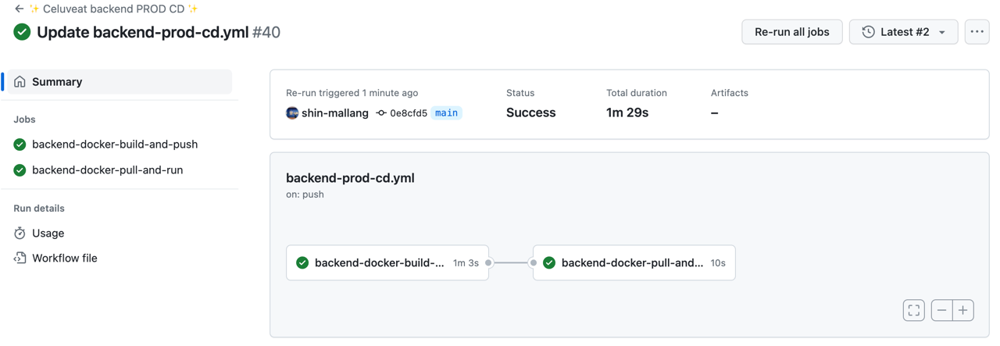
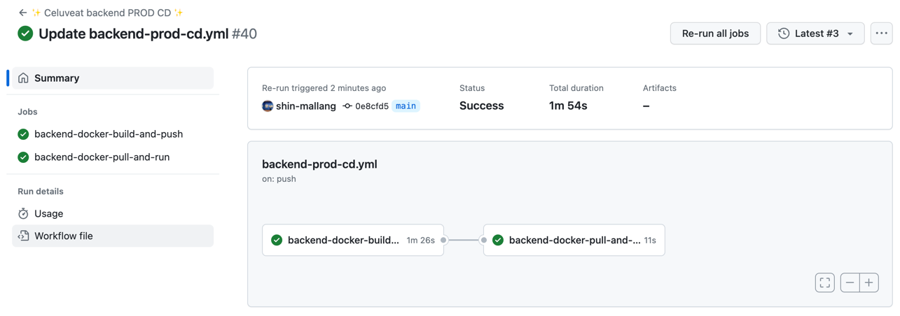
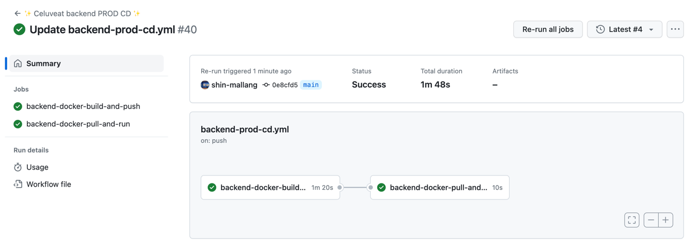
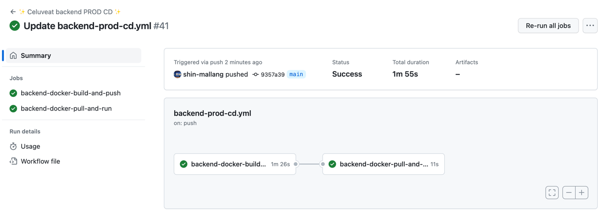
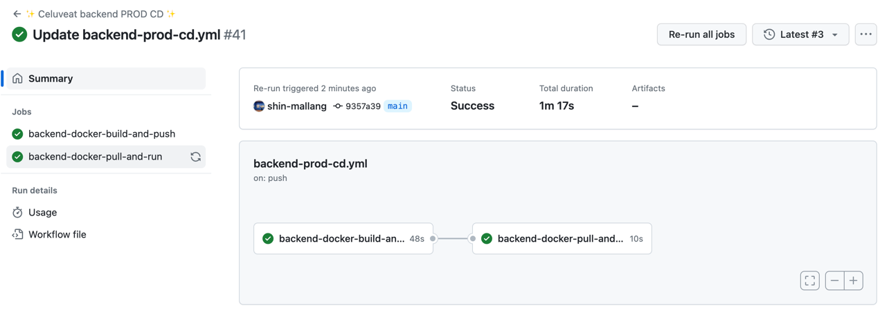
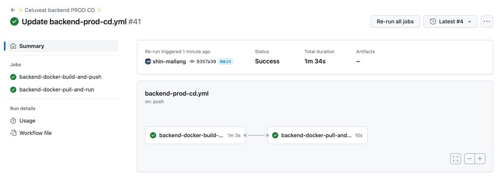
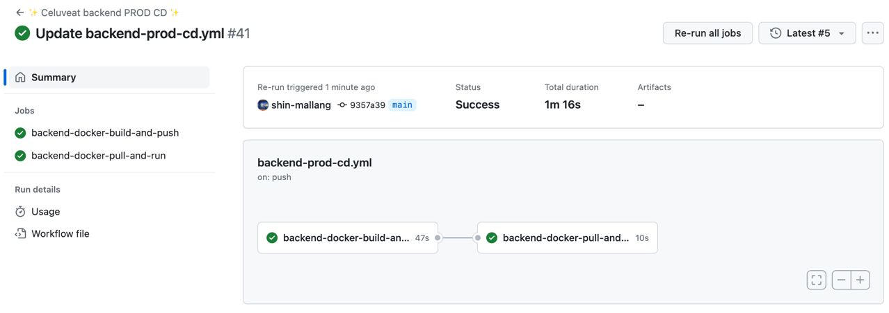

셀럽잇 CI/CD 발전기 - (4) CD 속도 향상기

<!--truncate-->

<br />
<br />

## 🧐 서론

안녕하세요. 셀럽잇의 백엔드 말랑입니다.

저희는 github actions와 docker를 사용하여 CD 워크플로우를 구성하였는데요,
해당 워크플로우가 한 번 실행될 때마다 1분 이상의 시간이 걸리는 것을 확인하고 있었습니다.

물론 어떻게 보면 그리 긴 시간은 아닐 수 있지만, 그래도 빠르면 빠를수록 좋잖아요?

그래서 이번 글에서는 CD 워크플로우의 속도를 향상시켜보는 시간을 가지도록 하겠습니다.

<br />
<br />
<br />
<br />
<br />
<br />

## 🧐Gradle Caching

현재 github actions의 workflow가 (jar 파일의 변경 없이) 전체 작업을 수행하는데 걸리는 시간은 다음과 같습니다.






평균적으로 1분 10초 정도의 시간이 걸리는 것을 알 수 있습니다.

이를 줄이기 위해 Gradle Caching을 해보도록 하겠습니다.

<br/>
<br/>
<br/>

### 🚀 Gradle Caching이란?
(참고 - [공식문서](https://docs.gradle.org/current/userguide/core_dependency_management.html#sec:dependency-mgmt-in-gradle))<br/>
Gradle은 빌드 시에 작업(Task)의존성 패키지들을 모두 가져온 뒤, 이들을 dependency cache라 불리는 로컬 캐시에 보관하여
이후 호출에서 불필요한 네트워크 호출을 방지하는 전략을 사용합니다.

그러나 Github Actions의 workflow에서는 매 실행마다 새롭게 의존성들을 가지고 오게 됩니다.<br/>
의존성을 가져오기 위해 대체로 네트워크 호출을 사용하기 때문에, 해당 과정이 없어진다면 전체 빌드 시간이 매우 단축될 것이라 예상할 수 있습니다.

한번 Gradle Caching을 적용하여 성능 향상이 얼마나 이루어지는지 확인해보도록 하겠습니다.
방법은 매우 간단합니다.
```yml
- name: ✨ Gradle Caching
  uses: actions/cache@v3
  with:
    path: |
        ~/.gradle/caches
        ~/.gradle/wrapper
    key: ${{ runner.os }}-gradle-${{ hashFiles('**/*.gradle*', '**/gradle-wrapper.properties') }}
    restore-keys: |
        ${{ runner.os }}-gradle-
```

위 코드를 추가해주면 되는데요, 이를 적용한 전체 workflow는 다음과 같습니다.

<br/>
<br/>

```yml
name: ✨ Celuveat backend PROD CD ✨

env:
  PROFILE: prod
  IMAGE_TAG: prod-${{ secrets.APP_VERSION_TAG }}
  DOCKER_CONTAINER_NAME: backend
  DOCKER_HUB_REPOSITORY: celuveat/celuveat

on:
  workflow_dispatch:
  push:
    branches:
      - main
    paths:
      - "backend/**"

jobs:
  backend-docker-build-and-push:
    runs-on: ubuntu-latest
    defaults:
      run:
        working-directory: ./backend

    steps:
      - name: ✨ Checkout repository
        uses: actions/checkout@v3
        with:
          submodules: true
          token: ${{ secrets.ACTION_TOKEN }}

      - name: ✨ JDK 17 설정
        uses: actions/setup-java@v3
        with:
          java-version: '17'
          distribution: 'temurin'

      - name: ✨ Gradle Caching
        uses: actions/cache@v3
        with:
          path: |
              ~/.gradle/caches
              ~/.gradle/wrapper
          key: ${{ runner.os }}-gradle-${{ hashFiles('**/*.gradle*', '**/gradle-wrapper.properties') }}
          restore-keys: |
              ${{ runner.os }}-gradle-

      - name: ✨ Gradlew 권한 설정
        run: chmod +x ./gradlew

      - name: ✨ Jar 파일 빌드
        run: ./gradlew bootJar

      - name: ✨ DockerHub에 로그인
        uses: docker/login-action@v2
        with:
          username: ${{ secrets.DOCKERHUB_USERNAME }}
          password: ${{ secrets.DOCKERHUB_PASSWORD }}

      - name: ✨ Docker Image 빌드 후 DockerHub에 Push
        uses: docker/build-push-action@v4
        with:
          context: ./backend
          file: ./backend/Dockerfile
          push: true
          platforms: linux/arm64
          tags: ${{ env.DOCKER_HUB_REPOSITORY }}:${{ env.IMAGE_TAG }}

  backend-docker-pull-and-run:
    runs-on: [self-hosted, prod]
    if: ${{ needs.backend-docker-build-and-push.result == 'success' }}
    needs: [ backend-docker-build-and-push ]
    steps:
      - name: ✨ DockerHub에서 Image Pull
        run: |
          docker login --username ${{ secrets.DOCKERHUB_USERNAME }} --password ${{ secrets.DOCKERHUB_PASSWORD }}
          docker pull ${{ env.DOCKER_HUB_REPOSITORY }}:${{ env.IMAGE_TAG }}
          docker stop ${{ env.DOCKER_CONTAINER_NAME }} || true
          docker container prune -f
          docker image prune -f

      - name: ✨ Docker Image 실행
        run: |
          docker run \
            -d \
            --name ${{ env.DOCKER_CONTAINER_NAME }} \
            -p 8080:8080 \
            -e "SPRING_PROFILES_ACTIVE=${{ env.PROFILE }}" \
            ${{ env.DOCKER_HUB_REPOSITORY }}:${{ env.IMAGE_TAG }}
```

<br/>
<br/>

캐싱을 적용한 github actions의 workflow가 (jar 파일의 변경 없이) 전체 작업을 수행하는데 걸리는 시간은 다음과 같습니다.

#### 첫 실행


#### 이후 실행





<br/>

간단한 그래이들 캐싱만으로도 (첫 실행 제외) 성능이 대략 25%정도 향상된 것을 확인할 수 있습니다.

<br/>
<br/>
<br/>
<br/>
<br/>
<br/>

## 🧐Docker Layer Caching
### 🚀 Docker Layer란?
도커 이미지는 빌드 시 Dockerfile에 적힌 명령어들을 실행하며 차례로 레이어를 생성합니다.
이때 RUN, ADD, COPY로 생성되는 레이어는 파일의 용량을 커지게 만들고, 이미지를 생성하는 시간도 길어지게 합니다.

<br/>

### 🚀 Docker Layer Caching
도커는 빌드를 실행할 때 이전 빌드의 레이어를 재사용하려고 시도합니다.
레이어가 변경되지 않은 경우, 이전 빌드의 레이어를 재사용함으로써 빌드 시간을 단축시킬 수 있습니다.
그리고 이는 도커의 이미지 빌더가 자동으로 수행해줍니다.

<br/>

### 🚀 Github Actions에서의 Docker Layer Caching
Github Actions의 러너는 매번 새로운 가상 환경에서 실행됩니다.<br/>
따라서 빌드를 여러번 수행하더라도 캐시되지 않고 매번 새롭게 수행됩니다.
그래서 그래이들 캐싱 부분에서 살펴보았던 것과 같이 Github Actions에서 캐싱을 하기 위해서는 ([별도의 설정](https://docs.github.com/en/actions/using-workflows/caching-dependencies-to-speed-up-workflows))을 진행해야 합니다.

<br/>

Docker Layer Caching의 경우, 현재 저희가 사용하는 actions인 [`docker/build-push-action@v4`](https://github.com/docker/build-push-action/tree/master)에서 편하게 설정해서 사용할 수 있도록 제공해주고 있습니다.

다음과 같이 설정할 수 있습니다.
```yml
- name: ✨ Docker Image 빌드 후 DockerHub에 Push
  uses: docker/build-push-action@v4
  with:
    context: ./backend
    file: ./backend/Dockerfile
    push: true
    platforms: linux/arm64
    tags: ${{ env.DOCKER_HUB_REPOSITORY }}:${{ env.IMAGE_TAG }}
    cache-from: type=gha
    cache-to: type=gha,mode=max
```
- `cache-from`과 `cache-to` 부분을 추가해주었고, 프론트 역시 동일하게 추가할 수 있습니다.
([참고](https://docs.docker.com/build/ci/github-actions/cache/#github-cache))

<br/>
<br/>


### 🚀 시간 비교

#### 백엔드 첫 실행

<br/>
<br/>

#### 백엔드 이후 실행

<br/>
<br/>

#### 프론트 첫 실행

<br/>
<br/>

#### 프론트 이후 실행


<br/>
<br/>
<br/>
<br/>
<br/>
<br/>

## 🧐 Jar 파일 Bind Mount
### 🚀 Bind Mount란?
([공식문서](https://docs.docker.com/storage/bind-mounts/))<br/>
Bind Mount는 쉽게 말해서 호스트 머신의 파일을 도커와 연결하는 것입니다.
이를 통해 도커 내부에서 생성하는 파일을 컨테이너 외부에서도 볼 수 있고,
또한 컨테이너 외부의 파일을 컨테이너 내부에서 사용할 수도 있습니다.


<br/>
<br/>

### 🚀 Jar 파일 Bind Mount를 통한 성능 향상
현재 백엔드의 Dockerfile은 다음과 같습니다.

```dockerfile
FROM amazoncorretto:17-alpine-jdk

WORKDIR /app

COPY ./build/libs/celuveat-0.0.1-SNAPSHOT.jar /app/celuveat.jar

CMD ["java", "-jar", "celuveat.jar"]
```

이때 COPY 명령어가 사용되는 것을 확인할 수 있습니다.

애플리케이션 코드가 변경되어 jar 파일이 새롭게 빌드된 경우, 이로 인해 이미지를 새로 빌드해야 하는 상황이 발생합니다.<br/>
그러나 사실 위 Dockerfile을 Jar파일을 Copy하는 부분을 제외하면 거의 변경될 일이 없는 이미지입니다.<br/>
즉 Jar파일만 따로 처리할 수 있도록 한다면 캐싱을 통해 성능을 향상할 수 있을 것입니다.


그래서 다음과 같은 방법을 통해 성능을 향상시켜보도록 하겠습니다.
1. DockerFile에서 Copy 부분을 제거한다
2. jar파일 빌드 후, 이를 SCP를 통해 EC2로 넘겨준다.
3. 컨테이너 실행 시 jar 파일을 bind mount로 연결하여 실행한다.


<br/>
<br/>


<br/>
<br/>

