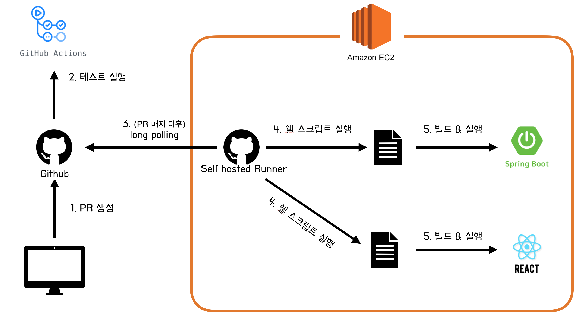
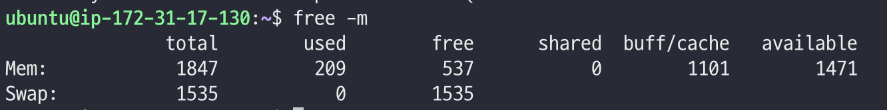
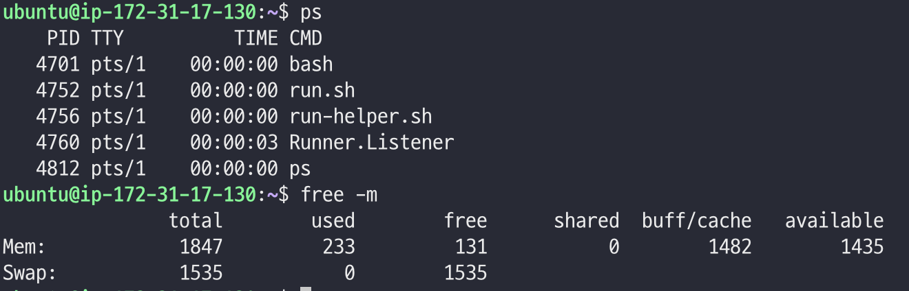
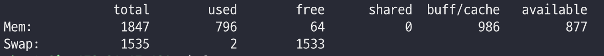
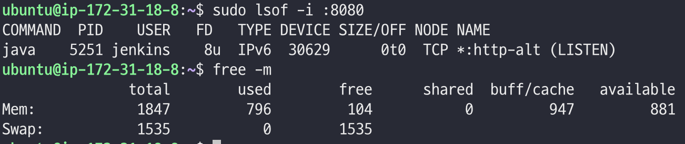
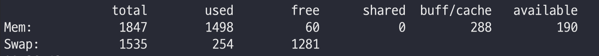

## 서론

안녕하세요. 셀럽잇의 백엔드 말랑입니다.

셀럽잇 팀의 CI/CD 아키텍처를 소개해 드리기 위해 찾아왔습니다 😎

셀럽잇 팀은 주어진 제약 내에서 배포 자동화를 달성하기 위해 많은 고민을 하였고, 최종적으로 다음과 같은 CI/CD 아키텍처를 도입하였습니다.

<br/>



<br/>


이러한 과정에서 생겨난 고민들과 발생했던 문제들을 살펴보며 전체적인 구축 과정을 소개해 드리려 합니다.


<br/>
<br/>
<br/>
<br/>

## 제약조건과 요구사항

### 컴퓨팅 파워
- 서버 개수: 최대 3대
- 서버 사양: 최대 t4g.small
- 스토리지: 최대 20GiB


### 요구사항
- 개발 서버와 프로덕션 서버의 분리


<br/>
<br/>
<br/>
<br/>

## 셀럽잇 팀의 git 브랜치 전략
CI/CD 아키텍처에 대한 소개 전에, 원할한 설명을 위하여 저희 팀의 git 브랜치 전략에 대해 우선 소개하도록 하겠습니다.

셀럽잇 팀은 gitflow 전략을 조금 수정하여 다음과 같이 5개의 브랜치를 사용합니다.
- `main` - 프로덕션용 브랜치
- `develop-backend` - 백엔드의 다음 출시 버전을 개발하는 브랜치
- `develop-frontend`- 프론트엔드의 다음 출시 버전을 개발하는 브랜치
- `feature` - 기능 개발 브랜치
- `hotfix` - main 브랜치에서 발생한 버그를 수정할 때 사용하는 브랜치

<br/>

### main 브랜치
`main` 브랜치에 존재하는 코드는 실제 서비스될 코드이기 때문에 항상 배포 가능한 상태여야 하며 기능이 완전히 구현된 상태여야 합니다.<br/>
`main` 브랜치는 `develop-backend` 브랜치와 `develop-frontend` 브랜치에서 기능들이 완성한 이후 `merge`됩니다.

<br/>

### develop-[backend/frontend] 브랜치
git flow의 `develop` 브랜치를 저희의 상황에 맞게 재구성한 브랜치로,
백엔드와 프론트엔드가 각각 서로의 영향을 받지 않고 개발을 이어갈 수 있도록 하기 위하여 위와 같이 구성하였습니다.

프로젝트에서는 하나의 `Repository`를 사용하기 때문에, 백엔드와 프론트엔드의 코드 파일 분리도 필요했는데요,
저희는 최상위 directory에서 `backend` 폴더와 `frontend` 폴더를 두어 코드를 분리하였습니다.

`develop-backend` 브랜치에서는 `backend` 폴더에서만 작업이 이루어지며,
`develop-frontend` 브랜치에서는 `frontend` 폴더에서만 작업이 이루어집니다.


<br/>

### feature 브랜치
`feature` 브랜치는 기능을 개발하는 브랜치로, 기본적으로 `이슈`와 1대1 매핑 됩니다.<br/>
개발해야 하는 기능들에 대하여 먼저 이슈를 생성하면, 각 이슈별 담당자가 이슈에 대응되는 `feature` 브랜치를 생성합니다.<br/>
기능을 개발되면 `feature` 브랜치에서 `develop` 브랜치에 `PR`을 날립니다.

<br/>

### hotfix 브랜치
`hotfix` 브랜치는 `main` 브랜치에서 발생한 버그를 급하게 수정해야 하는 경우 사용하는 브랜치입니다.<br/>
이때 `hotfix` 브랜치의 변경 사항은 `main` 브랜치와 `develop` 브랜치에 모두 반영됩니다.


<br/>
<br/>
<br/>
<br/>

## CI 기술 선택과 구축
저희 팀은 CI를 위해 `Github Actions`를 사용하기로 결정했습니다.

`Github Actions`가 `Jenkins`에 비해 학습 & 적용하기 쉽다고 판단했으며, `Github Actions` 만으로도 원하는 기능을 모두 사용할 수 있었기에 굳이 `Jenkins`를 사용할 이유가 없었습니다.

무엇보다도 `Jenkins`를 도입한다면 이를 위한 서버를 하나 더 사용해야 하는데, 이렇게 되면 저희에게 주어진 `제약조건`을 만족하며 프로젝트를 진행하기 어렵다는 판단이 들었습니다.

그래서 저희는 백엔드와 프론트엔드 모두 CI 기술로써 `Github Actions`를 도입했으며, 다음과 같이 설정을 진행했습니다.

<br/>

### 백엔드 CI workflow
```yml
name: ✨ Celuveat Backend CI ✨

on:
  push:
    branches: [ "develop-backend" ]
  pull_request:
    branches: [ "develop-backend" ]

permissions:
  checks: write
  pull-requests: write

jobs:
  backend-test:
    runs-on: ubuntu-latest
    env:
      working-directory: ./backend

    steps:
    - uses: actions/checkout@v3

    - name: ✨ JDK 17 설정
      uses: actions/setup-java@v3
      with:
        java-version: '17'
        distribution: 'temurin'

    - name: ✨ Gradlew 권한 설정
      run: chmod +x ./gradlew
      working-directory: ${{ env.working-directory }}

    - name: ✨ 테스트 진행
      run: ./gradlew test
      working-directory: ${{ env.working-directory }}

    - name: ✨ 테스트 결과 Report
      uses: EnricoMi/publish-unit-test-result-action@v2
      if: always()
      with:
         files: '**/build/test-results/**/*.xml'

    - name: ✨ 테스트 실패 Comment
      uses: mikepenz/action-junit-report@v3
      if: always()
      with:
        report_paths: '**/build/test-results/test/TEST-*.xml'
```


이러한 설정에 대한 자세한 내용은 [말랑이의 블로그](https://ttl-blog.tistory.com/1350)를 참고해주세요.

<br/>

### 프론트엔드 CI workflow
```yml
name: 🍔 Celuveat Frontend CI 🍔

on:
  push:
    branches: [ "develop-frontend" ]
  pull_request:
    branches: [ "develop-frontend" ]

jobs:
  frontend-test:
    runs-on: ubuntu-latest
    env:
      working-directory: ./frontend

    name: 🍔테스트 딱 대라 💢👊

    steps:
      - uses: actions/checkout@v3

      - uses: actions/setup-node@v3
        with:
          node-version: '18.16.1'

      - name: 🍔 yarn install
        run: yarn install
        working-directory: ${{ env.working-directory }}

      - name: 🍔 eslint 테스트
        run: yarn lint
        working-directory: ${{ env.working-directory }}

      - name: 🍔 React 프로젝트 빌드
        run: yarn build
        working-directory: ${{ env.working-directory }}
```

위와 같이 백엔드와 프론트엔드의 CI workflow를 작성하여 develop-backend & develop-frontend 브랜치에 PR이 발샐할 때마다 테스트를 수행하도록 설정했습니다.

<br/>
<br/>
<br/>
<br/>

### 통합(main) CI workflow
**(아직 작성하지 않았습니다 😎)**

<br/>
<br/>
<br/>
<br/>


## CD 기술 선택과 구축
처음에는 CD를 위한 기술로써 `Jenkins`를 사용하려 했습니다.
저를 포함한 몇몇 팀원들이 이미 경험해 본 기술이었기 때문에, 적용하는데 큰 어려움이 없을 것이라 판단했었습니다.

그런데 위에서 언급한 `제약조건`을 고려한 결과, 최종적으로 `Jenkins` 대신 `Github Actions`의 `self-hosted runners`를 사용하기로 결정하였습니다.

<br/>
<br/>


### Jenkins 대신 Github Actions를 사용한 이유

제약조건 속에는 다음과 같은 항목이 존재했습니다.
- 서버 개수: 최대 3대
- 서버 사양: 최대 t4g.small

개발 서버와 프로덕션 서버를 분리하기 위한 요구사항을 고려했을 때, 우선 이들을 위한 서버가 최소한 2대는 할당되어야 했습니다.<br/>
(개발 서버 1대, 프로덕션 서버 1대)

또한 데이터베이스를 사용하여야 했기 때문에, DB 전용 서버가 한 대 더 필요한 상황이었습니다.<br/>
개발 서버에서 데이터베이스를 설치하여 사용하는 방법도 있었지만, 보안 & 성능상의 문제로 인해 이는 좋은 방법이 아니라 판단하였고, 데이터베이스용 서버를 따로 두기로 결정하였습니다.

최종적으로 개발, 프로덕션, 데이터베이스 서버를 각각 분리하여 사용하기로 결정했습니다.

이러한 상황이었기에 CD를 위해서 추가로 서버를 사용할 수 없었고, 결국 기존 서버에 추가하는 식으로 구성하여야 했습니다.

이때 각 서버의 사양인 `t4g.small`의 스펙은 다음과 같습니다
- vCPU: 2
- RAM: 2 GiB


RAM이 2GB밖에 안되기 때문에 메모리를 최대한 적게 사용하는 도구를 사용하여야 했으며, 이를 위해 `Jenkins`와 `Github Actions`의 `self-hosted runners`를 비교했습니다.

비교 결과는 `Github Actions`의 `self-hosted runners`가 `Jenkins`보다 메모리 사용량이 훨씬 낮았고, 따라서 `Github Actions`를 통해 CD를 구축하기로 결정했습니다.

<br/>
<br/>

### 참고 - 메모리 사용량 비교
비교 시 공통 사항은 다음과 같습니다.
- Swap 메모리 1.5 GB 할당
- java 17 버전 설치

<br/>

#### 기본적인 서버의 메모리 사용량

자바만을 깔아둔 서버의 메모리 사용량은 다음과 같습니다.


<br/>
<br/>

#### Github Actions self-hosted runner

단순 Runner 설치 후 실행 상태입니다.


<br/>
<br/>

웹훅으로 runner가 동작하여 bootJar을 실행할 때의 최대 메모리 사용량입니다.


<br/>
<br/>


#### Jenkins

Jenkins 설치 후 단순 실행 상태입니다.


웹훅으로 젠킨스가 동작하여 bootJar을 실행할 때의 최대 메모리 사용량입니다.


<br/>
<br/>

이렇듯 간단한 비교를 통해서도 `Jenkins`가 `Github Actions` 의 `self-hosted runners`보다 많은 메모리를 필요로 하는 것을 알 수 있었습니다.

최종적으로 저희 팀은 메모리 사용량도 적고, 적용하기도 쉬운(?) `Github Actions self-hosted runners`를 사용하기로 했습니다.


<br/>
<br/>
<br/>


### 백엔드 CD workflow
```yml
name: ✨ Celuveat backend DEV CD ✨

on:
  push:
    branches:
      - develop-backend
    paths:
      - 'backend/**'

jobs:
  deploy-backend:
    runs-on: self-hosted

    steps:
      - name: ✨ Run Backend Deploy Script
        run: |
          cd ~
          sudo ./deploy-backend.sh
```

<br/>
<br/>
<br/>

### 백엔드 배포 스크립트
```bash
#!/bin/sh

echo() {
    command echo "$(date '+%Y-%m-%d %H:%M:%S') - $*"
}

PROJECT_PATH=/home/ubuntu/2023-celuveat
PROJECT_NAME=backend
PORT=8080
BUILD_PATH=build/libs
JAR_NAME=celuveat-0.0.1-SNAPSHOT.jar


echo "\n ✨   [$PROJECT_PATH] 경로로 이동합니다.\n"
cd $PROJECT_PATH

echo " ✨   develop-backend 브랜치로 이동합니다!\n"
git switch develop-backend

echo "\n ✨   [$PROJECT_NAME] 경로로 이동합니다.\n"
cd ./$PROJECT_NAME

echo " ✨    최신 코드를 PULL 합니다!\n"
git pull


echo " ✨   프로젝트를 새롭게 빌드합니다.\n"
./gradlew clean build

echo " ✨   [$PORT] 번 포트를 사용하는 애플리케이션을 찾습니다...\n"

PID=$(lsof -i :$PORT -t)

if [ -z $PID ]; then
	echo " 🎉   실행중인 애플리케이션이 없어서 곧바로 실행합니다.\n"

else
	echo " ❌   실행중인 애플리케이션이 있어서 이를 종료합니다. [PID = $PID]\n"
	kill -15 $PID
fi

echo " ✨   애플리케이션을 실행하는데 필요한 환경변수를 세팅합니다.\n"

export SPRING_PROFILES_ACTIVE="dev"
export DB_DRIVER_CLASS_NAME="com.mysql.cj.jdbc.Driver"
export DB_URL="jdbc:mysql://[비밀입니당]"
export DB_USERNAME="비밀입니당"
export DB_PASSWORD="비밀입니당"
export CORS_ALLOW_ORIGINS="http://127.0.0.1:3000"

echo " 🎉   애플리케이션 실행합니다~ 🎉\n"

current_date=$(date '+%Y-%m-%dT%H-%M')
BACKEND_LOG_FILE="backend-log-$current_date.log"
nohup java -jar $PROJECT_PATH/$PROJECT_NAME/$BUILD_PATH/$JAR_NAME > /home/ubuntu/log/backend/$BACKEND_LOG_FILE 2>&1 &
```

조금 더 고도화가 필요하지만, 우선은 간단하게만 작성했습니다.

<br/>
<br/>
<br/>

### 프론트엔드 CD workflow
```yml
name: 🍔 Celuveat frontend DEV CD 🍔

on:
  push:
    branches:
      - develop-frontend
    paths:
      - 'frontend/**'

jobs:
  deploy-frontend:
    runs-on: self-hosted

    steps:
      - name: 🍔 .env 파일 세팅
        run: |
          touch ~/frontend-env/.env
          echo KAKAO_MAP_API_KEY=${{ secrets.KAKAO_MAP_API_KEY }} >> ~/frontend-env/.env

      - name: 🍔 Run Frontend Deploy Script
        run: |
          cd ~
          sudo ./deploy-frontend.sh
```


<br/>
<br/>
<br/>

### 프론트엔드 배포 스크립트
```bash
#!/bin/sh

echo() {
    command echo "$(date '+%Y-%m-%d %H:%M:%S') - $*"
}

PROJECT_PATH=/home/ubuntu/2023-celuveat
PROJECT_NAME=frontend
PORT=3000

echo "\n ✨   [$PROJECT_PATH] 경로로 이동합니다.\n"
cd $PROJECT_PATH

echo " ✨   develop-frontend 브랜치로 이동합니다!\n"
git switch develop-frontend


echo "\n ✨   [$PROJECT_NAME] 경로로 이동합니다.\n"
cd ./$PROJECT_NAME

echo " ✨    최신 코드를 PULL 합니다!\n"
git pull

echo " ✨   yarn install & yarn build 로 빌드합니다.\n"
yarn install
yarn build

echo " ✨   [$PORT] 번 포트를 사용하는 애플리케이션을 찾습니다...\n"

PID=$(lsof -i :$PORT -t)

if [ -z $PID ]; then
	echo " 🎉   실행중인 애플리케이션이 없어서 곧바로 실행합니다.\n"

else
	echo " ❌   실행중인 애플리케이션이 있어서 이를 종료합니다. [PID = $PID]\n"
	kill -15 $PID
fi

echo " ✨   .env 파일 복사\n"
cd /home/ubuntu
mv /home/ubuntu/frontend-env/.env $PROJECT_PATH/$PROJECT_NAME

cd $PROJECT_PATH/$PROJECT_NAME
pwd

echo " ✨   애플리케이션 실행\n"
current_date=$(date '+%Y-%m-%dT%H-%M')
FRONTEND_LOG_FILE="frontend-log-$current_date.log"
nohup yarn start -- --port $PORT > /home/ubuntu/log/frontend/$FRONTEND_LOG_FILE 2>&1 &
```

<br/>
<br/>
<br/>

## 마무리

이렇게 해서 셀럽잇 팀의 CI/CD 아키텍처를 살펴보았습니다.
이것보다 더 좋은 대안이 있을 수도 있겠지만, 빠르게 개발을 진행해야 하는 상황과,
팀원 대부분이 지식이 별로 없는 상태에서 적용하기 수월한 구조를 찾다 보니 이러한 구조로 귀결된 것 같습니다.

부족한 내용은 차근차근 추가하도록 하겠습니다.
읽어주셔서 감사합니다 😊


<br/>
<br/>
<br/>
