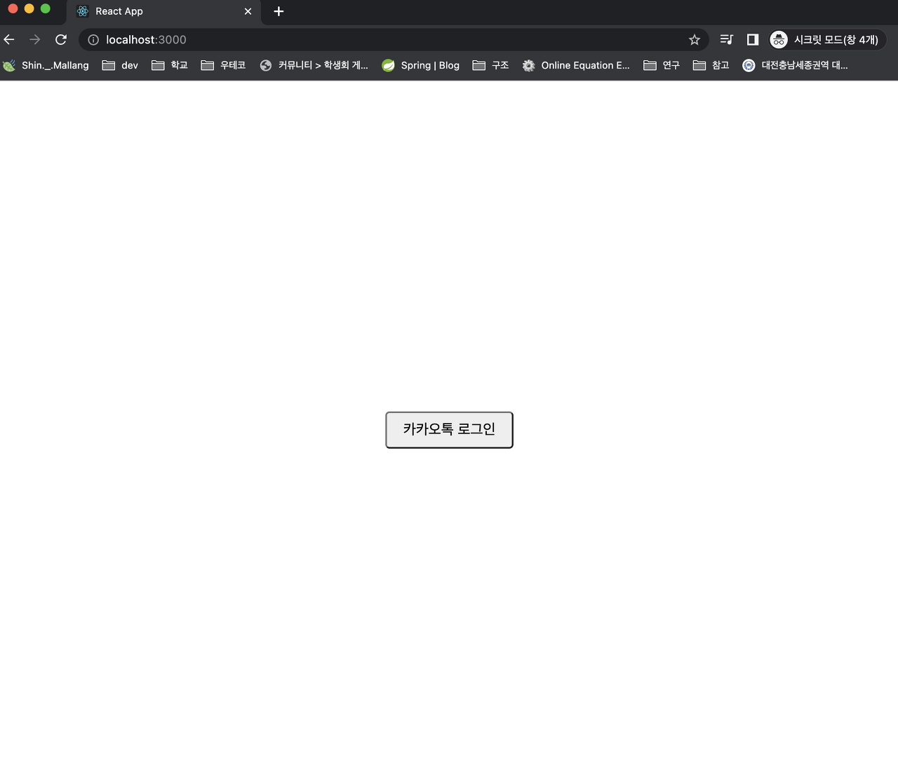
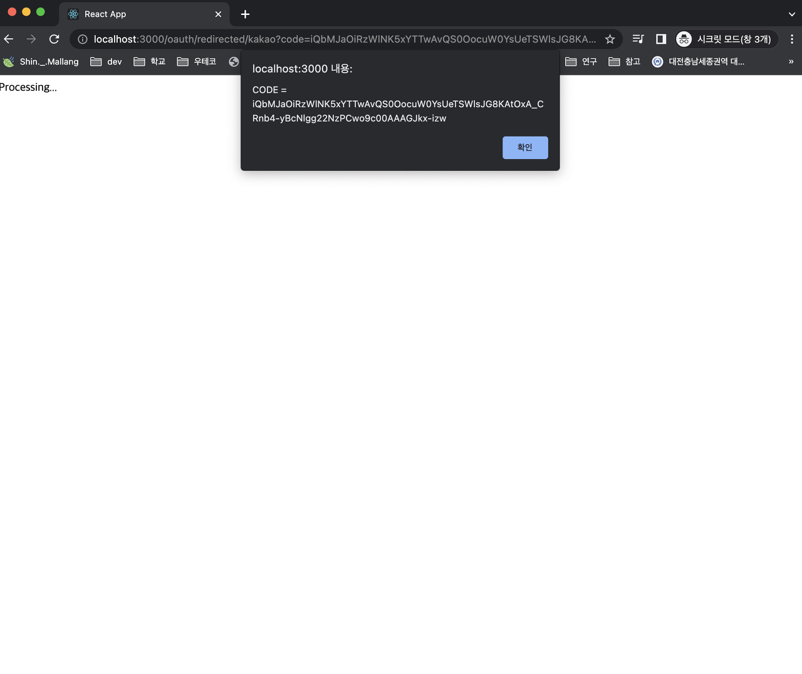
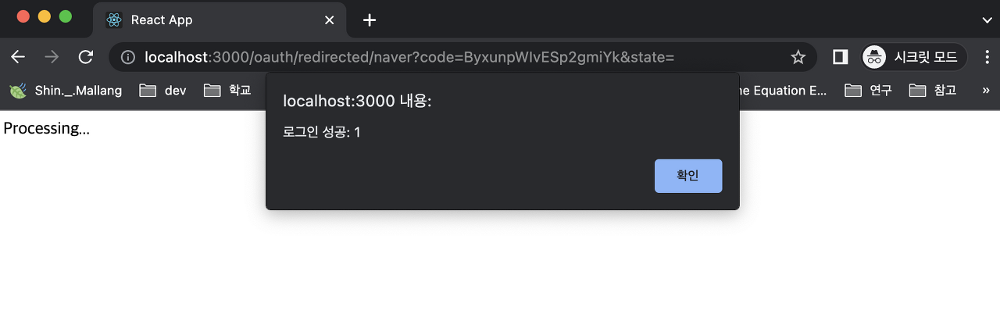

OAuth2.0 도입기

<!--truncate-->

<br />
<br />

> 이 글은 백엔드 크루 말랑이가 작성했기 때문에, 프론트 코드는 다소 엉망진창일 수 있습니다.

<br />
<br />

OAuth2.0의 개념에 대해서는 이미 많은 블로그들에서 다루고 있으므로 해당 글에서는 다루지 않음을 먼저 밝힙니다.

해당 글에서는 (적어도 제가 살펴보았던) 대부분의 블로그에서 애매하게 설명되어있는 **프론트엔드와 백엔드의 역할**과, 이를 실제로 어떻게 구현하는지를 집중적으로 다룰 것입니다.

또한 단순히 구현하고 끝내는 것이 아니라, 새로운 타사 플랫폼을 추가하는 과정도 간단하게 처리할 수 있도록 **유연하고 확장 가능한 구조**를 가진 코드를 작성해보도록 하겠습니다.

소스 코드는 [해당 Repository](https://github.com/shin-mallang/oauth-login-sample) 에서 확인하실 수 있습니다.

<br />
<br />
<br />
<br />

## 🧐 OAuth 2.0 플로우 정리

처음 OAuth 2.0을 접하고 공부하다 보면 다음과 같은 그림과 설명을 흔하게 마주할 수 있습니다.


위 설명은 프론트엔드와 백엔드의 역할이 불분명하다는 문제점이 있습니다.

위 개념을 처음 접하고 구현하려는 사람들을 대부분 프론트엔드 개발자와 백엔드 개발자일텐데, 이들의 역할은 어떻게 구분되어질까요?

OAuth2.0 에 대해 설명하는 글들을 찾아보면, 이들의 역할을 단순히 Client로만 뭉뚱그려 설명하는 글들이 대부분이었습니다.

이러면 저같은 바보 개발자 입장에서는 구현하기가 쉽지 않겠죠... 😢

그래서 저는 프론트엔드 개발자와 백엔드 개발자의 역할을 조금 더 구분지어 Client의 역할에 집중하고자 합니다.

<br />
<br />
<br />
<br />

## 🧐 구현하는 방법

OAuth2.0 을 통한 로그인을 구현하는 방법은 크게 **Redirect URI**를 **백엔드**로 설정하는 방법과 **프론트엔드**로 설정하는 방법으로 나뉩니다.

각각의 방식으로 구현했을 때 장점과 한계점에 대해 설명하고, 이들 중 **프론트엔드**로 Redirect URI를 설정하는 방법에 대해 알아보겠습니다.

(이때 모든 상황에서 회원가입 & 로그인을 한다는 가정을 통해 장점과 단점을 알아보도록 하겠습니다. 회원가입 플로우는 위 그림과 동일합니다.)

<br />
<br />
<br />

### 🐳 Redirect URI를 백엔드로 설정하기

큰 흐름은 다음과 같습니다.

> 1\. 사용자가 로그인 버튼을 클릭한다.
>
> 2\. (버튼을 누르면) 프론트엔드는 백엔드의 특정 URI로 요청을 보낸다.
>
> 3\. 백엔드는 이를 처리하여 cliend_id, redirect_uri 등을 포함하여 카카오 인증 서버(Authorization Server)의 Auth Code 발급 URL로 Redirect 시킨다.
> 이렇게 되면 카카오 인증 서버에서 사용자에게 로그인 페이지를 제공한다.
>
> 4\. 사용자가 로그인을 진행하고, 정보 사용에 동의한다.
>
> 5\. 해당 정보는 Authorization Server에 전달되며, 이후 사전에 등록한 백엔드의 Redirect URI로 Auth Code와 함께 Redirected 된다.
>
> 6\. 백엔드는 @GetMapping 등으로 Redirect URI로 들어오는 요청을 처리하도록 구현한다.
>
> - 요청의 Query String으로부터 Code를 추출한다.
> - 해당 Code를 가지고 AccessToken을 받아온다.
> - 해당 AccessToken을 통해 사용자 정보를 받아와 회원가입&로그인 시킨다.
> - 로그인 이후 발급된 인증 정보(session 혹은 token)을 쿼리 파라미터로 추가하여 프론트엔드의 로그인 성공을 처리하는 URL로 Redirect 시킨다.

Redirect URI를 백엔드로 설정하면, 프론트는 아무런 처리를 하지 않아도 됩니다.

백엔드 내부에서 Auth Code를 통해 AccessToken을 가져오고, 이어서 AccessToken을 통해 사용자의 정보까지 가져온 뒤 회원가입 & 로그인을 진행하게 됩니다.

그러나 로그인 성공 이후 Header나 Body에 token 등의 정보를 넣어주는 경우 CORS 문제가 발생하여 전달할 수 없는 상황이 발생합니다.


그래서 이 경우, 회원가입 혹은 로그인 처리 완료 시 생성되는 인증 정보(JWT 혹은 세션 등)을 프론트엔드에 전달하기 위해서는 오직 Query String을 통해 다음과 같은 형태로 전달하는 방법밖에 없습니다.

> \[로그인 이후 Redirect할 프론트엔드 URL\]?accessToken={로그인 후 발급한 액세스 토큰(or 세션 ID)}

더 큰 문제점은 Redirect를 사용할 수 없는 안드로이드와 같은 모바일 환경의 경우 이 방법으로는 회원가입과 로그인을 진행할 수 없다는 것입니다.

그래서 이러한 경우라면 반드시 Redirect URI를 프론트엔드로 설정하고 처리하여야 합니다.

즉 이 방법의 특징을 정리하면 다음과 같습니다.

- 인증 정보(토큰, 세션)을 Query String으로 전달하는 방법밖에 없다.
- 안드로이드와 같이 Redirect 할 수 없는 모바일 환경에서는 사용할 수 없다.

이제 Redirect URI를 프론트엔드로 설정하는 방법에 대해 알아보겠습니다.

<br />
<br />
<br />

### 🐳 Redirect URI를 프론트엔드로 설정하기

이 방법을 사용하는 플로우는 다음과 같습니다.

> 1\. 사용자가 로그인 버튼을 클릭한다.
>
> 2\. (버튼을 누르면) 프론트엔드는 백엔드의 특정 URI로 요청을 보낸다.
>
> 3\. 백엔드는 이를 처리하여 cliend_id, redirect_uri 등을 포함하여 카카오 인증 서버(Authorization Server)의 Auth Code 발급 URL로  Redirect 시킨다. 
> 이렇게 되면 카카오 인증 서버에서 사용자에게 로그인 페이지를 제공한다.
>
> 4\. 사용자가 로그인을 진행하고, 정보 사용에 동의한다. --- 여기까지 동일
>
> 5\. 해당 정보는 Authorization Server에 전달되며, 이후 사전에 등록한 **프론트엔드**의 Redirect URI로 Auth Code와 함께 Redirected 된다.
>
> 6\. 프론드엔드는 해당 Redirect URI로 요청이 들어오면, Query String에서 code를 추출하여 백엔드의 code를 통해 회원가입 & 로그인을 진행하는 API로 요청을 전송한다.
>
> 7\. 백엔드는 @PostMapping(Get도 상관없고 뭐 아무튼) 등으로 해당 요청을 처리(code를 통해 회원가입 & 로그인)한다.
>
> - 요청의 Query String으로부터 Code를 추출한다.
> - 해당 Code를 가지고 AccessToken을 받아온다.
> - 해당 AccessToken을 통해 사용자 정보를 받아와 회원가입&로그인 시킨다.
> - 로그인 이후 발급된 인증 정보(session 혹은 token)을 Header, Cookie, Body 등에 담에 프론트엔드에 반환한다.

<br />

위 방법은 Redirect URI를 백엔드로 설정했을 때의 단점을 모두 해결합니다.

즉 이 방법의 특징은 다음과 같습니다.

- 인증 정보(토큰, 세션)을 여러 방법(Query String, Header, Body)으로 전달할 수 있다.
- 안드로이드와 같이 Redirect 할 수 없는 모바일 환경에서도 사용할 수 있다.

이제부터 해당 방법을 통해 회원가입 & 로그인을 진행하는 코드를 작성해 보도록 하겠습니다.

우선 제일 쉬운 카카오부터 시작하도록 하겠습니다.

<br />
<br />
<br />
<br />

## 🧐 카카오 Developers에 애플리케이션 등록

Kakao Developers([https://developers.kakao.com/](https://developers.kakao.com/))에 접속합니다.


**내 애플리케이션**을 클릭합니다.

<br />
<br />
<br />


**애플리케이션 추가하기**를 클릭합니다.

<br />
<br />
<br />


**앱 이름**과 **사업자명**을 입력합니다.

<br />
<br />
<br />


**앱 설정** - **요약 정보** 화면에 보이는 **REST API** **키** 를 어디엔가 적어두세요!

해당 키를 **client_id**라고 부릅니다.

저는 이제부터 이를 **mallang-kakao-client-id** 로 가정하고 진행하겠습니다.

(생각해보니 어차피 노출되는 값이라 굳이 가릴 필요는 없었네용..)

<br />
<br />
<br />


**제품 설정** - **카카오 로그인**으로 이동하여 **활성화 상태**를 OFF 에서 **ON**으로 바꿔줍니다.

이후 **Redirect URI 등록** 버튼을 클릭해주세요.

<br />
<br />
<br />


Redirect URI를 프론트엔드로 설정할 것이므로, auth code를 통해 백엔드로 로그인 요청을 보낼 **프론트엔드**의 **URI**를 입력해주세요.

그냥 저 따라 **http://localhost:3000/oauth/redirected/kakao** 를 설정하는 것이, 앞으로 코드 진행을 따라오는 것에 있어서 제일 쉽기 때문에, 일단 따라 하시는 것을 추천합니다.

<br />
<br />
<br />


**카카오 로그인** - **보안**으로 이동하여 **Client Secret**을 생성해줍니다.

<br />
<br />
<br />


생성된 **Client Secret**을 어딘가에 잘 적어 두시고, **활성화 상태**를 사용안함에서 **사용함**으로 변경해주세요.

저는 이제부터 이를 **mallang-kakao-secret-key** 로 부르도록 하겠습니다.

<br />
<br />
<br />


**카카오 로그인** - **동의항목**으로 이동합니다.

이곳에서는 사용할 사용자의 정보를 설정해주면 되는데요, 이번 실습에서는 **닉네임**(profile_nickname)과 **프로필 사진**(profile_image)만을 설정하도록 하겠습니다.

<br />
<br />
<br />


위와 같이 **필수 동의**를 클릭한 뒤 저장해주세요.

여기까지 하면 기본적인 설정이 끝났고, 여기서 생성한 정보들을 정리하면 다음과 같습니다.

> REST API 키(client_id) : mallang-kakao-client-id<br/>
> Client Secret : mallang-kakao-secret-key<br/>
> Redirect URI : http://localhost:3000/oauth/redirected/kakao<br/>
> 동의 항목 : 닉네임(profile_nickname), 프로필 사진(profile_image)

이제 프론트엔드 코드를 작성하도록 하겠습니다.

<br />
<br />
<br />
<br />
<br />

## 🧐 프론트엔드 코드 작성 (React)

파일은 index.js, App.js, KakaoRedirectPage.js, LoginPage.js 4개입니다.

프론트엔드 패키지를 어떻게 나눠야 할 지 몰라서 그냥 하나에 때려박았습니다.


<br />
<br />
<br />

### index.js

```js
import React from "react";
import ReactDOM from "react-dom/client";
import App from "./App";

const root = ReactDOM.createRoot(document.getElementById("root"));
root.render(<App />);
```

이건 메인 페이지입니다.

<br />
<br />
<br />

### App.js

```js
import { BrowserRouter, Routes, Route } from "react-router-dom";
import LoginPage from "./LoginPage";
import KakaoRedirectPage from "./KakaoRedirectPage";

const App = () => {
  return (
    <div className="App">
      <BrowserRouter>
        <Routes>
          <Route path="/" element={<LoginPage />}></Route>
          <Route
            path="/oauth/redirected/kakao"
            element={<KakaoRedirectPage />}
          ></Route>
        </Routes>
      </BrowserRouter>
    </div>
  );
};

export default App;
```

라우터를 통해서 /로 들어오는 요청은 로그인 페이지를 보여주고,

**/oauth/redirected/kakao**로 들어오는 요청은 KakaoRedirectPage를 보여줍니다.

이때 **/oauth/redirected/kakao** 는 카카오 로그인 API에 **Redirect URI**로 설정한 URI입니다.

(저는 Redirect URI를 http://localhost:3000**/oauth/**redirected**/kakao**로 설정했었습니다.)

<br />
<br />
<br />

### LoginPage.js

```js
import React from "react";

const LoginPage = () => {
  const handleButtonClick = () => {
    window.location.href = "http://localhost:8080/oauth/kakao";
  };

  return (
    <div
      style={{
        display: "flex",
        justifyContent: "center",
        alignItems: "center",
        height: "100vh",
      }}
    >
      <button
        onClick={handleButtonClick}
        style={{
          padding: "10px 20px",
          fontSize: "18px",
          borderRadius: "5px",
          cursor: "pointer",
        }}
      >
        카카오톡 로그인
      </button>
    </div>
  );
};

export default LoginPage;
```

그냥 카카오톡 로그인 버튼 하나 있는 페이지입니다.

로그인 버튼을 누르면 http://localhost:8080**/oauth/kakao**로 이동하게 되는데요, 이는 백엔드에서 처리하며 cliend_id, redirect_uri 등을 포함하여 **카카오 로그인 페이지로 Redirect** 시켜줍니다.

<br />
<br />
<br />

### KakaoRedirectPage.js

```js
import React, { useEffect } from "react";
import { useLocation, useNavigate } from "react-router-dom";
import axios from "axios";

const KakaoRedirectPage = () => {
  const location = useLocation();
  const navigate = useNavigate();

  const handleOAuthKakao = async (code) => {
    try {
      // 카카오로부터 받아온 code를 서버에 전달하여 카카오로 회원가입 & 로그인한다
      const response = await axios.get(
        `http://localhost:8080/oauth/login/kakao?code=${code}`
      );
      const data = response.data; // 응답 데이터
      alert("로그인 성공: " + data);
      navigate("/success");
    } catch (error) {
      navigate("/fail");
    }
  };

  useEffect(() => {
    const searchParams = new URLSearchParams(location.search);
    const code = searchParams.get("code"); // 카카오는 Redirect 시키면서 code를 쿼리 스트링으로 준다.
    if (code) {
      alert("CODE = " + code);
      handleOAuthKakao(code);
    }
  }, [location]);

  return (
    <div>
      <div>Processing...</div>
    </div>
  );
};

export default KakaoRedirectPage;
```

해당 페이지는 App.js에 의해 **/oauth/redirected/kakao**로 요청이 들어오면 보여질 화면입니다.

해당 화면은 보여지자마자 http://localhost:8080/oauth/login/kakao로 요청을 보냅니다.

이는 카카오 인증 서버에 의해 리다이렉트되는 페이지로, 리다이렉트 되는 동시에 쿼리 파라미터로 **code**가 함께 전달되는데요, 이를 추출하여 백엔드 서버에 함께 전달합니다.

원래는 AccessToken등을 백엔드 서버로부터 받겠지만, 여기서는 코드가 너무 길어지기때문에 단순 Id를 반환하는 것으로 타협하겠습니다.

구체적인 동작 과정은 백엔드 코드까지 작성한 뒤 살펴보겠습니다.

<br />
<br />
<br />
<br />

## 🧐 백엔드 코드 작성 (Spring)

초기 설정은 다음과 같습니다.


<br />
<br />
<br />

### 🐳 build.gradle

```groovy
plugins {
    id 'java'
    id 'org.springframework.boot' version '3.1.2'
    id 'io.spring.dependency-management' version '1.1.2'
}

group = 'mallang'
version = '0.0.1-SNAPSHOT'

java {
    sourceCompatibility = '17'
}

configurations {
    compileOnly {
        extendsFrom annotationProcessor
    }
}

repositories {
    mavenCentral()
}

dependencies {
    implementation 'org.springframework.boot:spring-boot-starter-data-jpa'
    implementation 'org.springframework.boot:spring-boot-starter-web'

    // Http Interface
    implementation 'org.springframework.boot:spring-boot-starter-webflux'

    compileOnly 'org.projectlombok:lombok'

    runtimeOnly 'com.h2database:h2'

    // FOR @ConfigurationProperties
    annotationProcessor "org.springframework.boot:spring-boot-configuration-processor"

    annotationProcessor 'org.projectlombok:lombok'

    testImplementation 'org.springframework.boot:spring-boot-starter-test'
    testImplementation 'io.rest-assured:rest-assured:5.3.0'
}

tasks.named('test') {
    useJUnitPlatform()
}

// FOR @ConfigurationProperties
tasks.named('compileJava') {
    inputs.files(tasks.named('processResources'))
}
```

별다른 설명 없이 넘어가도록 하겠습니다.

<br />
<br />
<br />

### 🐳 application.yml

```yml
logging:
  level:
    org.hibernate.orm.jdbc.bind: TRACE

spring:
  jpa:
    show-sql: true
    properties:
      hibernate:
        format_sql: true
        use_sql_comments: true
        highlight_sql: true

    hibernate:
      ddl-auto: create
```

이것도 별다른 설명 없이 넘어가도록 하겠습니다.

대체로 로그를 남기기 위한 설정입니다.

초기 설정은 끝났고, 이제부터 코드를 작성할 것인데요, 처음에는 간단히 구현한 뒤 리팩토링 하는 과정을 보여드릴까 싶었지만 너무 루즈해질 수 있을 것 같아서, 조금 복잡하더라도 최종 형태의 코드를 보여드리도록 하겠습니다.

<br />
<br />
<br />

### 🐳 구현 순서

구현 순서는 다음과 같습니다.

> 1\. 사용자가 프론트엔드를 통해 http://localhost:8080**/oauth/kakao**로 접속하면 카카오톡 로그인 화면으로 Redirect 시키는 과정을 구현한다.
>
> 사용자가 카카오톡 로그인 & 정보 제공 동의를 진행한 이후 카카오톡 인증 서버에서 프론트엔드로 Auth Code를 포함하여 Redirect 시킨다.
>
> 프론트엔드는 Redirect 되는 순간 Auth Code를 꺼내서 http://localhost:8080**/oauth/login/kakao**?**code={받은 Auth Code}**로 POST 요청을 보낸다.
>
> 2\. /oauth/login/**kakao**로 auth code와 함께 POST 요청이 도착하면 백엔드는 받은 **auth code**와 함께 카카오 인증 서버에 **AccessToken**을 요청하여 발급받는다.
>
> 3\. 받아온 AccessToken을 가지고 카카오에 등록된 회원 정보(닉네임, 프로필 사진)를 조회한다.
>
> 4\. 받아온 정보를 통해 로그인을 진행한다. 이때 회원가입 되어있지 않다면 회원가입도 함께 진행한다.
>
> 5\. /oauth/login/kakao로 요청이 들어오면 2~4의 과정을 통해 로그인을 진행한 뒤, AccessToken(얘는 백엔드가 인증을 위해 발급해주는애)을 생성하고, 이를 메세지 본문에 담는다.

위 과정을 진행하며 확장에 유연한 코드를 작성하고, 이후 Naver도 추가해보며 얼마나 간단하게 추가할 수 있는지를 살펴보도록 하겠습니다.

<br />
<br />
<br />

### 🐳 최종 구조 미리 살펴보기


<br />
<br />
<br />
<br />

## 🧐 1. /oauth/kakao으로 접속하면 카카오톡 로그인 화면으로 Redirect 시킨다.

### ✨ OauthServerType

```java
package mallang.oauth.domain;

import static java.util.Locale.ENGLISH;

public enum OauthServerType {

    KAKAO,
    ;

    public static OauthServerType fromName(String type) {
        return OauthServerType.valueOf(type.toUpperCase(ENGLISH));
    }
}
```

이는 카카오, 구글, 네이버 등 Oauth2.0 인증을 제공하는 서버의 종류를 명시할 Enum입니다.

"**kakao**"를 통해 OauthServerType.**KAKAO**를 찾아오기 위해 fromName() 이라는 메서드를 구현하였습니다.

이제 OauthServerType별로 해당 서비스의 Auth Code를 받아오는 URL을 생성해주는 기능을 작성하도록 하겠습니다.

<br />
<br />
<br />

### ✨ AuthCodeRequestUrlProvider

```java
package mallang.oauth.domain.authcode;

import mallang.oauth.domain.OauthServerType;

public interface AuthCodeRequestUrlProvider {

    OauthServerType supportServer();

    String provide();
}
```

이는 인터페이스로, AuthCode를 발급할 URL을 제공하는 기능을 제공합니다.

supportServer()는 자신이 어떤 OauthServerType를 지원할 수 있는지를 나타합니다.

예를 들어 KakaoAuthCodeRequestUrlProvider는 OauthServerType으로 KAKAO를 반환할 것입니다.

provide()를 통해 URL을 생성하여 반환하며, 해당 주소로 Redirect 한다면 다음과 같은 화면이 나옵니다.


그리고 지금은 Kakao 뿐이지만, 이후 Naver 등 다른 서비스도 추가할 것이기 때문에 해당 기능을 인터페이스로 추상화하였습니다.

Kakao에서 Auth Code를 받아오기 위한 API는 다음 링크([https://developers.kakao.com/docs/latest/ko/kakaologin/rest-api#request-code](https://developers.kakao.com/docs/latest/ko/kakaologin/rest-api#request-code))에 나와있습니다.

<br />


아래의 저희가 설정한 정보를 기준으로,

> REST API 키(client_id) : mallang-kakao-client-id<br/>
> Client Secret : mallang-kakao-secret-key<br/>
> Redirect URI : http://localhost:3000/oauth/redirected/kakao<br/>
> 동의 항목 : 닉네임(profile_nickname), 프로필 사진(profile_image)

<br />

필수값만 사용한다고 가정했을 때, 다음과 같은 URL로 요청을 보내야 합니다.

> https://kauth.kakao.com/oauth/authorize<br/>
> ?response_type=code<br/>
> &client_id=mallang-kakao-client-id<br/>
> &redirect_uri=http://localhost:3000/oauth/redirected/kakao<br/>
> &scope=profile_nickname,profile_image

<br />

이에 맞게 구현한 구현체는 다음과 같습니다.

<br />
<br />
<br />

### ✨ KakaoAuthCodeRequestUrlProvider

```java
package mallang.oauth.infra.oauth.kakao.authcode;

import lombok.RequiredArgsConstructor;
import mallang.oauth.domain.OauthServerType;
import mallang.oauth.domain.authcode.AuthCodeRequestUrlProvider;
import mallang.oauth.infra.oauth.kakao.KakaoOauthConfig;
import org.springframework.stereotype.Component;
import org.springframework.web.util.UriComponentsBuilder;

@Component
@RequiredArgsConstructor
public class KakaoAuthCodeRequestUrlProvider implements AuthCodeRequestUrlProvider {

    private final KakaoOauthConfig kakaoOauthConfig;

    @Override
    public OauthServerType supportServer() {
        return OauthServerType.KAKAO;
    }

    @Override
    public String provide() {
        return UriComponentsBuilder
                .fromUriString("https://kauth.kakao.com/oauth/authorize")
                .queryParam("response_type", "code")
                .queryParam("client_id", kakaoOauthConfig.clientId())
                .queryParam("redirect_uri", kakaoOauthConfig.redirectUri())
                .queryParam("scope", String.join(",", kakaoOauthConfig.scope()))
                .toUriString();
    }
}
```

<br />

이때 KakaoOauthConfig는 저의가 설정한 정보를 담고 있는 클래스로, 다음과 같습니다.

<br />
<br />

### ✨ KakaoOauthConfig

```java
package mallang.oauth.infra.oauth.kakao;

import org.springframework.boot.context.properties.ConfigurationProperties;

@ConfigurationProperties(prefix = "oauth.kakao")
public record KakaoOauthConfig(
        String redirectUri,
        String clientId,
        String clientSecret,
        String[] scope
) {
}
```

**application.yml**에 **oauth.kakao**로 설정된 정보들을 통해 생성됩니다.

<br />
<br />
<br />

### ✨ application.yml 수정

이제 application.yml 파일을 아래와 같이 수정합니다.

```yml
logging:
  level:
    org.hibernate.orm.jdbc.bind: TRACE

spring:
  jpa:
    show-sql: true
    properties:
      hibernate:
        format_sql: true
        use_sql_comments: true
        highlight_sql: true

    hibernate:
      ddl-auto: create

# 추가
oauth:
  kakao:
    client_id: mallang-kakao-client-id # REST API 키
    redirect_uri: http://localhost:3000/oauth/redirected/kakao
    client_secret: mallang-kakao-secret-key # Client Secret 키
    scope: profile_nickname, profile_image
```

그리고 @ConfigurationProperties를 사용하기 위해서는 @ConfigurationPropertiesScan이 필요합니다.

<br />
<br />
<br />

### ✨ OauthApplication 수정

```java
package mallang.oauth;

import org.springframework.boot.SpringApplication;
import org.springframework.boot.autoconfigure.SpringBootApplication;
import org.springframework.boot.context.properties.ConfigurationPropertiesScan;

@SpringBootApplication
@ConfigurationPropertiesScan
public class OauthApplication {

    public static void main(String[] args) {
        SpringApplication.run(OauthApplication.class, args);
    }

}
```

이제 이를 사용해야겠죠?

<br />
<br />
<br />

### ✨ AuthCodeRequestUrlProviderComposite

```java
package mallang.oauth.domain.authcode;

import static java.util.function.Function.identity;
import static java.util.stream.Collectors.toMap;

import java.util.Map;
import java.util.Optional;
import java.util.Set;
import mallang.oauth.domain.OauthServerType;
import org.springframework.stereotype.Component;

@Component
public class AuthCodeRequestUrlProviderComposite {

    private final Map<OauthServerType, AuthCodeRequestUrlProvider> mapping;

    public AuthCodeRequestUrlProviderComposite(Set<AuthCodeRequestUrlProvider> providers) {
        mapping = providers.stream()
                .collect(toMap(
                        AuthCodeRequestUrlProvider::supportServer,
                        identity()
                ));
    }

    public String provide(OauthServerType oauthServerType) {
        return getProvider(oauthServerType).provide();
    }

    public AuthCodeRequestUrlProvider getProvider(OauthServerType oauthServerType) {
        return Optional.ofNullable(mapping.get(oauthServerType))
                .orElseThrow(() -> new RuntimeException("지원하지 않는 소셜 로그인 타입입니다."));
    }
}
```

Composite 패턴을 조금 변형하여 OauthServerType의 종류에 따라, 이에 해당하는 AuthCodeRequestUrlProvier를 사용하여 URL을 생성할 수 있도록 위 클래스를 작성하였습니다.

이를 위해 supportServer()라는 메서드를 구현했습니다.

이를 통해 Naver 로그인 등을 추가할 때, 기존 코드의 변경 없이 새로 추가된 타입을 사용할 수 있게 됩니다.

이제 이를 사용하여 URL을 실제로 만들어내는 Service 코드를 살펴보겠습니다.

<br />
<br />
<br />

### ✨ OauthService

```java
package mallang.oauth.application;

import lombok.RequiredArgsConstructor;
import mallang.oauth.domain.OauthServerType;
import mallang.oauth.domain.authcode.AuthCodeRequestUrlProviderComposite;
import org.springframework.stereotype.Service;

@Service
@RequiredArgsConstructor
public class OauthService {

    private final AuthCodeRequestUrlProviderComposite authCodeRequestUrlProviderComposite;

    public String getAuthCodeRequestUrl(OauthServerType oauthServerType) {
        return authCodeRequestUrlProviderComposite.provide(oauthServerType);
    }
}
```

OauthServerType을 받아서 해당 인증 서버에서 Auth Code를 받아오기 위한 URL 주소를 생성해줍니다.

이를 사용하는 Controller 코드는 다음과 같습니다.

<br />
<br />
<br />

### ✨ OauthController

```java
package mallang.oauth.presentation;

import jakarta.servlet.http.HttpServletResponse;
import lombok.RequiredArgsConstructor;
import lombok.SneakyThrows;
import mallang.oauth.application.OauthService;
import mallang.oauth.domain.OauthServerType;
import org.springframework.http.ResponseEntity;
import org.springframework.web.bind.annotation.GetMapping;
import org.springframework.web.bind.annotation.PathVariable;
import org.springframework.web.bind.annotation.RequestMapping;
import org.springframework.web.bind.annotation.RestController;

@RequiredArgsConstructor
@RequestMapping("/oauth")
@RestController
public class OauthController {

    private final OauthService oauthService;

    @SneakyThrows
    @GetMapping("/{oauthServerType}")
    ResponseEntity<Void> redirectAuthCodeRequestUrl(
            @PathVariable OauthServerType oauthServerType,
            HttpServletResponse response
    ) {
        String redirectUrl = oauthService.getAuthCodeRequestUrl(oauthServerType);
        response.sendRedirect(redirectUrl);
        return ResponseEntity.ok().build();
    }
}
```

@PathVariable을 통해 /oauth/**kakao** 등의 요청에서 **kakao**를 OauthServerType로 변환하여 받아옵니다.

이는 Converter를 등록해 주어야 하는데, 조금 뒤에 살펴보고 일단 로직의 흐름을 살펴보겠습니다.

사용자가 프론트엔드를 통해 /oauth/kakao로 접속하면 위의 메서드가 실행됩니다.

이때 kakao는 OauthServerType.KAKAO로 변환될 것입니다.

이제 위에서 구현한 Service를 통해 KAKAO에서 Auth Code를 받아오기 위한 URL을 생성하고,

여기서 생성된 URL로 사용자를 Redirect 시킵니다.

아래 Converter 구현을 잠깐 살펴보고, 여기까지의 동작을 살펴보도록 하겠습니다.

<br />
<br />
<br />

### ✨ OauthServerTypeConverter

```java
package mallang.oauth.presentation;

import mallang.oauth.domain.OauthServerType;
import org.springframework.core.convert.converter.Converter;

public class OauthServerTypeConverter implements Converter<String, OauthServerType> {

    @Override
    public OauthServerType convert(String source) {
        return OauthServerType.fromName(source);
    }
}
```

String을 OauthServerType으로 변환해줍니다.

그리고 이를 적용하기 위해서는 다음과 같이 WebConfigurer를 구현하여 추가해주어야 합니다.

<br />
<br />
<br />

### ✨ WebConfig

```java
package mallang.oauth.common.config;

import lombok.RequiredArgsConstructor;
import mallang.oauth.presentation.OauthServerTypeConverter;
import org.springframework.context.annotation.Configuration;
import org.springframework.format.FormatterRegistry;
import org.springframework.http.HttpMethod;
import org.springframework.web.servlet.config.annotation.CorsRegistry;
import org.springframework.web.servlet.config.annotation.WebMvcConfigurer;

@Configuration
@RequiredArgsConstructor
public class WebConfig implements WebMvcConfigurer {

    @Override
    public void addCorsMappings(CorsRegistry registry) {
        registry.addMapping("/**")
                .allowedOrigins("http://localhost:3000")
                .allowedMethods(
                        HttpMethod.GET.name(),
                        HttpMethod.POST.name(),
                        HttpMethod.PUT.name(),
                        HttpMethod.DELETE.name(),
                        HttpMethod.PATCH.name()
                )
                .allowCredentials(true)
                .exposedHeaders("*");
    }

    @Override
    public void addFormatters(FormatterRegistry registry) {
        registry.addConverter(new OauthServerTypeConverter());
    }
}
```

CORS 설정까지 미리 해주었습니다.

<br />
<br />
<br />

### 😎 중간 점검 - 동작 확인하기

react와 spring을 모두 실행합니다.

> react를 실행하기 위해서는 npm install, npm install react-router-dom axios 한 번 실행 이후 npm start를 통해 실행시킬 수 있을 것입니다.

http://localhost:3000으로 접속합니다.


사용자는 위와 같이 카카오톡 로그인 버튼을 보고, 클릭할 것입니다.

(이를 클릭하면, 백엔드에서 Kakao 인증 서버에서 Auth code를 가져오기 위한 URL로 리다이렉트 시켜줍니다.)

<br />
<br />


클릭하면 위와 같은 화면이 나옵니다.

아이디와 비밀번호를 입력하고 진행합니다.

<br />
<br />


이때 현재 사이트의 URL을 살펴보면 다음과 같습니다.

> https://kauth.kakao.com/oauth/authorize?scope=profile\_nickname%2Cprofile\_image&response\_type=code&redirect\_uri=http%3A%2F%2Flocalhost%3A3000%2Foauth%2Fredirected%2Fkakao&through\_account=true&client\_id=비밀&additional\_auth\_login=true

이를 [URL Decode](https://www.urldecoder.org/)를 통해 디코딩하면 다음과 같습니다.

> https://kauth.kakao.com/oauth/authorize
> ?scope=profile_nickname,profile_image
> &response_type=code
> &redirect_uri=http://localhost:3000/oauth/redirected/kakao
> &through_account=true <-- 예는 로그인 하고 들어오면 자동 추가됩니다. 무시하세요
> &client_id=REST API ID
> &additional_auth_login=true <-- 예는 로그인 하고 들어오면 자동 추가됩니다. 무시하세요

백엔드에서 설정해준 URL이 잘 작동하는 것을 확인할 수 있습니다.

**동의하고 계속하기**를 클릭해보겠습니다.

<br />
<br />


Auth Code까지 잘 받아온 것을 알 수 있습니다.

이제 그 다음 단계인 Auth Code를 통해 카카오 인증 서버로부터 AccessToken을 받아오는 코드를 작성해 보도록 하겠습니다.

<br />
<br />
<br />
<br />

## 🧐 2. Auth Code를 통해 카카오 인증 서버로부터 AccessToken을 받아온다

우선 카카오 인증 서버가 제공하는 AccessToken을 받아오기 위한 API는 다음 링크([https://developers.kakao.com/docs/latest/ko/kakaologin/rest-api#request-token](https://developers.kakao.com/docs/latest/ko/kakaologin/rest-api#request-token))에 나와있습니다.

<br />


이에 맞게 카카오 인증 서버에 요청을 보내고 응답을 받아오는 과정을 구현하도록 하겠습니다.

외부 API를 사용하는 방법에는 가장 흔한 방법으로는 RestTemplate이나 WebClient를 사용할 수 있으며, 간소화를 위해서는 FeignClient 등을 사용하는 것도 좋은 방법입니다.

그러나 저는 이번에는 스프링 6에 새로 추가된 [HTTP Interface Client](https://docs.spring.io/spring-framework/reference/web/webflux-http-interface-client.html)를 사용하도록 하겠습니다.

우선 위 요청의 응답을 객체로 받아오기 위해 DTO를 생성하도록 하겠습니다.

<br />
<br />
<br />

### ✨ KakaoToken

```java
package mallang.oauth.infra.oauth.kakao.dto;

import com.fasterxml.jackson.databind.PropertyNamingStrategies.SnakeCaseStrategy;
import com.fasterxml.jackson.databind.annotation.JsonNaming;

@JsonNaming(SnakeCaseStrategy.class)
public record KakaoToken(
        String tokenType,
        String accessToken,
        String idToken,
        Integer expiresIn,
        String refreshToken,
        Integer refreshTokenExpiresIn,
        String scope
) {
}
```

@JsonNaming(SnakeCaseStrategy.class)를 통해 token_type과 같은 응답을 tokenType으로 받아올 수 있습니다.

<br />
<br />
<br />

### ✨ KakaoApiClient

```java
package mallang.oauth.infra.oauth.kakao.client;

import static org.springframework.http.MediaType.APPLICATION_FORM_URLENCODED_VALUE;

import mallang.oauth.infra.oauth.kakao.dto.KakaoToken;
import org.springframework.util.MultiValueMap;
import org.springframework.web.bind.annotation.RequestParam;
import org.springframework.web.service.annotation.PostExchange;

public interface KakaoApiClient {

    @PostExchange(url = "https://kauth.kakao.com/oauth/token", contentType = APPLICATION_FORM_URLENCODED_VALUE)
    KakaoToken fetchToken(@RequestParam MultiValueMap<String, String> params);
}
```

위는 Http Interface Client를 사용한 코드입니다.

우선 Url에는 AccessToken을 받아오기 위한 URL을 명시하였고, 이를 위한 ContentType과 요청 파라미터를 받아야 하므로 MultiValueMap을 파라미터로 설정했습니다.

응답 값은 KakaoToken을 통해 객체로 바로 받아올 수 있도록 작성하였습니다.

위처럼 인터페이스를 통해 바로 사용할 수 있지만, 한가지 추가 작업이 필요합니다.

<br />
<br />
<br />

### ✨ HttpInterfaceConfig

```java
package mallang.oauth.infra.oauth.config;

import mallang.oauth.infra.oauth.kakao.client.KakaoApiClient;
import org.springframework.context.annotation.Bean;
import org.springframework.context.annotation.Configuration;
import org.springframework.web.reactive.function.client.WebClient;
import org.springframework.web.reactive.function.client.support.WebClientAdapter;
import org.springframework.web.service.invoker.HttpServiceProxyFactory;

@Configuration
public class HttpInterfaceConfig {

    @Bean
    public KakaoApiClient kakaoApiClient() {
        return createHttpInterface(KakaoApiClient.class);
    }

    private <T> T createHttpInterface(Class<T> clazz) {
        WebClient webClient = WebClient.create();
        HttpServiceProxyFactory build = HttpServiceProxyFactory
                .builder(WebClientAdapter.forClient(webClient)).build();
        return build.createClient(clazz);
    }
}
```

위와 같이 Http Interface Client 구현체를 빈으로 등록해주는 과정이 필요합니다.

아직 구현하지 않은 클래스들이 많기에 여기서 바로 다음으로 넘어가겠지만, 다음과 같이 사용할 것임을 참고를 위해 남겨두겠습니다.\

<br />
<br />
<br />

```java
@Component
@RequiredArgsConstructor
public class KakaoMemberClient implements OauthMemberClient {

    private final KakaoApiClient kakaoApiClient;
    private final KakaoOauthConfig kakaoOauthConfig;


    @Override
    public OauthMember fetch(String authCode) {
        KakaoToken tokenInfo = kakaoApiClient.fetchToken(tokenRequestParams(authCode));
        // 생략
    }

    private MultiValueMap<String, String> tokenRequestParams(String authCode) {
        MultiValueMap<String, String> params = new LinkedMultiValueMap<>();
        params.add("grant_type", "authorization_code");
        params.add("client_id", kakaoOauthConfig.clientId());
        params.add("redirect_uri", kakaoOauthConfig.redirectUri());
        params.add("code", authCode);
        params.add("client_secret", kakaoOauthConfig.clientSecret());
        return params;
    }
}
```

<br />
<br />
<br />
<br />

## 🧐 3. AccessToken을 통해 사용자 정보를 받아온다

이제 위에서 발급받은 AccessToken을 통해 사용자의 정보를 받아와야 합니다.

이에 대한 API는 다음 링크([https://developers.kakao.com/docs/latest/ko/kakaologin/rest-api#req-user-info](https://developers.kakao.com/docs/latest/ko/kakaologin/rest-api#req-user-info))에서 확인할 수 있습니다.

<br />


위 형식에 맞게 AccessToken을 발급할 때 처럼 HTTP Interface Client를 사용하여 구현하도록 하겠습니다.

우선 응답을 매핑할 클래스는 다음과 같습니다.

<br />
<br />
<br />

### ✨ KakaoMemberResponse

```java
package mallang.oauth.infra.oauth.kakao.dto;

import static mallang.oauth.domain.OauthServerType.KAKAO;

import com.fasterxml.jackson.databind.PropertyNamingStrategies.SnakeCaseStrategy;
import com.fasterxml.jackson.databind.annotation.JsonNaming;
import java.time.LocalDateTime;
import mallang.oauth.domain.OauthId;
import mallang.oauth.domain.OauthMember;

@JsonNaming(SnakeCaseStrategy.class)
public record KakaoMemberResponse(
        Long id,
        boolean hasSignedUp,
        LocalDateTime connectedAt,
        KakaoAccount kakaoAccount
) {

    public OauthMember toDomain() {
        return OauthMember.builder()
                .oauthId(new OauthId(String.valueOf(id), KAKAO))
                .nickname(kakaoAccount.profile.nickname)
                .profileImageUrl(kakaoAccount.profile.profileImageUrl)
                .build();
    }

    @JsonNaming(SnakeCaseStrategy.class)
    public record KakaoAccount(
            boolean profileNeedsAgreement,
            boolean profileNicknameNeedsAgreement,
            boolean profileImageNeedsAgreement,
            Profile profile,
            boolean nameNeedsAgreement,
            String name,
            boolean emailNeedsAgreement,
            boolean isEmailValid,
            boolean isEmailVerified,
            String email,
            boolean ageRangeNeedsAgreement,
            String ageRange,
            boolean birthyearNeedsAgreement,
            String birthyear,
            boolean birthdayNeedsAgreement,
            String birthday,
            String birthdayType,
            boolean genderNeedsAgreement,
            String gender,
            boolean phoneNumberNeedsAgreement,
            String phoneNumber,
            boolean ciNeedsAgreement,
            String ci,
            LocalDateTime ciAuthenticatedAt
    ) {
    }

    @JsonNaming(SnakeCaseStrategy.class)
    public record Profile(
            String nickname,
            String thumbnailImageUrl,
            String profileImageUrl,
            boolean isDefaultImage
    ) {
    }
}
```

필요없는 필드도 많지만, 언제 어떻게 바뀔지 모르기에 그냥 한번에 다 등록해 주었습니다.

이때 toDomain() 메서드를 통해서 받아온 정보를 토대로 OauthMember를 만들어 주는 것을 알 수 있습니다.

OauthMember는 Oauth를 통해 가입한 회원을 나타내는 객체이며, 이를 구현하도록 하겠습니다.

<br />
<br />
<br />

### ✨ OauthId

```java
package mallang.oauth.domain;

import static jakarta.persistence.EnumType.STRING;
import static lombok.AccessLevel.PROTECTED;

import jakarta.persistence.Column;
import jakarta.persistence.Embeddable;
import jakarta.persistence.Enumerated;
import lombok.AllArgsConstructor;
import lombok.NoArgsConstructor;

@Embeddable
@AllArgsConstructor
@NoArgsConstructor(access = PROTECTED)
public class OauthId {

    @Column(nullable = false, name = "oauth_server_id")
    private String oauthServerId;

    @Enumerated(STRING)
    @Column(nullable = false, name = "oauth_server")
    private OauthServerType oauthServerType;

    public String oauthServerId() {
        return oauthServerId;
    }

    public OauthServerType oauthServer() {
        return oauthServerType;
    }
}
```

특정 인증 서버의 식별자 값을 의미하는 oauthServerId와, 이를 제공하는 서비스 타입을 묶어 OauthId라는 클래스를 만들어 주었습니다.

하나의 서비스 내에서 식별자는 중복되지 않겠지만 서로 다른 서비스간에는 식별자가 중복될수도 있겠다 싶었기 때문에 위와 같이 구현하여 혹시 모를 식별자의 중복을 예방하려 하였습니다.

<br />
<br />
<br />

### ✨ OauthMember

```java
package mallang.oauth.domain;

import static lombok.AccessLevel.PROTECTED;

import jakarta.persistence.Embedded;
import jakarta.persistence.Entity;
import jakarta.persistence.GeneratedValue;
import jakarta.persistence.GenerationType;
import jakarta.persistence.Id;
import jakarta.persistence.Table;
import jakarta.persistence.UniqueConstraint;
import lombok.AllArgsConstructor;
import lombok.Builder;
import lombok.NoArgsConstructor;

@Entity
@Builder
@AllArgsConstructor
@NoArgsConstructor(access = PROTECTED)
@Table(name = "oauth_member",
        uniqueConstraints = {
                @UniqueConstraint(
                        name = "oauth_id_unique",
                        columnNames = {
                                "oauth_server_id",
                                "oauth_server"
                        }
                ),
        }
)
public class OauthMember {

    @Id
    @GeneratedValue(strategy = GenerationType.IDENTITY)
    private Long id;

    @Embedded
    private OauthId oauthId;
    private String nickname;
    private String profileImageUrl;

    public Long id() {
        return id;
    }

    public OauthId oauthId() {
        return oauthId;
    }

    public String nickname() {
        return nickname;
    }

    public String profileImageUrl() {
        return profileImageUrl;
    }
}
```

자동 증가되는 id 하나와, uniqueConstraints를 통해 OauthId의 유일함을 보장하도록 해주었습니다.

또한 사용자의 별명과 프로필 사진 URL에 대한 정보를 제공받기로 했으므로, 이를 저장하기 위해 필드를 추가해 주었습니다.

<br />
<br />
<br />

### ✨ OauthMemberRepository

```java
package mallang.oauth.domain;

import java.util.Optional;
import org.springframework.data.jpa.repository.JpaRepository;

public interface OauthMemberRepository extends JpaRepository<OauthMember, Long> {

    Optional<OauthMember> findByOauthId(OauthId oauthId);
}
```

간단하므로 넘어가겠습니다.

이제 구현해야 할 것은 AccessToken을 통해 사용자의 정보를 받아와 OauthMember를 생성하는 로직입니다.

아까 생성해둔 **KakaoApiClient**에 다음 메서드를 추가합니다.

<br />
<br />
<br />

### ✨ KakaoApiClient

```java
package mallang.oauth.infra.oauth.kakao.client;

import static org.springframework.http.HttpHeaders.AUTHORIZATION;
import static org.springframework.http.MediaType.APPLICATION_FORM_URLENCODED_VALUE;

import mallang.oauth.infra.oauth.kakao.dto.KakaoMemberResponse;
import mallang.oauth.infra.oauth.kakao.dto.KakaoToken;
import org.springframework.util.MultiValueMap;
import org.springframework.web.bind.annotation.RequestHeader;
import org.springframework.web.bind.annotation.RequestParam;
import org.springframework.web.service.annotation.GetExchange;
import org.springframework.web.service.annotation.PostExchange;

public interface KakaoApiClient {

    @PostExchange(url = "https://kauth.kakao.com/oauth/token", contentType = APPLICATION_FORM_URLENCODED_VALUE)
    KakaoToken fetchToken(@RequestParam MultiValueMap<String, String> params);

    // 추가
    @GetExchange("https://kapi.kakao.com/v2/user/me")
    KakaoMemberResponse fetchMember(@RequestHeader(name = AUTHORIZATION) String bearerToken);
}
```

[사용자 정보 가져오기 API](https://developers.kakao.com/docs/latest/ko/kakaologin/rest-api#req-user-info)에 알맞게 메서드를 작성해 주었습니다.

이렇게 하면 **AccessToken**을 통해 **회원 정보를 조회**하는 기능도 구현이 완료되었습니다.

이제 2번과 3번 과정을 합쳐서 Auth Code를 통해 최종적으로 OauthMember를 생성하는 로직을 작성해 보도록 하겠습니다.

이를 위해 우선 OauthMemberClient라는 인터페이스를 정의했습니다.

<br />
<br />
<br />

### ✨ OauthMemberClient

```java
package mallang.oauth.domain.client;

import mallang.oauth.domain.OauthMember;
import mallang.oauth.domain.OauthServerType;

public interface OauthMemberClient {

    OauthServerType supportServer();

    OauthMember fetch(String code);
}
```

여기서도 AuthCodeRequestUrlProvider와 비슷하게 supporServer()를 정의해주었고,

fetch() 메서드를 통해 OauthMember를 반환해주도록 하였습니다.

fetch() 메서드는 인자로 Auth Code를 받습니다.

회원가입 혹은 로그인 할 회원 정보를 받아오는 과정을 나열하면 다음과 같습니다.

1.  Auth Code를 통해 AccessToken 발급
2.  AccessToken을 통해 회원 정보 조회

이 과정을 Auth Code를 통해 회원 정보를 조회하는 과정으로 캡슐화하였습니다.

그리고 AuthCodeRequestUrlProviderComposite과 비슷하게, OauthMemberClientComposite을 구현하였습니다.

<br />
<br />
<br />

### ✨ OauthMemberClientComposite

```java
package mallang.oauth.domain.client;

import static java.util.function.Function.identity;
import static java.util.stream.Collectors.toMap;

import java.util.Map;
import java.util.Optional;
import java.util.Set;
import mallang.oauth.domain.OauthMember;
import mallang.oauth.domain.OauthServerType;
import org.springframework.stereotype.Component;

@Component
public class OauthMemberClientComposite {

    private final Map<OauthServerType, OauthMemberClient> mapping;

    public OauthMemberClientComposite(Set<OauthMemberClient> clients) {
        mapping = clients.stream()
                .collect(toMap(
                        OauthMemberClient::supportServer,
                        identity()
                ));
    }

    public OauthMember fetch(OauthServerType oauthServerType, String authCode) {
        return getClient(oauthServerType).fetch(authCode);
    }

    private OauthMemberClient getClient(OauthServerType oauthServerType) {
        return Optional.ofNullable(mapping.get(oauthServerType))
                .orElseThrow(() -> new RuntimeException("지원하지 않는 소셜 로그인 타입입니다."));
    }
}
```

이 역시도 카카오 뿐만 아니라 다른 서비스들을 기존 코드의 변경 없이 추가하기 위해 작성한 클래스입니다.

이제 OauthMemberClient를 카카오 서비스에 맞게 구현하도록 하겠습니다.

<br />
<br />
<br />

### ✨ KakaoMemberClient

```java
package mallang.oauth.infra.oauth.kakao;

import lombok.RequiredArgsConstructor;
import mallang.oauth.domain.OauthMember;
import mallang.oauth.domain.OauthServerType;
import mallang.oauth.domain.client.OauthMemberClient;
import mallang.oauth.infra.oauth.kakao.client.KakaoApiClient;
import mallang.oauth.infra.oauth.kakao.dto.KakaoMemberResponse;
import mallang.oauth.infra.oauth.kakao.dto.KakaoToken;
import org.springframework.stereotype.Component;
import org.springframework.util.LinkedMultiValueMap;
import org.springframework.util.MultiValueMap;

@Component
@RequiredArgsConstructor
public class KakaoMemberClient implements OauthMemberClient {

    private final KakaoApiClient kakaoApiClient;
    private final KakaoOauthConfig kakaoOauthConfig;

    @Override
    public OauthServerType supportServer() {
        return OauthServerType.KAKAO;
    }

    @Override
    public OauthMember fetch(String authCode) {
        KakaoToken tokenInfo = kakaoApiClient.fetchToken(tokenRequestParams(authCode)); // (1)
        KakaoMemberResponse kakaoMemberResponse =
                kakaoApiClient.fetchMember("Bearer " + tokenInfo.accessToken());  // (2)
        return kakaoMemberResponse.toDomain();  // (3)
    }

    private MultiValueMap<String, String> tokenRequestParams(String authCode) {
        MultiValueMap<String, String> params = new LinkedMultiValueMap<>();
        params.add("grant_type", "authorization_code");
        params.add("client_id", kakaoOauthConfig.clientId());
        params.add("redirect_uri", kakaoOauthConfig.redirectUri());
        params.add("code", authCode);
        params.add("client_secret", kakaoOauthConfig.clientSecret());
        return params;
    }
}
```

어렵지는 않을 것이라 생각되지만, fetch() 메서드에 대해 설명을 진행하도록 하겠습니다.

(1) - 먼저 Auth Code를 통해서 AccessToken을 조회합니다.<br/>
(2) - AccessToken을 가지고 회원 정보를 받아옵니다.<br/>
(3) - 회원 정보를 OauthMember 객체로 변환합니다.

이때 (1)번 과정에서 사용되는 **tokenRequestParams**()는 한참 전 설명에서 잠깐 참고용으로 등장했는데요,

[토큰 받기 API](https://developers.kakao.com/docs/latest/ko/kakaologin/rest-api#request-token)의 요청에 사용되는 요청 파라미터를 설정해줍니다.


이외에는 그냥 KakaoApiClient를 사용하는 코드이므로 넘어가겠습니다.

이제 해당 과정을 통해 생성한 OauthMember 객체에 대해서 로그인을 진행하는 코드를 작성해야 합니다.

이때 만약 회원가입되어있지 않다면 회원가입도 함께 진행합니다.

<br />
<br />
<br />

## 🧐 4\. 받아온 정보를 통해 로그인을 진행한다. 이때 회원가입 되어있지 않다면 회원가입도 함께 진행한다.

<br />

OauthService에 이를 위한 메서드를 추가합니다.

<br />

### ✨ OauthService

```java
package mallang.oauth.application;

import lombok.RequiredArgsConstructor;
import mallang.oauth.domain.OauthMember;
import mallang.oauth.domain.OauthMemberRepository;
import mallang.oauth.domain.OauthServerType;
import mallang.oauth.domain.authcode.AuthCodeRequestUrlProviderComposite;
import mallang.oauth.domain.client.OauthMemberClientComposite;
import org.springframework.stereotype.Service;

@Service
@RequiredArgsConstructor
public class OauthService {

    private final AuthCodeRequestUrlProviderComposite authCodeRequestUrlProviderComposite;
    private final OauthMemberClientComposite oauthMemberClientComposite;
    private final OauthMemberRepository oauthMemberRepository;

    public String getAuthCodeRequestUrl(OauthServerType oauthServerType) {
        return authCodeRequestUrlProviderComposite.provide(oauthServerType);
    }

    // 추가
    public Long login(OauthServerType oauthServerType, String authCode) {
        OauthMember oauthMember = oauthMemberClientComposite.fetch(oauthServerType, authCode);
        OauthMember saved = oauthMemberRepository.findByOauthId(oauthMember.oauthId())
                .orElseGet(() -> oauthMemberRepository.save(oauthMember));
        return saved.id();
    }
}
```

코드는 되게 간단합니다.

먼저 로그인을 진행하려는 OauthServerType에 해당하는 회원을 AuthCode를 통해 조회합니다.

그리고 유니크함이 보장되는 OauthId를 통해 데이터베이스에서 회원을 찾아옵니다.

만약 가입되어있지 않다면 저장(회원가입)합니다.

원래는 JWT를 사용한다면 여기서 JWT로 AccessToken을 생성하여 반환하여야 하지만, JWT까지 다루기에는 이미 분량이 너무 많으므로 Id를 반환하는 것으로 저혼자 타협하고 넘어갔었습니다 :)

이제 이를 Controller에서 사용해주면 됩니다.

<br />
<br />
<br />

### ✨ OauthController

```java
package mallang.oauth.presentation;

import jakarta.servlet.http.HttpServletResponse;
import lombok.RequiredArgsConstructor;
import lombok.SneakyThrows;
import mallang.oauth.application.OauthService;
import mallang.oauth.domain.OauthServerType;
import org.springframework.http.ResponseEntity;
import org.springframework.web.bind.annotation.GetMapping;
import org.springframework.web.bind.annotation.PathVariable;
import org.springframework.web.bind.annotation.RequestMapping;
import org.springframework.web.bind.annotation.RequestParam;
import org.springframework.web.bind.annotation.RestController;

@RequiredArgsConstructor
@RequestMapping("/oauth")
@RestController
public class OauthController {

    private final OauthService oauthService;

    @SneakyThrows
    @GetMapping("/{oauthServerType}")
    ResponseEntity<Void> redirectAuthCodeRequestUrl(
            @PathVariable OauthServerType oauthServerType,
            HttpServletResponse response
    ) {
        String redirectUrl = oauthService.getAuthCodeRequestUrl(oauthServerType);
        response.sendRedirect(redirectUrl);
        return ResponseEntity.ok().build();
    }

    // 추가
    @GetMapping("/login/{oauthServerType}")
    ResponseEntity<Long> login(
            @PathVariable OauthServerType oauthServerType,
            @RequestParam("code") String code
    ) {
        Long login = oauthService.login(oauthServerType, code);
        return ResponseEntity.ok(login);
    }
}
```

너무 길어져서 까먹으셨을 수도 있겠지만, 사용자가 카카오톡으로 로그인 + 정보 제공 동의를 진행하면 프론트엔드로 Redirect되며, 프론트엔드는 이때 code를 받아서 http://localhost:8080**/oauth/login/kakao**로 보내기로 했었습니다.

그 코드는 KakaoRedirectPage.js에 있습니다.

<br />
<br />
<br />

```js
import React, { useEffect } from "react";
import { useLocation, useNavigate } from "react-router-dom";
import axios from "axios";

const KakaoRedirectPage = () => {
  const location = useLocation();
  const navigate = useNavigate();

  const handleOAuthKakao = async (code) => {
    try {
      // 카카오로부터 받아온 code를 서버에 전달하여 카카오로 회원가입 & 로그인한다
      const response = await axios.get(
        `http://localhost:8080/oauth/login/kakao?code=${code}`
      );
      const data = response.data; // 응답 데이터
      alert("로그인 성공: " + data);
      navigate("/success");
    } catch (error) {
      navigate("/fail");
    }
  };

  useEffect(() => {
    const searchParams = new URLSearchParams(location.search);
    const code = searchParams.get("code"); // 카카오는 Redirect 시키면서 code를 쿼리 스트링으로 준다.
    if (code) {
      alert("CODE = " + code);
      handleOAuthKakao(code);
    }
  }, [location]);

  return (
    <div>
      <div>Processing...</div>
    </div>
  );
};

export default KakaoRedirectPage;
```

이렇게 되면 카카오톡 회원가입&로그인 기능 구현이 완료됩니다.

한번 테스트 해보도록 하겠습니다.

<br />
<br />
<br />

http://localhost:3000으로 이동합니다.



버튼을 누르고 진행합니다

<br />
<br />.


계속 진행합니다.

<br />
<br />



Auth Code를 잘 받아오는 것 까지는 이전에 확인했습니다.

확인을 누르고 서버 로그를 보면 다음과 같습니다.

<br />
<br />


회원가입이 아주 잘 되는 것을 확인했습니다.

<br />
<br />


이렇게 해서 카카오톡 로그인 구현이 완료되었습니다.

<br />
<br />
<br />
<br />
<br />

## 🧐 새로운 서비스를 등록하는 방법

지금까지의 코드를 통해 Oauth 로그인의 기본 구조가 갖추어졌습니다.<br/>
이제 새로운 서비스를 등록하기 위한 과정을 살펴보겠습니다.<br/>
네이버를 예시로 들어보겠습니다.

<br />
<br />
<br />

### 🐳 1. 개발자 애플리케이션 추가

네이버라면 네이버 개발자 사이트([https://developers.naver.com/apps/#/list](https://developers.naver.com/apps/#/list))로 이동하여, 애플리케이션을 생성하고 설정합니다.<br/>

이때 redirect_uri를 등록할 때에는 **http://localhost:3030/oauth/redirected**/{**서비스 별칭**?(kakao, naver, google 등 임의로 정의)}의 형식으로 등록해줍니다.

참고로 http://localhost:3000 같은 경우, 당연히 배포시에는 배포된 서버의 도메인을 입력해주어야 합니다.

같이 해보겠습니다.

<br />
<br />

네이버 개발자 사이트([https://developers.naver.com/apps/#/list](https://developers.naver.com/apps/#/list))로 이동합니다.


Application 등록을 클릭합니다.

<br />
<br />


위와 같이 설정해줍니다.

이때 CallbackUrl은 카카오와 비슷하지만, 마지막이 kakao가 아닌 naver로 변경되었다는 점만 다릅니다.

<br />
<br />


위 두개를 어딘가에 저장해둡니다.

<br />
<br />
<br />

### 🐳 2. OauthServerType에 서비스 추가

```java
public enum OauthServerType {

    KAKAO,
    NAVER,
    ;

    public static OauthServerType fromName(String type) {
        return OauthServerType.valueOf(type.toUpperCase(ENGLISH));
    }
}
```

그냥 이름에 맞게 추가해주시면 됩니다.

<br />
<br />
<br />

### 🐳 3. application.yml에 애플리케이션 정보 등록

```yml
oauth:
  kakao:
    client_id: ${KAKAO_CLIENT_ID}
    redirect_uri: ${KAKAO_REDIRECT_URI}
    client_secret: ${KAKAO_CLIENT_SECRET}
    scope: ${KAKAO_SCOPE}

  naver:
    client_id: ${NAVER_CLIENT_ID}
    redirect_uri: ${NAVER_REDIRECT_URI}
    client_secret: ${NAVER_CLIENT_SECRET}
    scope: ${NAVER_SCOPE}
```

1번에서 설정한 client_id, secret, redirect_uri, , scope(없으면 공백)를 등록해줍니다.

해당 설정 정보 클래스는 다음과 같이 구현합니다.

```java
package mallang.oauth.infra.oauth.naver;

import org.springframework.boot.context.properties.ConfigurationProperties;

@ConfigurationProperties(prefix = "oauth.naver")
public record NaverOauthConfig(
        String redirectUri,
        String clientId,
        String clientSecret,
        String[] scope,
        String state
) {
}
```

<br />
<br />
<br />

### 🐳 4. AuthCodeRequestUrlProvider 구현

#### 🚀 Auth Code 발급 API 명세

Auth Code와 AccessToken 관련 API 명세는은 [해당 링크](https://developers.naver.com/docs/login/api/api.md#2--api-%EA%B8%B0%EB%B3%B8-%EC%A0%95%EB%B3%B4)에 있습니다.


<br />
<br />
<br />

이에 맞게 구현합니다.

```java
package mallang.oauth.infra.oauth.naver.authcode;

import lombok.RequiredArgsConstructor;
import mallang.oauth.domain.OauthServerType;
import mallang.oauth.domain.authcode.AuthCodeRequestUrlProvider;
import mallang.oauth.infra.oauth.naver.NaverOauthConfig;
import org.springframework.stereotype.Component;
import org.springframework.web.util.UriComponentsBuilder;

@Component
@RequiredArgsConstructor
public class NaverAuthCodeRequestUrlProvider implements AuthCodeRequestUrlProvider {

    private final NaverOauthConfig naverOauthConfig;

    @Override
    public OauthServerType supportServer() {
        return OauthServerType.NAVER;
    }

    @Override
    public String provide() {
        return UriComponentsBuilder
                .fromUriString("https://nid.naver.com/oauth2.0/authorize")
                .queryParam("response_type", "code")
                .queryParam("client_id", naverOauthConfig.clientId())
                .queryParam("redirect_uri", naverOauthConfig.redirectUri())
                .queryParam("state", "samplestate") // 이건 나중에 따로 찾아보고 설정해서 쓰세용!
                .build()
                .toUriString();
    }
}
```

<br />
<br />
<br />
<br />

### 🐳 5. AccessToken 발급 & 회원 정보 조회 API Cleint 구현

### 🚀 AcessToken 발급 API 명세

AccessToken 관련도 [해당 링크](https://developers.naver.com/docs/login/api/api.md#2--api-%EA%B8%B0%EB%B3%B8-%EC%A0%95%EB%B3%B4)에 있습니다.


<br />
<br />

### 🚀회원 정보 조회 API 명세

회원 정보 조회는 [해당 링크](https://developers.naver.com/docs/login/profile/profile.md)에 존재합니다.


<br />
<br />
<br />

이에 맞게 구현합니다.

```java
package mallang.oauth.infra.oauth.naver.client;

import static org.springframework.http.HttpHeaders.AUTHORIZATION;

import mallang.oauth.infra.oauth.naver.dto.NaverMemberResponse;
import mallang.oauth.infra.oauth.naver.dto.NaverToken;
import org.springframework.util.MultiValueMap;
import org.springframework.web.bind.annotation.RequestHeader;
import org.springframework.web.bind.annotation.RequestParam;
import org.springframework.web.service.annotation.GetExchange;
import org.springframework.web.service.annotation.PostExchange;

public interface NaverApiClient {

    @PostExchange(url = "https://nid.naver.com/oauth2.0/token")
    NaverToken fetchToken(@RequestParam MultiValueMap<String, String> params);

    @GetExchange("https://openapi.naver.com/v1/nid/me")
    NaverMemberResponse fetchMember(@RequestHeader(name = AUTHORIZATION) String bearerToken);
}
```

<br />
<br />
<br />

```java
package mallang.oauth.infra.oauth.naver.dto;

import com.fasterxml.jackson.databind.PropertyNamingStrategies.SnakeCaseStrategy;
import com.fasterxml.jackson.databind.annotation.JsonNaming;

@JsonNaming(value = SnakeCaseStrategy.class)
public record NaverToken(
        String accessToken,
        String refreshToken,
        String tokenType,
        Integer expiresIn,
        String error,
        String errorDescription
) {
}
```

<br />
<br />
<br />

```java
package mallang.oauth.infra.oauth.naver.dto;

import static mallang.oauth.domain.OauthServerType.NAVER;

import com.fasterxml.jackson.databind.PropertyNamingStrategies.SnakeCaseStrategy;
import com.fasterxml.jackson.databind.annotation.JsonNaming;
import mallang.oauth.domain.OauthId;
import mallang.oauth.domain.OauthMember;

@JsonNaming(value = SnakeCaseStrategy.class)
public record NaverMemberResponse(
        String resultcode,
        String message,
        Response response
) {

    public OauthMember toDomain() {
        return OauthMember.builder()
                .oauthId(new OauthId(String.valueOf(response.id), NAVER))
                .nickname(response.nickname)
                .profileImageUrl(response.profileImage)
                .build();
    }

    @JsonNaming(value = SnakeCaseStrategy.class)
    public record Response(
            String id,
            String nickname,
            String name,
            String email,
            String gender,
            String age,
            String birthday,
            String profileImage,
            String birthyear,
            String mobile
    ) {
    }
}
```

그리고 HttpInterfaceConfig에 빈으로 등록합니다.

<br />
<br />
<br />

```java
package mallang.oauth.infra.oauth.config;

import mallang.oauth.infra.oauth.kakao.client.KakaoApiClient;
import mallang.oauth.infra.oauth.naver.client.NaverApiClient;
import org.springframework.context.annotation.Bean;
import org.springframework.context.annotation.Configuration;
import org.springframework.web.reactive.function.client.WebClient;
import org.springframework.web.reactive.function.client.support.WebClientAdapter;
import org.springframework.web.service.invoker.HttpServiceProxyFactory;

@Configuration
public class HttpInterfaceConfig {

    @Bean
    public KakaoApiClient kakaoApiClient() {
        return createHttpInterface(KakaoApiClient.class);
    }

    @Bean
    public NaverApiClient naverApiClient() {
        return createHttpInterface(NaverApiClient.class);
    }

    private <T> T createHttpInterface(Class<T> clazz) {
        WebClient webClient = WebClient.create();
        HttpServiceProxyFactory build = HttpServiceProxyFactory
                .builder(WebClientAdapter.forClient(webClient)).build();
        return build.createClient(clazz);
    }
}
```

<br />
<br />
<br />

### 🐳 6. OauthMemberClient 구현

```java
package mallang.oauth.infra.oauth.naver;

import lombok.RequiredArgsConstructor;
import mallang.oauth.domain.OauthMember;
import mallang.oauth.domain.OauthServerType;
import mallang.oauth.domain.client.OauthMemberClient;
import mallang.oauth.infra.oauth.naver.client.NaverApiClient;
import mallang.oauth.infra.oauth.naver.dto.NaverMemberResponse;
import mallang.oauth.infra.oauth.naver.dto.NaverToken;
import org.springframework.stereotype.Component;
import org.springframework.util.LinkedMultiValueMap;
import org.springframework.util.MultiValueMap;

@Component
@RequiredArgsConstructor
public class NaverMemberClient implements OauthMemberClient {

    private final NaverApiClient naverApiClient;
    private final NaverOauthConfig naverOauthConfig;

    @Override
    public OauthServerType supportServer() {
        return OauthServerType.NAVER;
    }

    @Override
    public OauthMember fetch(String authCode) {
        NaverToken tokenInfo = naverApiClient.fetchToken(tokenRequestParams(authCode));
        NaverMemberResponse naverMemberResponse = naverApiClient.fetchMember("Bearer " + tokenInfo.accessToken());
        return naverMemberResponse.toDomain();
    }

    private MultiValueMap<String, String> tokenRequestParams(String authCode) {
        MultiValueMap<String, String> params = new LinkedMultiValueMap<>();
        params.add("grant_type", "authorization_code");
        params.add("client_id", naverOauthConfig.clientId());
        params.add("client_secret", naverOauthConfig.clientSecret());
        params.add("code", authCode);
        params.add("state", naverOauthConfig.state());
        return params;
    }
}
```

이러면 네이버 로그인도 구현이 끝납니다.

<br />
<br />
<br />
<br />

## 🧐 네이버 로그인 테스트

확인하고 싶으면 프론트엔드에 다음 코드를 추가합니다.

```js
import React, { useEffect } from "react";
import { useLocation, useNavigate } from "react-router-dom";
import axios from "axios";

const NaverRedirectPage = () => {
  const location = useLocation();
  const navigate = useNavigate();

  const handleOAuthKakao = async (code) => {
    try {
      // 네이버로부터 받아온 code를 서버에 전달하여 카카오로 회원가입 & 로그인한다
      const response = await axios.get(
        `http://localhost:8080/oauth/login/naver?code=${code}`
      );
      const data = response.data; // 응답 데이터
      alert("로그인 성공: " + data);
      navigate("/success");
    } catch (error) {
      navigate("/fail");
    }
  };

  useEffect(() => {
    const searchParams = new URLSearchParams(location.search);
    const code = searchParams.get("code"); // 네이버는 Redirect 시키면서 code를 쿼리 스트링으로 준다.
    if (code) {
      alert("CODE = " + code);
      handleOAuthKakao(code);
    }
  }, [location]);

  return (
    <div>
      <div>Processing...</div>
    </div>
  );
};

export default NaverRedirectPage;
```

kakao와 비교해서 axios.get의 url의 마지막 부분이 kakao 에서 naver로만 바뀌었습니다.

(더 이쁘게 할 수 있었을 거 같은데, 제가 프론트 할 줄을 몰라서 그냥 이렇게 중복 만들게요..ㅠ)

그리고 라우팅을 추가합니다.

<br />
<br />
<br />

```js
import { BrowserRouter, Routes, Route } from "react-router-dom";
import LoginPage from "./LoginPage";
import KakaoRedirectPage from "./KakaoRedirectPage";
import NaverRedirectPage from "./NaverRedirectPage";

const App = () => {
  return (
    <div className="App">
      <BrowserRouter>
        <Routes>
          <Route path="/" element={<LoginPage />}></Route>
          <Route
            path="/oauth/redirected/kakao"
            element={<KakaoRedirectPage />}
          ></Route>
          <Route
            path="/oauth/redirected/naver"
            element={<NaverRedirectPage />}
          ></Route>
        </Routes>
      </BrowserRouter>
    </div>
  );
};

export default App;
```

메인 로그인 페이지도 버튼을 추가합니다.

<br />
<br />
<br />

```js
import React from "react";

const LoginPage = () => {
  const handleKakaoLoginClick = () => {
    window.location.href = "http://localhost:8080/oauth/kakao";
  };

  const handleNaverLoginClick = () => {
    window.location.href = "http://localhost:8080/oauth/naver"; // Replace with your Naver login URL
  };

  return (
    <div
      style={{
        display: "flex",
        justifyContent: "center",
        alignItems: "center",
        height: "100vh",
      }}
    >
      <div>
        <button
          onClick={handleKakaoLoginClick}
          style={{
            padding: "10px 20px",
            fontSize: "18px",
            borderRadius: "5px",
            cursor: "pointer",
            marginRight: "10px",
          }}
        >
          카카오톡 로그인
        </button>
        <button
          onClick={handleNaverLoginClick}
          style={{
            padding: "10px 20px",
            fontSize: "18px",
            borderRadius: "5px",
            cursor: "pointer",
          }}
        >
          네이버 로그인
        </button>
      </div>
    </div>
  );
};

export default LoginPage;
```

<br />
<br />
<br />

진행해 보겠습니다.


<br />


<br />


<br />


<br />



<br />


<br />

이렇게 해서 정말 간단하게 Naver 로그인도 추가된 것을 확인할 수 있습니다!
