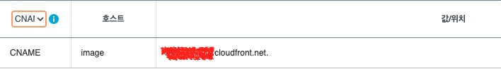
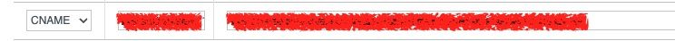

CloudFront와 ACM으로 S3 안전하게 사용하기

<!--truncate-->

# CloudFront와 ACM으로 S3 안전하게 사용하기

안녕하세요, 셀럽잇의 로이스입니다.

저희 셀럽잇 서비스에선 셀럽들이 다녀온 다양한 음식점에 대한 정보들을 제공합니다.

> www.celuveat.com
>
> 

보시는 것과 같이 음식점과 관련한 다양한 사진 파일들도 제공하고 있습니다.

현재, 어플리케이션을 운영중인 서버에 해당 대략 600개의 이미지 파일들을 저장하여 관리하고 있는데요.
더 다양한 음식점과 해당 음식점과 관련한 사진들을 지속적으로 추가할 예정이며,
사용자들의 사진 리뷰 기능이 추가될 계획에 따라 더 많은 이미지 파일들이 추가 될 수 있습니다.

이러한 상황에서 현재 방식(운영서버에서의 이미지 파일 저장 및 관리)은 이미지 파일이 지속적으로 적재되면서 **운영서버의 디스크가 부족**해질 수 있으며,
수많은 **이미지를 운영서버 내에서 관리**해야 한다는 문제점이 있습니다.
또, 이미지 요청마다 비교적 성능이 저조한 디스크로의 접근이 자주 발생하여 동일한 서버에서 운영중인 어플리케이션에도 영향을 끼칠 수 있습니다.

# S3

위와 같은 문제를 해결하기 위해 AWS에서 제공하는 **S3**(**S**imple Storage **S**ervice)를 사용하여 운영서버에서 이미지 파일로 인한 리소스 낭비와 관리 포인트를 분리하고자 합니다.

S3는 인터넷 스토리지 서비스로, 정적 파일들과 스크립트, 이미지, 음원, 바이너리 패키지등을 저장하는 관리하는 용도로 사용됩니다.

용량은 가용적으로 늘어나 무제한으로 사용 할 수 있으며, 직접적인 스케일링 작업이 필요하지 않습니다.
이러한 파일들의 업로드 혹은 삭제와 같은 작업을 `http/https`프로토콜을 통해 관리할 수 있습니다.
또한, ec2의 스토리지(ebs)를 사용하여 데이터를 저장하는 것보다 비용이 월등히 저렴합니다.

> _EBS 볼륨 pricing_
>
> 
>
> S3 볼륨 pricing
>
> 

## S3 버킷 생성

S3에서는 스토리지의 최상위 디렉토리를 **버킷(Bucket)**이라고 합니다.
S3에 저장되는 데이터의 최소 단위를 **객체(Object)**라고 합니다.

이미지 저장을 위해 AWS에서 버킷을 생성하겠습니다.

> 먼저 버킷의 이름을 지정합니다.
>
> 
>
> ACLs(Access Control Lists)은 비활성화 해둡니다.

> 빠른 접근을 위해 public access를 모두 허용합니다.
> ‼️**(보안적으로 매우 취약한 설정입니다. 우선 이미지 업로드를 살펴본 후, 보안과 관련된 부분에 대해 설명하며 해결할 예정이니 따라하지 않으셔도 됩니다.)**
>
> 

> 생성된 버킷에 접속합니다
>
> 

> 이미지 파일을 하나 업로드 합니다.
>
> 

> 객체 URL을 선택하여 해당 객체에 접근합니다.
>
> 

> 그럼 아래와 같이 Access Denied가 발생하는데요.
>
> 
>
> 버킷 정책을 설정해주지 않아서 발생하는 현상입니다.

> 버킷 설정으로 들어가 정책을 설정해보겠습니다.
>
> 
>
> 

> 정책 생성기에서 아래와 같이 설정하여 생성합니다.
>
> 
>
> - [1] **Select Type of Policy**: `S3 Buckey Policy 선택`
> - [2] **Principal**: `*`
> - [3] **Actions**: `GetObject 선택`
> - [4] **Amazon Resource Name (ARN)**: `arn:aws:s3:::{버킷이름}/*` (arn은 bucket properties에서 확인 할 수 있습니다)
> - [5] 정책 생성

> 이후 생성된 정책을 복사하여 적용합니다.
>
> 

다시 객체 URL로 접속하면 업로드한 이미지에 접근 할 수 있습니다!

## 보안 취약점

위 방식으로 이미지를 업로드하고, 해당 url을 통해 객체에 접근 할 수 있게 되었습니다.

하지만 현재 S3는 보안적으로 굉장히 취약한 상태입니다.

우선, 데이터들이 저장되어있는 S3 버킷의 주소가 노출되어 있어 악성 공격에 굉장히 취약한 상태입니다.
또, 모든 액세스 요청에 대해 허용되어 있기 때문에 신뢰할 수 없는 클라이언트의 접근 역시 가능합니다.

실제로 S3와 관련하여 다양한 보안 이슈들이 존재한다고 합니다.

> - [잘못된 S3보안 정책으로 10만명 이상의 학생들의 정보 유출](https://www.theregister.com/2022/12/20/mcgraw_hills_s3_buckets_exposed/)
>
> - [3TB의 항공사 직원의 개인 신상 정보(PII)와 비행기, 연료 라인, GPS 좌표 등의 민감한 회사 데이터 노출](https://www.darkreading.com/application-security/cloud-misconfig-exposes-3tb-sensitive-airport-data-amazon-s3-bucket)
>
> 출처: https://github.com/nagwww/s3-leaks

현재의 S3 보안 정책에 대해 개선해야할 필요가 있습니다.

AWS에서는 CloudFront라는 CDN 서비스를 통해 버킷을 숨기고(OAI) 액세스를 강하게 제한하면서 S3버킷을 [사용하도록 권장](https://aws.amazon.com/ko/blogs/korea/amazon-s3-amazon-cloudfront-a-match-made-in-the-cloud/)하고 있습니다.

그럼 간단하게 CDN에 대해 알아본 뒤, 좀 더 안전한 보안 정책을 수립해보겠습니다.

# CloudFront

우선 CDN에 대해 간단하게 살펴보고 가겠습니다.

## CDN(Content Delivery Network)

CDN은 사용자에게 빠르고 안전하게, 지리적 제약 없이 정적 콘텐츠를 제공하는할 수 있는 콘텐츠 전송 기술입니다.

CDN은 아래 사진과 같이 CDN 네트워크(캐시서버)를 구성하여 사용자의 요청에 대한 응답의 물리적인 거리를 줄여 콘텐츠 로딩에 소요되는 시간을 최소화합니다. 근접한 사용자의 요청에 원본 서버가 아닌 캐시 서버가 콘텐츠를 전달합니다.

> CDN없이 Origin 서버에서 서빙하는 경우

> CDN을 통해 캐시 서버에서 서빙하는 경우
>
> 

이러한 CDN기술은 다음과 같은 장점이 있습니다.

1. 웹사이트 로딩 속도 개선
2. 대역폭 사용 비용 절감
3. 컨텐츠 제공의 안정성
4. 웹사이트 보안

특히, 응답 속도가 느린 이미지를 자주 제공하는 셀럽잇에서는 CDN을 통해 웹페이지 로딩 속도를 크게 개선 할 수 있습니다.

> _CloudFront를 사용하면 지리적 제한, 서명된 URL, 서명된 쿠키 등 액세스 제한을 추가로 설정하여 기준이 서로 다른 콘텐츠에 대한 액세스 제한을 강화할 수 있습니다._ - AWS CloudFront

그리고, CloudFront는 이런 CDN을 제공하는 AWS 서비스입니다.

CloudFront를 사용하여 S3버킷의 직접적인 접근을 막고 CloudFront를 통해서만 액세스가 가능하도록 구성한다면, 보안적인 취약점을 해결 할 수 있습니다.
AWS에서 제공하는 웹 방화벽인 WAF와 DDoS 보호 서비스인 AWS Shield 역시 CloudFront에 적용 가능하여 보안을 강화 할 수 있습니다.

## CloudFront 적용

우선, 취약점 투성이인 S3의 정책을 강화하겠습니다.

열어두었던 Public access를 모두 막도록 수정하고, Bucket Policy도 제거합니다.

> 
>
> 

이후 CloudFront를 생성하겠습니다.

> S3버킷을 설정 합니다

> 이후, Origin access control settings를 선택하여 CloudFront를 통해서만 bucket에 접근하도록 합니다. 제어 설정도 추가합니다.
>
> 
>
> 

> 다음 cache 동작에서 http 요청 모두 -> https를 사용하도록 수정합니다.
>
> 
>
> 이번 적용에서는 WAF는 설정하지 않았습니다.
>
> 
>
> 위 구성으로 CloudFront를 생성합니다.

생성이 완료되면 연결된 버킷과 관련하여 버킷 정책이 생성되는데, 이를 복사한 뒤 버킷 정책에 추가합니다.

이제 S3객체 url로 직접 access는 불가능 하고, `{arn}.cloudfront.net/{객체이름}`으로만 접근이 가능한 것을 확인 할 수 있습니다!

# CloudFront 도메인 적용

이제 CloudFront를 통해서만 S3버킷에 접근이 가능하도록 구성하였습니다.

> 
>
> 출처: https://techblog.woowahan.com/6217/

하지만 CloudFront의 서버주소가 노출되어 있습니다. 구매한 도메인을 사용해보도록 하겠습니다.

셀럽잇은 gabia에서 도메인을 구매하여 관리하고 있습니다.

현재 CloudFront의 도메인을 CNAME으로 gabia에 등록하여 노출되지 않도록 수정해보겠습니다.

전파가 된 이후, `image.celuveat.com/celuveat-logo.jpeg`에 접속해 보면 아래와 같이 403이 나옵니다...

이는 CloudFront에선 허가되지 않은 CNAME 도메인에서의 접속을 차단하고 있기 때문입니다.

AWS의 Ceritication Manager를 통해 인증을 받아 해결 할 수 있습니다. (ACM에 대한 설명은 생략하겠습니다.)

## 인증서 요청

> CloudFront의 설정 수정에 들어간 뒤, SSL 인증서 요청을 클릭합니다.

> public 인증서 요청을 선택 한 뒤,
>
> 지정하고자 했던 도메인을 입력합니다. 이후 인증 방식을 선택 할 수 있습니다.
>
> 

DNS인증과 Email 인증 방식이 있습니다.

AWS의 root 계정이 아니라면, email 인증 방식에는 어려움이 있기 때문에 DNS방식을 선택하고 ssl 인증서를 생성합니다.

그럼 아래와 같이 `CNAME name`과 `CNAME value`가 생성됩니다.

이 CNAME과 value를 DNS에 등록하여 `image.celuveat.com`의 도메인 관리자임을 인증받을 수 있습니다.

> 만약 name이 `abcedasbfasens23_1212n.image.celuveat.com` 이고
>
> value가 `sjbndgaou232asnwbjoasubaasn.acm-validations.aws.` 이라면,
>
> 
>
> 호스트에 `abcedasbfasens23_1212n.image`,
>
> 값/위치에는 `sjbndgaou232asnwbjoasubaasn.acm-validations.aws.` 을 넣어주면 됩니다.

대략 몇분의 시간이 지난 뒤, Certificate status가 발행으로 변경됩니다! (저는 4분정도 걸렸습니다.)

이제 발급받은 ssl을 CloudFront에 적용하여 도메인으로 사용하도록 합시다!

CloudFront 편집에서 아래와 같이 `CNAME`을 입력하고, 인증받은 ssl을 선택합니다.

CloudFront 배포가 완료되면, `https://image.celuveat.com/celuveat-logo.png`로 접근 가능합니다!

> 참고
>
> - https://aws.amazon.com/ko/blogs/korea/amazon-s3-amazon-cloudfront-a-match-made-in-the-cloud/
> - https://www.youtube.com/watch?v=vgYfAndrpPU
> - https://sihyung92.oopy.io/devops/gabia/1
> - https://blog.pium.life/aws-s3-apply/
