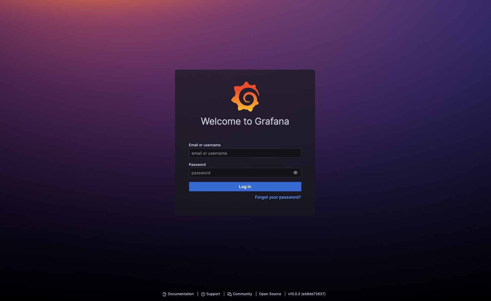

Spring boot actuator와 Docker로 Prometheus, Grafana 구성하기

<!--truncate-->

# 모니터링 시스템 구축기(1)

안녕하세요, 셀럽잇의 로이스입니다.

이번 글에서는 셀럽잇 모니터링 시스템 구축기에 대해 소개하겠습니다.

우선 서비스 모니터링이 필요한 이유에 대해 간단하게 짚고 넘어가겠습니다.

- 운영상 발생한 버그나 오류에 대해 빠른 확인
- 문제에 대한 원인에 대한 빠른 분석
- 시스템의 상태를 확인하여 개선점 발견 가능 (성능, 메모리 등)
- 사용자의 액세스와 활동 분석 -> 취약점, 어뷰징 등의 행위 발견 가능

로깅과 메트릭 모니터링가 필요한 이유는 이러한 이유 뿐만 아니라 다양합니다.

그래서 저희 셀럽잇도 운영중인 서비스에도 모니터링 시스템을 구축하고자 합니다.

## Spring actuator

우선, 셀럽잇에서는 logback를 사용하여 운영중에 발생한 로그를 모으고 있습니다.

로그 이외의 지표들은 어떤걸 모니터링 하고, 어떻게 수집해야 할까요?

직접 지표들을 추적하고 기록을 남길 수 있지만, 더욱 간편하게 `Spring Boot Actuator`를 사용하려고 합니다.

[Spring Boot Actuator](https://docs.spring.io/spring-boot/docs/2.1.8.RELEASE/reference/html/production-ready.html)는 운영 중인 애플리케이션을 `HTTP`나 `JMX`를 이용해서 모니터링하고 관리할 수 있는 기능을 제공합니다.

> **\*JMX**(**J**ava **M**anagement e**X**tension): 애플리케이션, 시스템, JVM 등을 모니터링하고 관리하기 위한 도구를 제공하는 Java 기술. JMX라는 표준화된 방법을 통해 다양한 모니터링 도구 및 시스템과 쉽게 통합할 수 있다.\*

`Actuator`를 통해서 간단한 설정들로 다양한 지표들을 확인 할 수 있습니다.

우선 Dependency에 추가하여 활성화 해보겠습니다.

`build.gradle`에 아래 코드를 추가합니다.

```groovy
implementation 'org.springframework.boot:spring-boot-starter-actuator'
```

이후, `http://{server}:{port}/actuator` 에 접속하시면 아래와 같은 화면을 볼 수 있습니다.
(celuveat은 8080 servlet의 기본 주소가 /api여서 http://localhost:8080/api/actuator 로 접속하였습니다.)


`_links` 하위에 `self`, `health` 등의 url들이 제공되는데요. Actuator는 이 url들을 통해 기능을 제공합니다.


설정을 통해 더 다양한 정보들을 제공 받을 수 있습니다.

`application.yml` 파일에서 아래와 같이 설정한 뒤, 다시 `actuator` url로 이동해보겠습니다.

```yaml
management:
  endpoints:
    web:
      exposure:
        include: "*"
```


```yaml
management:
  endpoints:
    web:
      exposure:
        include: "*"
```

설정을 통해 web 환경(HTTP) 에서 모든(\*) endpoints들을 노출 시켰기 때문에 다양한 actuator 기능을 사용할 수 있습니다.

> more endpoints: https://docs.spring.io/spring-boot/docs/3.0.5/reference/html/actuator.html#actuator.endpoints

그 중, `/metrics` endpoints를 살펴보면 유용한 지표(metric)들을 확인 할 수 있습니다.


- `application.ready.time`

- `jvm.threads.live`

- `jvm.gc.memory.allocated`

- `logback.events`

- `process.cpu.usage`

  ...

직관적인 이름으로 어떤 정보를 제공하는지 파악할 수 있는, 다양한 메트릭들이 제공됩니다.

예시로, `process.cpu.usage` 를 확인하고자 한다면, endpoints에 추가하여 접근 할 수 있습니다.

`/api/actuator/metrics/process.cpu.usage`


`Spring Actuator`는 단순한 매트릭 및 헬스 체킹 뿐만 아니라
[실행된 git 브랜치와 커밋, AutoConfiguration 정보, Java, OS 등의 정보](https://docs.spring.io/spring-boot/docs/3.0.5/reference/html/actuator.html#actuator.endpoints.info),
[런타임 중 Logging 레벨 변경](https://docs.spring.io/spring-boot/docs/3.0.5/reference/html/actuator.html#actuator.loggers) 역시 가능합니다.

주의할 점은, application에 대한 다양한 정보가 제공되기 때문에 보안적으로 심각한 문제를 야기 할 수 있습니다. 이부분을 해결하는 내용은 추후에 작성하겠습니다.

`Spring actuator`로 간단하게 의존성을 추가하고 약간의 설정으로 필요한 메트릭들에 대해 측정하고 확인할 수 있었습니다.

다음으로는 `Spring actuator`로부터 제공받은 메트릭들을 주기적으로 확인하고 저장하여 유의미하게 확인할 수 있도록 구성해보겠습니다.

<br />

## Prometheus

`Spring Actuator` 공식 문서의 [Metrics 챕터](https://docs.spring.io/spring-boot/docs/3.0.5/reference/html/actuator.html#actuator.metrics)를 보면 `Micrometer`에 대한 종속성 관리 혹은 자동 구성을 제공한다고 합니다.

먼저 Micrometer에 대해 간단하게 짚고 넘어가겠습니다.

> **[Micrometer](https://micrometer.io/docs/concepts)**: Micrometer는 JVM 기반 애플리케이션을 위한 메트릭 측정 라이브러리입니다. 모니터링 시스템용 클라이언트에 대해 추상화된 파사드를 제공하여 벤더(vender)사에 종속되지 않고 JVM 기반 애플리케이션 코드를 계측할 수 있습니다.

더 간단하게 말하면, JVM에서 메트릭을 측정할 수 있는 일종의 인터페이스라고 이해하면 좋을 것 같습니다.(``Log`의 `Slf4j`와 비슷한 역할)

`Micrometer`를 제공하는 벤더사는 다양하게 있는데요. 대표적인 것들은 아래와 같습니다.

- Atlas
- Datadog
- Elastic
- Graphite
- Influx
- JMX
- **Prometheus**

그 중 Prometheus를 사용하여 micrometer를 수집하고 집계하고자 합니다.

사용한 이유는 다음과 같습니다.

- Apache License 2.0가 사용된 무료 소프트웨어이다.
- PromQL을 통해 효율적으로 다양한 시계열 선택하고 집계할 수 있다.
- 그라파나에서 시각화를 제공한다.
- 사용자가 많아 참고할 자료가 다양한다.
- `Spring Actuator`에서 메트릭 정보를 제공한다.

그럼 `Prometheus`를 통해 메트릭 집계를 해보겠습니다.

## 준비

`Prometheus`가 metric을 폴링 할 수 있도록 `/actuator/prometheus` 엔드포인트를 제공해야 합니다.

먼저 build.gradle에 `prometheus` 의존성을 추가합니다.

`build.gradle`

```groovy
implementation 'io.micrometer:micrometer-registry-prometheus'
```

이후, `application.yml`에서 `exposure` 설정을 변경합니다.

`application.yml`

```yaml
management:
  endpoints:
    web:
      exposure:
        include: "prometheus"
```

잘 적용이 되었는지 `/actuator/prometheus` 로 접속해 확인해 볼 수 있습니다.


알아보긴 힘들지만, 잘 접속되는 것을 확인 할 수 있습니다.

url과 태그로 제공되는 방식과 달리, `executor_pool_max_threads{name="applicationTaskExecutor",} 2.147483647` 와 같은 문법으로 제공되는데, 이는 PromQL(Prometheus Query)으로 `Prometheus`의 메트릭 질의 언어입니다.

Prometheus을 통해 meterics를 polling하는데 필요한 준비는 끝났습니다!

### 설치

먼저, celuveat에서는 docker를 사용하여 `Spring application`을 운영중에 있습니다.

`prometheus` 역시 docker를 통해 관리하도록 하겠습니다.

```yaml
# docker-compose-monitoring.yml

version: "3"

services:
  prometheus:
    image: prom/prometheus:latest
    container_name: prometheus
    ports:
      - "9090:9090"
```

기본적으로, `promtheuse`는 9090 포트를 사용하기에 9090 포트를 바인딩 하였습니다.

volumes는 추후 설명하겠습니다.

`docker compose -f docker-compose-monitoring.yml up -d`를 통해 실행한 뒤, 9090포트에 접근하면 대시보드를 확인 하실 수 있습니다.


### 설정

이후 상단 메뉴 바에서 `Status` -> `Targets`를 통해 prometheus가 polling 중인 타겟을 확인 할 수 있습니다.


현재 아무런 설정을 하지 않았기에 `self`로 metrics를 `Scrape` 하는 것을 확인 할 수 있습니다.

이런 타겟 설정은 `prometheus.yml`에서 수정할 수 있습니다. 현재 저는 도커 컨테이너 내에서 동작중이다 보니, 외부에 `prometheus.yml`파일을 작성 한 뒤, 볼륨 마운트를 통해 설정하도록 하겠습니다.

`prometheus.yml`

```yaml
# prometheus.yml

scrape_configs:
  - job_name: "celuveatdev"
    metrics_path: "/api/actuator/prometheus"
    scrape_interval: 5s
    static_configs:
      - targets: ["localhost:8080"]
```

`metrics_path` : metric 경로 지정

`static_configs: - targets`에는 host를 지정합니다.

`scrape_interval`: 수집 주기를 설정합니다.

이후 `docker-compose-monitoring.yml` 을 수정하여 볼륨 마운트 설정을 합니다.

```yaml
# docker-compose-monitoring.yml

version: "3"

services:
  prometheus:
    image: prom/prometheus:latest
    container_name: prometheus
    ports:
      - "9090:9090"
    volumes:
      - ./prometheus.yml:/etc/prometheus/prometheus.yml
```

``./prometheus.yml`는 host에서의 경로, `/etc/prometheus/prometheus.yml`는 docker container내부의 경로입니다.

이후 다시 docker를 실행하면 원하는 타겟이 설정된 것을 확인 할 수 있습니다.


예시로 들었던 PrmoQL인 `executor_pool_max_threads{name="applicationTaskExecutor",}`을 메인 페이지에서 실행하면


원하는 메트릭 정보를 얻을 수 있습니다!

더 다양한 PromQL을 통해 다양한 지표들을 Table 뿐만 아니라 `Graph`로도 확인 하실 수 있습니다.

## Grafana

`Prometheus`를 통해 주기적으로 메트릭을 수집 할 수 있지만, 확인하기엔 어려움이 있습니다.

매번 PromQL을 통해 원하는 지표를 질의해야 하고, 시각화된 자료 또한 그래프 하나가 전부이기 때문에 불편함이 존재합니다.

그래서 `Prometheus`에서 수집한 메트릭을 유용하게 시각화 할 수 있는 시각화 도구로서 `Grafana`를 사용하려 합니다.

### 설치

`Grafana` 역시 도커로 구성하고자 합니다.

```yaml
# docker-compose-monitoring.yml

version: '3'

services:
  prometheus:
    image: prom/prometheus:latest
    container_name: prometheus
    ports:
      - "9090:9090"
    volumes:
       - ./prometheus.yml:/etc/prometheus/prometheus.yml

# 추가
	grafana:
    image: grafana/grafana:latest
    container_name: grafana
    user: "$UID:$GID"
    ports:
      - "3000:3000"
    volumes:
      - ./grafana-data:/var/lib/grafana
    depends_on:
      - prometheus
```

grafana는 기본적으로 3000포트를 사용합니다.

또, prometheus를 datasource로 추가할 예정이다 보니, depends_on 옵션으로 prometheus 컨테이너가 선행되도록 설정하였습니다.

> **volumes를 꼭 설정하셔야 합니다!** 도커 컨테이너가 내려가도 Grafana에서 설정한 대시보드나 데이터 소스가 사라지지 않도록 해야합니다.
>
> 이때, grafana image내 `/var/lib/grafana`의 쓰기 작업을 위해 `user: "$UID:$GID"`를 설정해야 합니다.
>
> 저도 알고 싶지 않았습니다.

`docker compose -f docker-compose-monitoring.yml up -d` 를 통해 실행 한 뒤,

3000포트로 접속하면 다음과 같은 화면이 나옵니다.



초기 계정과 비밀번호는 모두 "admin" 입니다.

최초 로그인 시, 비밀번호를 변경 할 수 있습니다.

로그인 후 Administration -> Data soureces에 들어와서 prometheus를 등록합니다.


이후 prometheus를 접속했던 url을 설정해줍니다.


Data sources 에서 추가된 걸 확인할 수 있습니다.

이제 [Grafana Labs](https://grafana.com/grafana/dashboards)에 가서 다양한 Dashboards를 탐색하고 선택하여 적용하면 됩니다.

`Spring boot`로 검색한 뒤, `Spring boot 2.1 System Monitor`를 선택합니다.


<br />

해당 대쉬보드의 ID를 복사 한 뒤,


<br />

아래 Import 대쉬보드를 선택합니다.

그 후 복사한 ID를 입력하면,


Spring Boot 2.1 System Monitor 가 불러와지는 것을 알 수 있습니다.


DataSource도 등록하여 추가하면 아래와 같이 대쉬보드를 확인 할 수 있습니다.


아래 메트릭을 확인하다 보면 `Jetty Statistics`를 확인할 수 있는데요.


Spring boot 에서 사용하고 있는 tomcat was 메트릭으로 변경이 필요해 보입니다.

다시 `application`으로 돌아와서 `application.yml`에 아래 옵션을 추가합니다.

```yaml
# application.yml
server:
  tomcat:
    mbeanregistry:
      enabled: true
```

이후 Dashboard settings에서 수정할 수 있도록 설정을 합니다.


이후 Query의 이름을 `tomcat_threads_config_max_threads`로 변경합니다.


## 정리

모니터링이 이루어지는 과정을 다시 정리해보겠습니다.

`Sping actuator`에서 제공하는 metrics를 `Micrometer` 를 구현한 prometheus에게 제공하고, prometheus는 주기적으로 지표들을 모아 저장합니다.

이런 prometheus에 저장되어 있는 데이터를 시각화 툴인 `Grafana`를 사용하여 대시보드를 구성하여 모니터링 할 수 있습니다.

간단하게 아래와 같은 구성이 갖추어 집니다.


