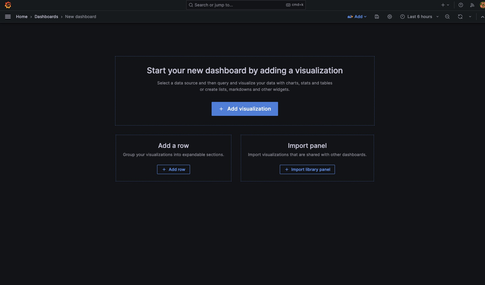

Promtail과 Loki로 로그 파일 모니터링하기

<!--truncate-->

# 모니터링 시스템 구축기(2)

안녕하세요, 셀럽잇의 로이스입니다.

이전 글에 이어서 메트릭 지표 뿐만 아니라 logback으로 남기는 로그 파일을 모니터링 할 수 있도록 구성해보겠습니다.

우선, 저희 셀럽잇에서는 log level에 나누어 다음과 같이 파일을 정리하고 있습니다.

- `INFO` -> `logs/backend/info`
- `WARN` -> `logs/backend/warn`
- `ERROR` -> `logs/backend/error`

레벨에 따라 각각 다른 폴더에 날짜별, 사이즈별로 분리되어 저장되고 있습니다.

```sh
# info.log

01:09:19.973 [http-nio-8080-exec-2] INFO  c.c.c.l.r.RequestLogInterceptor - [Web Request START] : [
#  ...

	[Method] = [GET]
	[URL] = [http://localhost:8080/api/celebs]
	[QueryString] = [null]
	[Params] = [

	]
	[Body] = []
	[Controller Method] = [CelebController.findAll()]
]
01:09:19.982 [http-nio-8080-exec-2] INFO  com.celuveat.common.log.Logger                        - [f28a3f61(anonymous)]  |--->CelebController.findAll()
01:09:19.984 [http-nio-8080-exec-2] INFO  com.celuveat.common.log.Logger                        - [f28a3f61(anonymous)]  |    |--->CelebRepository.findAll()
01:09:20.044 [http-nio-8080-exec-2] INFO  com.celuveat.common.log.Logger                        - [f28a3f61(anonymous)]  |    |<---CelebRepository.findAll()                                                time=74ms
01:09:20.046 [http-nio-8080-exec-2] INFO  com.celuveat.common.log.Logger                        - [f28a3f61(anonymous)]  |<---CelebController.findAll()                                                     time=76ms
01:09:20.077 [http-nio-8080-exec-2] INFO  c.c.c.l.r.RequestLogInterceptor                       - [Web Request END] : [
	[ID] = [f28a3f61(anonymous)]
	[Status] = [200]
	[Headers] = [
		[Vary] = [[Origin, Access-Control-Request-Method, Access-Control-Request-Headers]]
	]
	[Body] = [
		[ ]
	]
	[Query Count] = [1]
	[Total Time] = [107ms]
]
```

`Logback`을 통해 유용한 정보들을 남기지만, 매번 서버에 직접 들어가서 확인해야 한다는 불편함이 있었습니다.

날짜와 사이즈, 레벨 별로도 분리되어 있고, 개발 및 운영 환경별로도 로그가 분리되어 있어 통합적으로 모니터링하는 것은 상당히 어려웠습니다.

또, 뒤죽박죽으로 섞여 있는 로그들을 쉽게 확인하기 어려웠습니다.

그래서 모니터링을 하기 위해 `Promtail`과 `Loki`를 도입하기로 하였습니다.

## Promtail과 Loki

Promatil [공식문서](https://grafana.com/docs/loki/latest/clients/promtail/)에서는 다음과 같이 설명하고 있습니다.

> Promtail is an agent which ships the contents of **local logs to a private Grafana Loki instance** or Grafana Cloud. It is usually deployed to every machine that has applications needed to be monitored.
>
> It primarily:
>
> - Discovers targets
> - Attaches labels to log streams
> - **Pushes them to the Loki instance.**

간단하게 추려보면, Promtail은 모니터링이 필요한 로컬 머신에서 `Loki instance`에 로컬 로그를 푸시하는 agent라고 합니다.

Loki [공식문서](https://grafana.com/docs/loki/latest/fundamentals/overview/)에서는 다음과 같이 설명하네요.

> Grafana Loki is a log aggregation tool, and it is the core of a fully-featured logging stack.

로깅에 특화된 집계 도구로 이해하면 좋을 것 같습니다.

(https://grafana.com/docs/loki/latest/fundamentals/overview/)

공식문서에서 제공하는 overview 입니다.
Promtail과 같은 agent가 app에서 발생하는 로그들을 수집하여 HTTP API를 통해 `Loki`에 전송하는 구조를 띄고 있습니다.

대략적인 구조를 파악했으니, 빠르게 적용해보겠습니다.

## 적용하기

이번에도 `docker-compose-monitoring.yml`에 구성하도록 하겠습니다.

```yaml
# docker-compose-monitoring.yml

version: "3"

services:
  prometheus:
    image: prom/prometheus:latest
    container_name: prometheus
    ports:
      - "9090:9090"
    volumes:
      - ./prometheus.yml:/etc/prometheus/prometheus.yml
    depends_on:
      - celuveatdev

  grafana:
    image: grafana/grafana:latest
    container_name: grafana
    user: "$UID:$GID"
    ports:
      - "3000:3000"
    volumes:
      - ./grafana-data:/var/lib/grafana
    depends_on:
      - prometheus

  # 추가됨
  loki:
    image: grafana/loki:latest
    ports:
      - "3100:3100"
    command: -config.file=/etc/loki/local-config.yaml

  promtail:
    image: grafana/promtail:latest
    volumes:
      - ./logs/backend:/logs
      - ./promtail-config.yml:/etc/promtail/config.yml
    command: -config.file=/etc/promtail/config.yml
```

우선 `Loki`에 대해 살펴보겠습니다. Loki 이미지를 다운 받고, 포트를 바인딩 하는건 별로 어색하지 않습니다.

`command` 옵션은 도커 컨테이너가 실행된 후 실행하는 명령을 정의할 수 있습니다.

`-config.file=/etc/loki/local-config.yaml`은 Loki 가 실행될 때 사용할 설정 파일을 지정하는 것 인데, 건들일 필요가 없어서 기본값으로 설정해두었습니다.

<br />

다음으로 `promtail`입니다.

우선 접근해야할 `log` 파일들이 저장되어있는 호스트의 `./logs/backend`를 불륨 마운트 시켜줍니다.

이후 `promtail`이 Log를 수집하는 job을 정의하는 `/etc/promtail/config.yml`를 직접 정의할 수 있도록 이 역시도 마운트 시켜줍니다.

Loki와 마찬가지로 사용할 설절 파일을 기본값으로 설정하여 실행합니다.

그럼, Log를 수집하는 job을 `promtail-config.yml`에서 정의해보겠습니다.

```yaml
positions:
  filename: /tmp/positions.yaml # 동기화 작업을 이루기 위해 promtail이 읽은 마지막 로그 정보를 저장하는 곳

clients:
  - url: http://localhost:3100/loki/api/v1/push # push할 Loki의 주소

scrape_configs:
  - job_name: info
    static_configs:
      - targets:
          - localhost
        labels:
          job: info_logs
          __path__: ./logs/info/*.log # info 폴더 내에 log 파일들 모두 수집

  - job_name: warn
    static_configs:
      - targets:
          - localhost
        labels:
          job: warn_logs
          __path__: ./logs/warn/*.log # warn 폴더 내에 log 파일들 모두 수집

  - job_name: error
    static_configs:
      - targets:
          - localhost
        labels:
          job: error_logs
          __path__: ./logs/error/*.log # error 폴더 내에 log 파일들 모두 수집
```

구성이 완료되면, docker을 다시 실행한 뒤 Grafana로 들어갑니다!

Loki Datasource를 추가해보겠습니다.


선택을 한 뒤,


Loki의 주소를 입력하여 추가합니다.

이후 새로운 대시보드를 작성합니다.





원하는 job을 설정하면 해당 job이 수집한 로그들을 볼 수 있습니다.


log는 기본적으로 한 줄 단위로 분리되어 작성되는데요.

저희 celuveat의 로깅 방식에 맞게 `multiline` 옵션을 추가하여 한 블럭의 단위를 조정해보겠습니다.

```yaml
pipeline_stages:
  - multiline:
      firstline: '^\d{2}:\d{2}:\d{2}\.\d{3} \[.*\] INFO  .* \[Web Request (START|END)\]'
      max_wait_time: 1s
      max_lines: 500
```

블럭의 단위가 [Web Request START/END]를 기준으로 나눠 볼 수 있게 되었습니다.


또, error 로그의 경우는 다음과 같이 추가하였습니다.

```yaml
pipeline_stages:
  - multiline:
      firstline: '^\d{2}:\d{2}:\d{2}\.\d{3} \[.*\] ERROR'
      max_wait_time: 1s
      max_lines: 500
```


최종 형태

```yaml
# promtail-confing.yml

positions:
  filename: /tmp/positions.yaml

clients:
  - url: http://localhost:3100/loki/api/v1/push

scrape_configs:
  - job_name: info
    static_configs:
      - targets:
          - localhost
        labels:
          job: info_logs
          __path__: ./logs/info/*.log
    pipeline_stages:
      - multiline:
          firstline: '^\d{2}:\d{2}:\d{2}\.\d{3} \[.*\] INFO  .* \[Web Request (START|END)\]'
          max_wait_time: 1s
          max_lines: 500

  - job_name: warn
    static_configs:
      - targets:
          - localhost
        labels:
          job: warn_logs
          __path__: ./logs/warn/*.log

  - job_name: error
    static_configs:
      - targets:
          - localhost
        labels:
          job: error_logs
          __path__: ./logs/error/*.log
    pipeline_stages:
      - multiline:
          firstline: '^\d{2}:\d{2}:\d{2}\.\d{3} \[.*\] ERROR'
          max_wait_time: 1s
          max_lines: 500
```

## 다음으로

이제 로그백으로 남기는 로그들 까지 모니터링이 가능해졌습니다.

Docker를 사용하여 비교적 간단하게 설치하여 구성할 수 있었습니다.

물론 직접 설치해도 되지만, 현재 인스턴스 상황에 따라 모니터링 서버를 어디에 구축하여야 하는 지 확정이 되지 않아 빠르게 이식할 수 있도록 구성해보게 되었습니다.

또, 다음 포스팅이에서 도커 네트워크를 통해서 비교적 안전하게 내부 네트워크를 통해 meteric정보들을 노출 시키지 않고 모니터링이 가능하도록 구성할 예정입니다.
