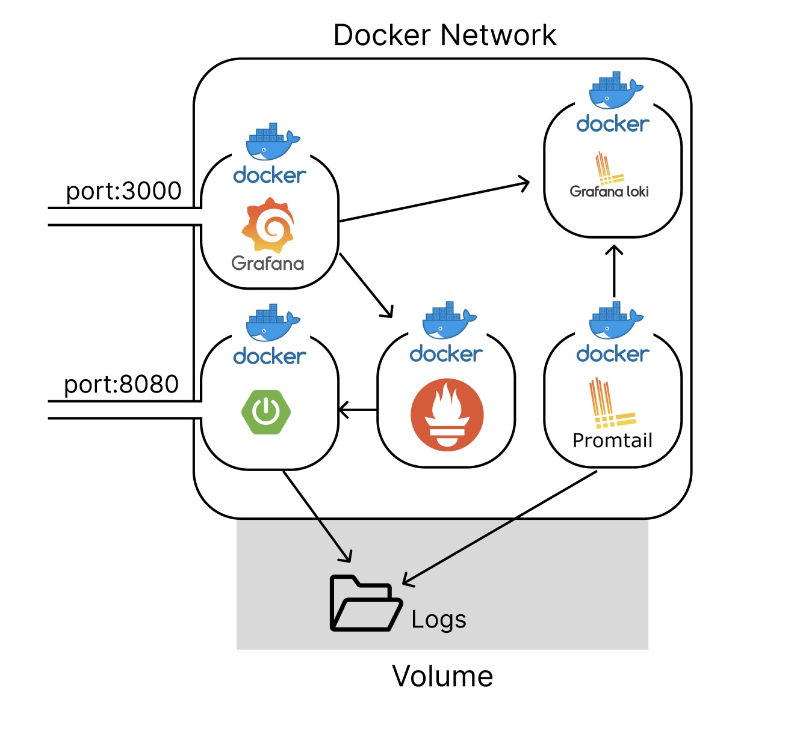
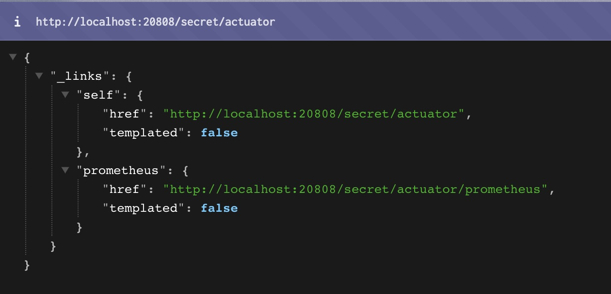
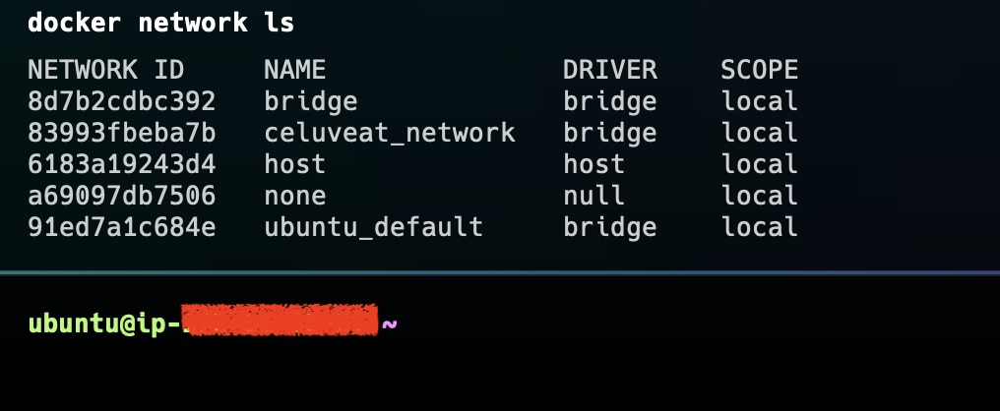
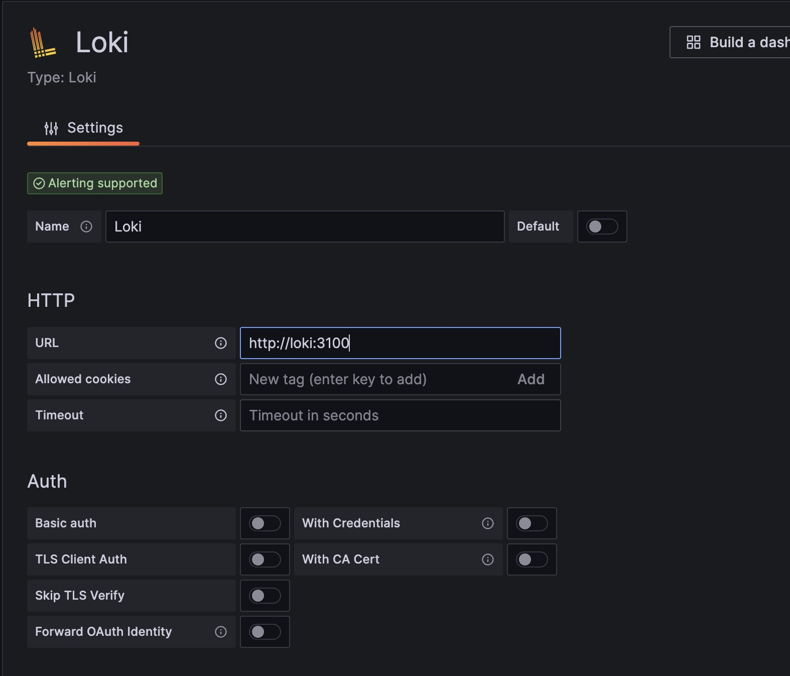
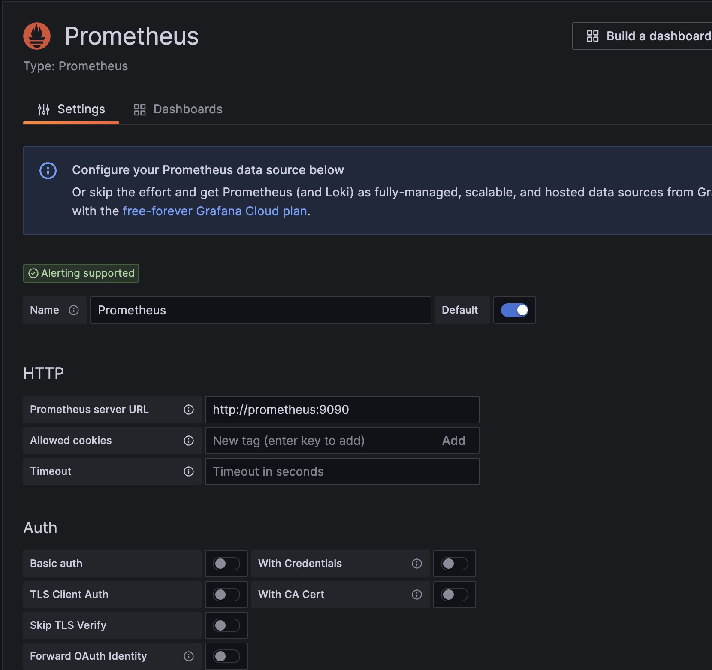
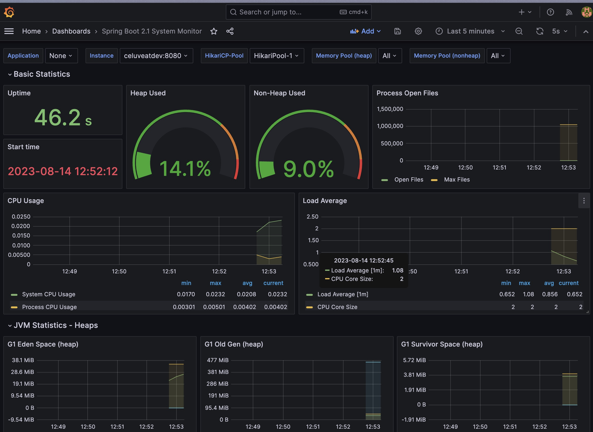
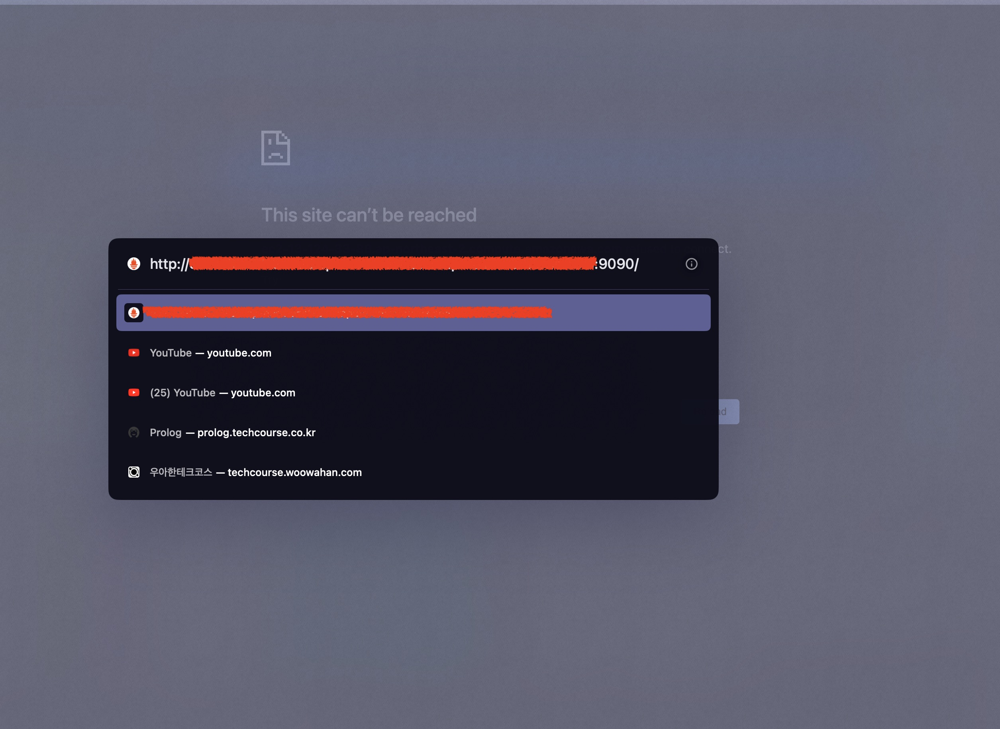

모니터링에 보안을 신경쓰자

<!--truncate-->

# 모니터링 시스템 구축기(3)

안녕하세요, 셀럽잇의 로이스입니다.

이전 글들을 통해 모니터링을 적절히 구성하였는데요.

이번엔 보안적인 부분에 대해 신경쓰며 개선해보도록 하겠습니다.

메트릭은 어플리케이션에 대한 다양한 지표들을 나타내고 있기 때문에, 관리자입장에서는 유용한 정보이면서도 노출되면 위험할 수 있는 지표입니다.

현재 `Spring Actuator`, `Prometheus` 는 외부에서 누구든지 접속 할 수 있습니다. `Granfana`도 접근할 수 있지만, 자체적으로 제공하는 `ID/PW` 인증이 존재합니다.

`Spring Actuator` 같은 경우에는 Spring application 단에서 해당 경로 (`/actuator`) 자체에 대한 보안을 추가할 수 있습니다. `Intercetpor`나 `Filter`에서 해당 url에 대한 인가 정보를 검증하는 식으로요.

그러면 `Prometheus`에서 Scrape 요청시 인증 정보를 추가하여야 합니다.

그렇다면 `Prometheus`에 대한 자체적인 접근은 어떻게 막을 수 있을까요? 이 또한 보안을 둔다면, Grafana에서의 요청에서도 인증 정보를 추가적으로 설정해야 합니다.


이런 플로우를 따라 이전 단계에서 보안을 적용하면 영향을 많이 받게 됩니다.

그래서 저는 모니터링 컨테이너들 간의 통신은 가능하고, 외부에서는 Grafana를 통해서만 모니터링을 할 수 있도록 구성해보려 합니다.

최종적인 모습은 아래와 같습니다.



복잡하긴 하지만, 결국 Grafana를 통해서만 모니터링 정보가 노출 될 수 있도록 관리하려고 합니다.

## Actuator 포트 및 경로 분리

우선 Spring actuator의 prometheus endpoints를 분리해보겠습니다.

Actuator는 기본적으로 ``/actuator/{endpoints}` 의 형태를 가지기 때문에 비교적 쉽게 예측하고 접근 할 수 있습니다.

따라서 아래 설정을 통해 해당 매트릭 지표의 url을 분리할 수 있습니다.

```yaml
# application.yml

management:
  endpoints:
    web:
      exposure:
        include: "prometheus"
  server:
    port: ${SECRET PORT}
    base-path: ${SECRET PATH}
```

이제 `localhost:8080/actuator/prometheus` 는

`localhost:{secret_port}/{secret_path}/actuator/prometheus` 경로로 노출되게 됩니다.



_(port: 20808, base-path: secret 인 경우)_

> 8080를 사용하는 톰캣 context와 분리되어 이전 server.servlet.contextPath="/api" 는 적용되지 않습니다.

이제 달라진 endpoint에 맞게 prometheus에서 설정을 변경해주겠습니다.

## Docker network

`Docker Network`란 실행된 각각의 컨테이너끼리 연결하기 위한 논리적인 네트워크입니다.

Docker Network를 구성하면 같은 네트워크 안에서는 각각의 IP를 지정할 필요 없이 `name`만으로 네트워크 연결이 가능하다는 장점이 있습니다.

또한 아웃바운드 포트를 오픈하지 않고도 내부적으로만 통신하게 구성할 수 있습니다.

일종의 private network를 구현 할 수 있습니다.

먼저, Sping application과 monitoring 툴들이 사용할 network를 하나 생성하겠습니다.

```bash
 docker network create celuveat_network
```

이후 `docker network ls`를 통해 생성된 네트워크를 확인 할 수 있습니다.



Docker Network에는 3가지의 드라이버가 있는데, 기본적으로 `bridge`로 생성됩니다.
(참고: https://docs.docker.com/network/drivers/)

우선 동일한 호스트(ec2)에서 도커 이미지간의 통신을 위해 사용되므로 `bridge` driver로 구성하겠습니다.

Docker network와 함께 각각의 컨테이너들을 구성하는 `docker-compose-monitoring.yml` 파일을 수정하겠습니다.

```yaml
# docker-compose-monitoring.yml

version: "3"

services:
  prometheus:
    image: prom/prometheus:latest
    container_name: prometheus
    networks:
      - celuveat_network
    #ports:
    #  - "9090:9090" 외부 포트 바인딩 제거
    volumes:
      - ./prometheus.yml:/etc/prometheus/prometheus.yml
    depends_on:
      - celuveatdev

  grafana:
    image: grafana/grafana:latest
    container_name: grafana
    networks:
      - celuveat_network
    user: "$UID:$GID"
    ports:
      - "3000:3000"
    volumes:
      - ./grafana-data:/var/lib/grafana
    depends_on:
      - prometheus

  loki:
    image: grafana/loki:latest
    networks:
      - celuveat_network
    # ports:
    #  - "3100:3100" 외부 포트 바인딩 제거
    command: -config.file=/etc/loki/local-config.yaml

  promtail:
    image: grafana/promtail:latest
    networks:
      - celuveat_network
    volumes:
      - ./logs:/logs
      - ./promtail-config.yml:/etc/promtail/config.yml
    command: -config.file=/etc/promtail/config.yml

networks:
  celuveat_network:
    external: true
```

각각의 서비스 마다 networks 옵션을 추가하여 network에 구성 시켰고,

```yaml
networks:
  - celuveat_network
```

compose 파일 하단에 아래 옵션을 통해 이번 compose파일에서 구성하는 것이 아닌 존재하는 network임을 명시하였습니다.

```yaml
networks:
  celuveat_network:
    external: true
```

또, 외부 포트 바인딩 없이 private network를 통해서 접근하려고 하는 prometheus의 포트 바인딩 옵션도 제거하였습니다.

이에 맞게 Spring application을 구성하는 docker-compose.yml 파일도 수정하였습니다.

```yaml
# docker-compose.yml

version: "3"

services:
  celuveatdev:
    image: roycewon/celuvedev:0.0.1
    networks: # 추가된 옵션
      - celuveat_network
    container_name: celuveatdev
    ports:
      - "8080:8080"
    environment:
      - SPRING_PROFILES_ACTIVE=prod
    volumes:
      - /logs:/logs

networks:
  celuveat_network:
    external: true
```

## 설정 수정

이제 private 망으로 숨어버린 prometheus와 loki에 접근할 수 있도록 설정 값들을 변경하겠습니다.

우선 docker network를 통해 이제 ip가 아닌, 컨테이너 이름으로 접근할 수 있게 되었습니다.

먼저 prometheus -> spring application에 접근하여 메트릭을 수집하는 설정을 수정해보겠습니다.

```yaml
scrape_configs:
  - job_name: "celuveatdev"
    metrics_path: "/{secret_base_path}/actuator/prometheus"
    scrape_interval: 5s
    static_configs:
      - targets: ["celuveatdev:{secret_port}"] # 변경
```

이제 ip, localhost가 아닌 `celuveatdev`라는 컨테이너 이름으로 지정하도록 수정하였습니다. 또, 앞서 변경해두었던 port와 base-path에 맞게 수정하였습니다.

다음으로 log파일을 수집하여 loki로 보내는 promtail의 값을 변경해보겠습니다.

아래 `clients.url` 옵션만 localhost(ip) -> loki 라는 컨테이너 이름으로 지정하겠습니다.

```yaml
clients:
  - url: http://loki:3100/loki/api/v1/push
```

마지막으로 모니터링이 가능한 grafana입니다!

앞서 했던 적용방식과 동일하게 ip 대신 container 이름으로 변경합니다.





이후 docker-compose를 재실행 하면 대시보드가 잘 작동하는 것을 확인 할 수 있습니다.



그리고 Prometheus의 기본 포트였던 9090으로는 접근이 불가합니다.



8080포트에서 분리했던 Spring actuator 역시 8080외의 포트에 할당되었기 때문에 외부에서 접근할 수 없게 되었습니다!

컨테이너 이름만으로 가능했던 이유는 도커에서 지원해주는 내장 DNS서버가 있기 때문입니다. 먼저 docker network에 연결되어있는 dns를 탐색하게 되기 때문이죠.

## 정리

3번의 글에 걸쳐 모니터링 시스템을 구축하였습니다.
아래의 구조로 구성하게 되었습니다.

모니터링 툴이 다양하여 어떤 툴을 적용할 지 정답은 없지만, 운영중인 서비스에 대한 모니터링은 반드시 필요한 것은 분명합니다.

모니터링에 사용되는 지표들은 유용하면서도 위험이 될 수 있기에 보안적은 부분에 신경을 쓰며 구성하면 좋을 듯 합니다!
